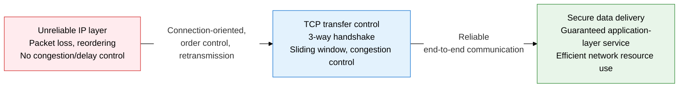
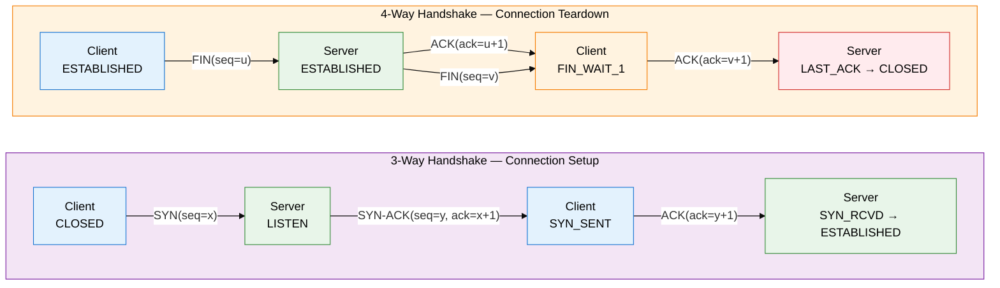
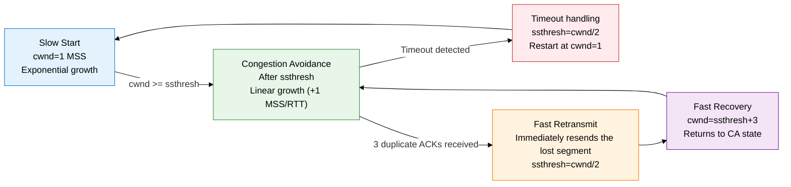

**Transport Layer — Transmission Control Protocol / User Datagram Protocol**

## 1. The Core Transport Protocols for End-to-End Reliability — Overview of TCP/UDP

**Definition**: TCP is an L4 transport protocol that guarantees reliable end-to-end data delivery through connection orientation, order guarantee, error control, flow control, and congestion control mechanisms.
- TCP (Transmission Control Protocol) compensates for the unreliability of the IP layer, providing data integrity and order consistency.
- UDP (User Datagram Protocol) requires no connection setup and is suited to real-time services that need fast transfer with low overhead.
- Both protocols support multiplexing, identifying multiple application processes on the same host through port numbers.

**Characteristics**:
- **Connection orientation**: TCP establishes a logical connection via a 3-way handshake before sending data, and safely tears it down via a 4-way handshake on termination.
- **Reliability control**: Sequence and ACK numbers manage packet order, and timeout- and duplicate-ACK-based retransmission recovers lost data.
- **Congestion control**: 4 stages — Slow Start, Congestion Avoidance, Fast Retransmit, Fast Recovery — detect network congestion and dynamically adjust the transmission rate.

---

## 2. Core Structure of TCP/UDP

### A. TCP vs. UDP Comparison and the Connection Setup/Teardown Procedure

| Category | TCP | UDP |
|---|---|---|
| **Connection type** | Connection-oriented | Connectionless |
| **Reliability** | Order guarantee, retransmission, error recovery | Not guaranteed — loss tolerated |
| **Order guarantee** | Reassembled in order via sequence numbers | Not guaranteed |
| **Flow control** | Sliding window (rwnd-based) | None |
| **Congestion control** | Slow Start, CA, Fast Retransmit | None |
| **Header size** | 20-60 bytes | 8 bytes fixed |
| **Main uses** | HTTP, FTP, SMTP, SSH | DNS (UDP 53), VoIP, streaming, DHCP |

| TCP header field | Size | Role |
|---|---|---|
| **Source/destination port** | 16 bits each | Identifies the application process (multiplexing) |
| **Sequence number** | 32 bits | Specifies the byte offset of sent data, manages order |
| **ACK number** | 32 bits | Next byte expected — cumulative acknowledgment |
| **Window size** | 16 bits | Available receive buffer space (rwnd) — basis for flow control |
| **Flags (6 bits)** | 1 bit each | SYN, ACK, FIN, RST, PSH, URG control bits |
| **Checksum** | 16 bits | Detects errors in header plus data (includes the pseudo header) |

TCP state transition order: `CLOSED → LISTEN → SYN_SENT → SYN_RCVD → ESTABLISHED → FIN_WAIT_1 → FIN_WAIT_2 → TIME_WAIT (waits 2MSL) → CLOSED`. The TIME_WAIT state is held for 2x MSL (Maximum Segment Lifetime) to handle late-arriving packets and prevent duplicate connections.

---

### B. TCP Flow Control and Congestion Control Mechanisms

Flow control is the mechanism by which the sender adjusts its transmission rate based on the rwnd (Receive Window) value advertised by the receiver. The sliding window advances forward on each ACK, enabling continuous pipelined transmission. The actual amount of data that can be sent is determined by `min(cwnd, rwnd)`.

The **Nagle algorithm** batches small data segments into one larger segment to improve network efficiency; interactive applications (SSH, gaming) disable it with the `TCP_NODELAY` option. **Silly Window Syndrome** is an inefficiency where the receiver repeatedly sends ACKs for just 1-2 bytes at a time when its buffer is low; it is prevented by the Clark algorithm (receiver side) and the Nagle algorithm (sender side).

| Congestion control stage | Trigger condition | cwnd change | ssthresh adjustment | Next transition |
|---|---|---|---|---|
| **Slow Start** | Connection start, or restart after timeout | 1 MSS → doubles on every ACK (exponential) | Unchanged | Transitions to CA when cwnd reaches ssthresh |
| **Congestion Avoidance** | cwnd at or above ssthresh | Linear growth of 1 MSS per RTT | Unchanged | Timeout → SS / 3 duplicate ACKs → FR |
| **Fast Retransmit** | Same ACK received 3 times (duplicate) | Sets ssthresh = cwnd/2 | Reduced to cwnd/2 | Enters Fast Recovery |
| **Fast Recovery** | Immediately after Fast Retransmit | cwnd = ssthresh + 3 MSS | Held | Returns to CA on a new ACK |

---

## 3. Expected Benefits and Practical Applications of TCP/UDP

| Category | Key benefits | Practical applications |
|---|---|---|
| **Reliability, integrity** | Sequence numbers, ACKs, and retransmission guarantee delivery without data loss | Adopt TCP for services where data accuracy matters — financial transactions, file transfer, API communication |
| **Protecting network resources** | Congestion control (Slow Start, CA, Fast Retransmit) prevents congestion collapse | Data center traffic engineering, applying modern congestion control algorithms such as BBR (Bottleneck Bandwidth and RTT) |
| **Optimizing real-time services** | UDP's low overhead and latency deliver real-time responsiveness | Apply UDP to delay-sensitive services: VoIP, online gaming, video streaming, DNS lookups |
| **Security integration** | Layers a TLS/SSL handshake on top of the TCP connection to establish an encrypted channel | Used as the basis for secure transport implementations like HTTPS (TCP 443), SSH (TCP 22), FTPS |

---

> **Exam points**
> - Be able to explain the flags at each stage of the TCP 3-way handshake (SYN, SYN-ACK, ACK) and how the sequence/ACK numbers change.
> - Understand why the TIME_WAIT state exists (handling delayed packets, preventing connection reuse).
> - Precisely distinguish the trigger condition, cwnd change, and ssthresh readjustment logic for each of the 4 congestion control stages.
> - TCP vs. UDP selection criteria: services that need reliability (HTTP, FTP, SMTP) vs. delay-sensitive services (DNS, VoIP, streaming).
