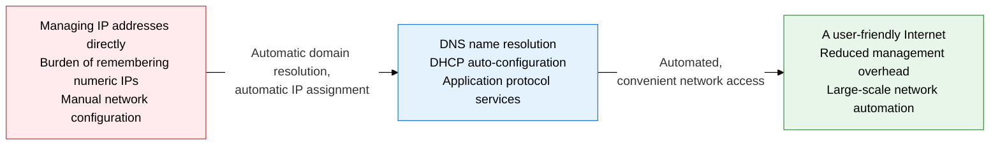
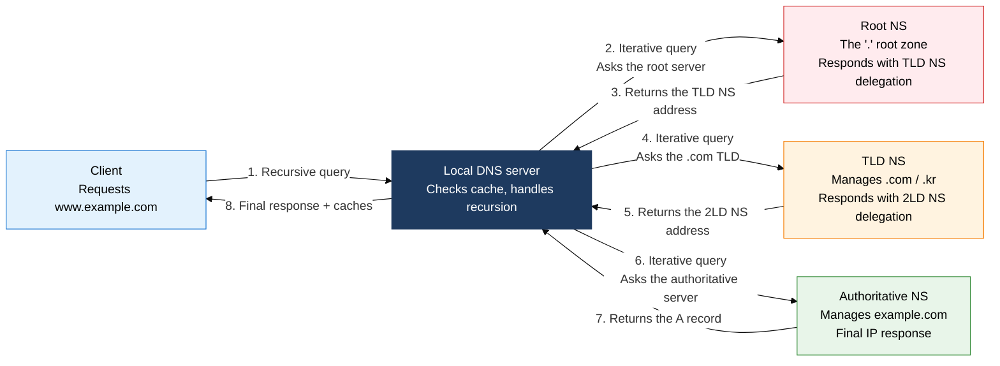

**Domain Name System / Dynamic Host Configuration Protocol**

## 1. Realizing Network Convenience Through Domain Resolution and Automatic Address Assignment — Overview of DNS/DHCP

**Definition**: DNS is a distributed hierarchical database system that translates domain names into IP addresses, and DHCP is a protocol that automatically assigns an IP address, subnet mask, gateway, and DNS server to a device connecting to the network.
- DNS distributes domain information worldwide across a hierarchy of Root → TLD → second-level domain → hostname, and reduces query load through TTL (Time To Live)-based caching.
- DHCP performs lease-based address assignment through a broadcast-based 4-stage DORA (Discover-Offer-Request-Acknowledge) exchange.
- Key application protocols (SMTP, FTP, SNMP, etc.) tie into L4 port numbers, providing an independent communication channel per application service.

**Characteristics**:
- **Distributed, hierarchical structure**: Separates roles among Root NS (13 clusters), TLD NS, and Authoritative NS, forming a global name-resolution infrastructure with no single point of failure.
- **Dual query modes**: Combines recursive queries (client-to-Local DNS) with iterative queries (Local DNS-to-upper NS) to perform efficient name resolution while minimizing client load.
- **Dynamic address management**: DHCP manages limited IP resources efficiently by reusing an address pool based on lease time, and a Relay Agent lets a single DHCP server be shared across different subnets.

---

## 2. Core Structure of DNS/DHCP

### A. The DNS Hierarchy and How Queries Work

The DNS name resolution process is a dual-query structure: the client sends a recursive query to the Local DNS server, and the Local DNS server performs iterative queries — Root NS → TLD NS → Authoritative NS — on the client's behalf. The cache lookup order is **browser cache → OS DNS cache (including the hosts file) → Local DNS cache → start a recursive query**. Cached responses are reused until the TTL expires, greatly reducing the load on the Root NS. DNS over HTTPS (DoH) and DNS over TLS (DoT) are security extensions that encrypt DNS queries to prevent eavesdropping and tampering attacks.

**DNS security threats and countermeasures**: DNS Cache Poisoning is an attack where an attacker injects a forged DNS response into the Local DNS cache to redirect users to a malicious site. **DNSSEC (DNS Security Extensions)** adds a digital signature (RRSIG) to DNS records and verifies response integrity through a public-key-based chain of trust (DNSKEY, DS records). A DNS Amplification attack is a DDoS amplification attack that triggers a large response from a small query; it is defended against by restricting ANY queries and applying Response Rate Limiting (RRL).

| DNS record | Purpose | Example |
|---|---|---|
| **A** | Maps a domain to an IPv4 address | `www.example.com → 93.184.216.34` |
| **AAAA** | Maps a domain to an IPv6 address | `www.example.com → 2606:2800:220:1:248:1893:25c8:1946` |
| **CNAME** | Links a domain alias to the canonical domain | `blog.example.com → example.github.io` |
| **MX** | Designates a domain's mail server | `example.com MX mail.example.com (priority 10)` |
| **NS** | Designates a domain's authoritative name server | `example.com NS ns1.example.com` |
| **PTR** | Reverse lookup from an IP address to a domain | `34.216.184.93.in-addr.arpa → www.example.com` |
| **SOA** | Zone authority information (Serial, Refresh, Retry, Expire, TTL) | `example.com SOA ns1.example.com admin.example.com 2024010101 3600 900 604800 300` |
| **TXT** | Arbitrary text data (SPF, DKIM, domain ownership verification) | `example.com TXT "v=spf1 include:_spf.google.com ~all"` |

---

### B. The DHCP DORA Procedure and Key Application Protocols

```mermaid
%%{init: { 'theme': 'base', 'themeVariables': { 'edgeLabelBackground': '#fff' }}}%%
flowchart LR
    D["Discover<br/>Broadcast<br/>255.255.255.255<br/>UDP 67/68"] --"DHCP Offer"--> O["Offer<br/>DHCP server responds<br/>Candidate IP, lease time,<br/>includes gateway, DNS"]
    O --"DHCP Request"--> R["Request<br/>Client selects,<br/>rebroadcasts,<br/>notifies other servers"]
    R --"DHCP ACK"--> A["Acknowledge<br/>Server confirms response<br/>Lease begins<br/>Lease Time applied"]
    A --"Renews before lease expires"--> RN["Renew/Rebind<br/>Renews at 50% of lease<br/>Unicast re-request"]
    RN --> A

    style D fill:#FFEBEE,stroke:#D32F2F,color:#000
    style O fill:#FFF3E0,stroke:#F57C00,color:#000
    style R fill:#E3F2FD,stroke:#1976D2,color:#000
    style A fill:#E8F5E9,stroke:#388E3C,color:#000
    style RN fill:#F3E5F5,stroke:#7B1FA2,color:#000
```

The 4 DHCP DORA stages: **Discover (broadcast)** → **Offer (server proposal)** → **Request (client request)** → **Acknowledge (server confirmation)**. Because the client doesn't know its own IP the first time it joins the network, it broadcasts the Discover message with source IP 0.0.0.0 and destination IP 255.255.255.255. A DHCP Relay Agent converts the broadcast into unicast and forwards it to a remote DHCP server, so a separate DHCP server is not needed on every subnet. The lease is renewed via Renew once 50% of the lease period has elapsed, or via Rebind at 87.5%.

**FTP Active vs. Passive mode**: In Active mode, the client sends a PORT command over the control channel (21), and the server attempts to connect to the client on the data channel (20). Because a firewall may block the server's outbound connection, **Passive mode** is recommended. In Passive mode, the client sends a PASV command, the server opens a temporary port, and the client connects to that port.

**SNMPv3 security enhancements**: SNMPv1/v2c authenticate with a Community String, a plaintext method with known vulnerabilities. SNMPv3 provides MD5/SHA authentication and DES/AES encryption through USM (User-based Security Model), and implements fine-grained, OID-level access control through VACM (View-based Access Control Model).

| Protocol | Port | Transport layer | Key characteristics | Secure version |
|---|---|---|---|---|
| **SMTP** | 25 (server-to-server) / 587 (submission) | TCP | Mail transfer protocol, supports STARTTLS upgrade, relay/recipient verification | SMTPS (465, TLS required) |
| **FTP** | 21 (control) / 20 (data) | TCP | Separates control and data channels, Active (server→client) / Passive (client→server) modes | FTPS (TLS), SFTP (SSH-based) |
| **SNMP** | 161 (agent) / 162 (trap) | UDP | Monitors/configures network devices via the MIB (Management Information Base)/OID hierarchy | SNMPv3 (authentication + encryption) |
| **DNS** | 53 | UDP (normal) / TCP (zone transfer) | Recursive/iterative queries, TTL caching, zone transfer (AXFR) uses TCP | DoH (443), DoT (853) |
| **DHCP** | 67 (server) / 68 (client) | UDP | 4-stage DORA automatic IP assignment, Relay Agent support, DHCPv6 (for IPv6) | DHCPv6+SLAAC combination |

---

## 3. Expected Benefits and Practical Applications of DNS/DHCP

| Category | Key benefits | Practical applications |
|---|---|---|
| **Operational automation** | DHCP-based automatic IP assignment removes manual configuration errors, automating large-scale device onboarding | In an enterprise environment, combine DHCP with 802.1X to identify connecting devices and auto-assign VLANs |
| **Strengthened security** | DNSSEC prevents DNS response forgery (DNS spoofing, cache poisoning); DoH/DoT encrypt DNS queries | In a Zero Trust environment, deploy DNS filtering (Cisco Umbrella, Cloudflare Gateway) to block malicious domains |
| **Service continuity** | DNS TTL tuning and multi-NS configuration enable fast failover during an outage; DHCP redundancy (active-standby) ensures high availability for address assignment | Automatic failover based on AWS Route 53 Health Check; server redundancy via the DHCP Failover Protocol |
| **Network visibility** | Monitors device status via SNMP MIB/OID; DHCP lease logs trace device connection history | Real-time network device monitoring via Zabbix/Nagios SNMP polling; detect unauthorized devices through SIEM integration |

---

> **Exam points**
> - Be able to precisely explain the role split between DNS recursive queries (client-Local DNS) and iterative queries (Local DNS-upper NS).
> - Understand the destination IP (broadcast/unicast), port numbers (67/68), and Relay Agent operation at each DHCP DORA stage.
> - Be able to distinguish the purpose and example of each DNS record type (A, AAAA, CNAME, MX, NS, PTR, SOA, TXT).
> - Be able to explain the difference between FTP Active and Passive mode, and why Passive mode is needed in a firewall environment.
> - Be able to compare the security level difference between SNMPv1/v2c and SNMPv3 (community string vs. USM authentication/encryption).
> - Understand the DNSSEC chain of trust (RRSIG, DNSKEY, DS records) structure and how it defends against cache poisoning.

---

### Reference: DNS Query Type Comparison

| Category | Recursive Query | Iterative Query |
|---|---|---|
| **Initiator** | Client → Local DNS | Local DNS → Root/TLD/Auth NS |
| **Server role** | Returns only the final answer or an error | Returns the address of the next NS to consult (delegation) |
| **Load location** | The Local DNS server bears the full resolution burden | The Root NS keeps minimal load |
| **Cache use** | Checks the Local DNS cache first | Each stage applies its cache independently |
