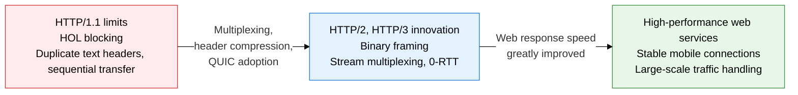
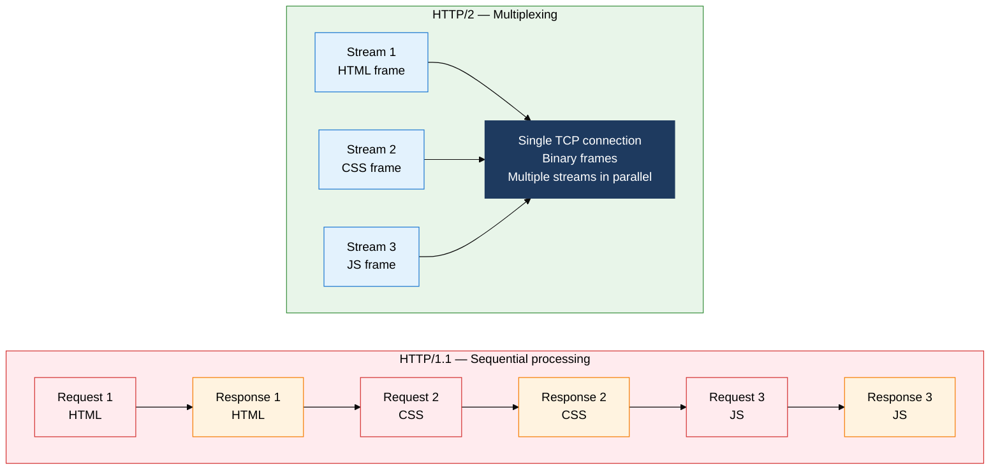

**HyperText Transfer Protocol — HTTP/1.1 → HTTP/2 → HTTP/3(QUIC)**

## 1. Overview of HTTP Protocol Generational Innovation to Overcome Web Performance Limits

**Definition**: HTTP is an application-layer protocol for transferring hypertext documents between client and server. From HTTP/1.1 to HTTP/3, it evolved by generation to resolve HOL blocking, reduce connection overhead, and build in security.
- HTTP/1.1 introduces persistent connections with Keep-Alive, but carries HOL blocking from strict request-response ordering and repeated header transmission.
- HTTP/2 uses binary framing and stream-based multiplexing to achieve application-level parallel transfer, though TCP-level HOL blocking remains.
- HTTP/3 runs on the UDP-based QUIC protocol, fully resolving TCP's structural HOL blocking and supporting 0-RTT connections.

**Characteristics**:
- **Staged performance evolution**: Each generation resolves a structural limit at the transport layer — HTTP/1.1 (text, sequential) → HTTP/2 (binary, parallel) → HTTP/3 (QUIC, 0-RTT).
- **Header compression innovation**: HTTP/2's HPACK compresses headers with static and dynamic tables, cutting repeated-transfer overhead by more than 80%; HTTP/3's QPACK delivers the same function while preserving QUIC stream independence.
- **Optimized connection setup**: HTTP/2 needs 2-3 RTTs for the TCP+TLS handshake, while HTTP/3's QUIC minimizes connection latency with 1-RTT on first connect and 0-RTT on reconnect.

---

## 2. Core Structure of the HTTP Protocol

### A. HTTP/1.1 Limits and the HTTP/2 Multiplexing Innovation

The core innovation of HTTP/2 is the **binary framing layer**. It splits every HTTP message into fixed-size binary frames and interleaves multiple streams over a single TCP connection. A stream is a logical unit of bidirectional byte flow, a message maps to one request or response, and a frame is the smallest unit of transfer. **Server Push** lets the server proactively send resources it expects the client to need, without a client request, using the PUSH_PROMISE frame.

| Comparison | HTTP/1.1 | HTTP/2 |
|---|---|---|
| **Connection model** | New connection per request, or reused Keep-Alive | Multiple streams in parallel over a single TCP connection |
| **Wire format** | Text-based (ASCII) | Binary framing (fixed-size frames) |
| **Header handling** | Full headers resent on every request | HPACK static/dynamic tables compress duplicate headers |
| **HOL blocking** | Occurs at both application and TCP level | Resolved at application level (still present at TCP level) |
| **Server capability** | Can only respond to requests | Server Push (PUSH_PROMISE) sends resources proactively |
| **Performance gain** | Baseline | Page load cut by roughly 50-80% |

---

### B. HTTP/3 — The QUIC-Based Next-Generation Transport Protocol

```mermaid
%%{init: { 'theme': 'base', 'themeVariables': { 'edgeLabelBackground': '#fff' }}}%%
flowchart LR
    subgraph STACK["Protocol stack comparison"]
        direction LR
        subgraph S1["HTTP/2 stack"]
            direction TB
            A1["HTTP/2"] --> A2["TLS 1.3"] --> A3["TCP"] --> A4["IP"]
        end
        subgraph S2["HTTP/3 stack"]
            direction TB
            B1["HTTP/3"] --> B2["QUIC (TLS built in)"] --> B3["UDP"] --> B4["IP"]
        end
    end
    subgraph FEAT["Core QUIC features"]
        direction TB
        F1["0-RTT connection resumption<br/>Uses cached session ticket"] --> F2["Independent stream multiplexing<br/>Fully resolves TCP HOL blocking"]
        F2 --> F3["Connection migration<br/>Keeps the connection when IP changes"]
        F3 --> F4["Built-in TLS 1.3<br/>No separate handshake needed"]
    end

    style A1 fill:#E3F2FD,stroke:#1976D2,color:#000
    style A2 fill:#F3E5F5,stroke:#7B1FA2,color:#000
    style A3 fill:#FFF3E0,stroke:#F57C00,color:#000
    style A4 fill:#E8F5E9,stroke:#388E3C,color:#000
    style B1 fill:#E3F2FD,stroke:#1976D2,color:#000
    style B2 fill:#1E3A5F,stroke:#1E3A5F,color:#fff
    style B3 fill:#FFEBEE,stroke:#D32F2F,color:#000
    style B4 fill:#E8F5E9,stroke:#388E3C,color:#000
    style F1 fill:#E3F2FD,stroke:#1976D2,color:#000
    style F2 fill:#E8F5E9,stroke:#388E3C,color:#000
    style F3 fill:#FFF3E0,stroke:#F57C00,color:#000
    style F4 fill:#F3E5F5,stroke:#7B1FA2,color:#000
    style S1 fill:#FFF3E0,stroke:#F57C00,color:#000
    style S2 fill:#E8F5E9,stroke:#388E3C,color:#000
    style STACK fill:#F5F5F5,stroke:#9E9E9E,color:#000
    style FEAT fill:#E3F2FD,stroke:#1976D2,color:#000
```

QUIC (Quick UDP Internet Connections) is a UDP-based transport protocol designed by Google and standardized by the IETF as RFC 9000. It implements TCP-style connection-oriented reliability in user space and integrates TLS 1.3 directly into the protocol, eliminating a separate TLS handshake. Connection identification by **Connection ID** enables Connection Migration, which keeps an existing connection alive even when the client's IP address changes (for example, switching from Wi-Fi to LTE). In HTTP/3, each stream is handled as an independent QUIC stream, so packet loss on one stream does not affect the others — resolving TCP-level HOL blocking at its root.

| Comparison | HTTP/1.1 | HTTP/2 | HTTP/3 |
|---|---|---|---|
| **Underlying transport** | TCP | TCP | QUIC (UDP) |
| **HOL blocking** | Occurs at application + TCP level | Remains at TCP level | Fully resolved |
| **Connection setup** | TCP (1-RTT) + TLS (1-2 RTT) | TCP (1-RTT) + TLS (1 RTT) | QUIC 1-RTT, 0-RTT on reconnect |
| **Header compression** | None | HPACK | QPACK |
| **TLS integration** | Separate layer | Separate layer | Built into QUIC (mandatory) |
| **Signature feature** | Keep-Alive | Multiplexing, Server Push | Connection Migration, 0-RTT |

---

## 3. Expected Benefits and Practical Applications of HTTP Protocol Evolution

| Category | Key Benefits | Practical Applications |
|---|---|---|
| **Performance and responsiveness** | HTTP/2 multiplexing removes HOL blocking, cutting page load time by more than 50% | Enable HTTP/2 on Nginx/Apache; enable HTTP/3 support on CDNs (Cloudflare, AWS CloudFront) to improve response times for global services |
| **Network efficiency** | HPACK/QPACK header compression cuts repeated header traffic by 80%, saving bandwidth | Apply HTTP/2 to mobile API servers; run efficient microservice-to-microservice communication over gRPC (HTTP/2-based) |
| **Mobility** | QUIC Connection Migration keeps streaming or calls alive across IP changes without re-establishing the connection | Apply QUIC/HTTP/3 to video conferencing (Zoom, Google Meet) and mobile streaming apps to prevent drops during handoff |
| **Built-in security** | Mandatory TLS 1.3 integration in HTTP/3's QUIC guarantees encryption by default and blocks downgrade attacks | ALPN (Application-Layer Protocol Negotiation) automatically selects the HTTP version between server and client and applies the matching security policy |
