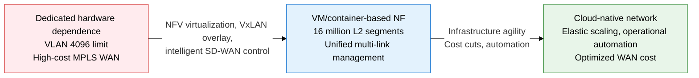
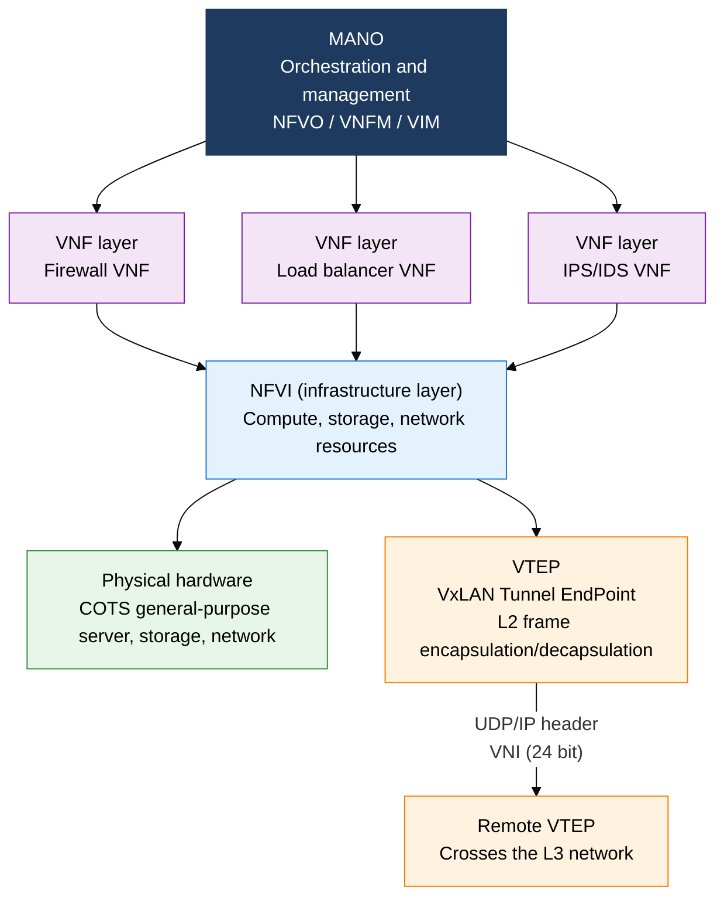
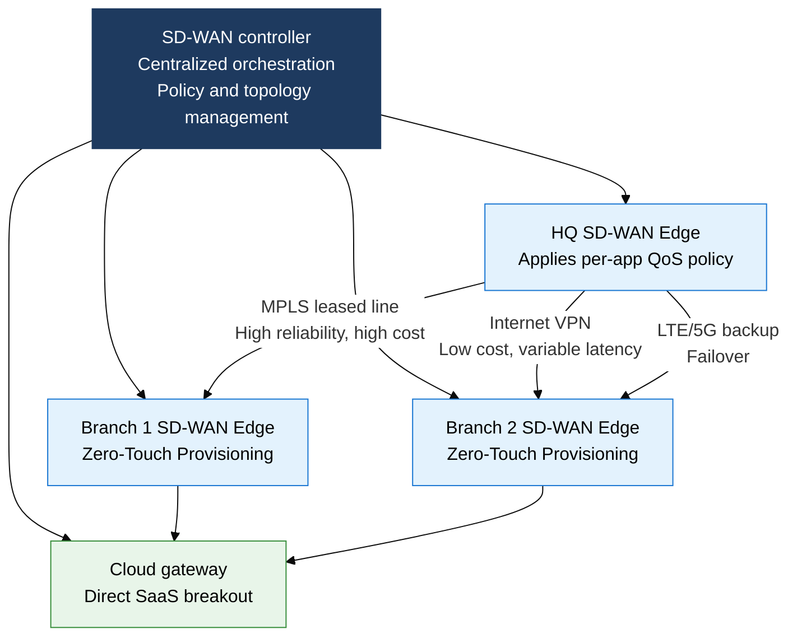

## 1. Overview of NFV, VxLAN, and SD-WAN — Breaking Hardware Dependence, Extending Overlays, and Making the WAN Intelligent

**Definition**: A family of software-defined infrastructure technologies spanning NFV, which separates network functions from dedicated hardware and runs them as VMs/containers on general-purpose servers; VxLAN, which builds an L2 overlay on top of an L3 network; and SD-WAN, which unifies control of multiple WAN links in software.
- NFV is standardized on ETSI's three-layer reference architecture (VNF, NFVI, MANO) and operates as a complement to SDN.
- VxLAN implements up to 16.77 million independent L2 segments using a 24-bit VNI (Virtual Network Identifier) with UDP encapsulation (port 4789).
- SD-WAN unifies control of heterogeneous links — MPLS, internet, LTE — based on per-app QoS, and automates branch rollout with Zero-Touch Provisioning.

**Characteristics**:
- **Function virtualization (NFV)**: Converts physical network functions such as firewalls, routers, and load balancers into VNFs that run on general-purpose COTS servers, so capacity can scale up or down without a hardware refresh
- **Overlay extension (VxLAN)**: Overcomes VLAN's 4,094-segment limit with a 24-bit VNI, enabling L2 connectivity across L3 boundaries to support VM migration between data centers
- **WAN intelligence (SD-WAN)**: Selects the optimal path in real time based on per-app SLA policy (latency, bandwidth, packet loss), breaking cloud traffic out directly instead of routing it through MPLS

---

## 2. Core Structure of NFV, VxLAN, and SD-WAN

### A. NFV Architecture and the VxLAN Overlay

**ETSI NFV MANO's three-layer structure**:

| Component | Role | Key Functions |
|---|---|---|
| **NFVO** | NFV Orchestrator | Service chaining (SFC), end-to-end VNF life-cycle orchestration, global resource optimization |
| **VNFM** | VNF Manager | Creates, scales, heals, and deletes individual VNF instances; deploys based on the VNFD (descriptor) |
| **VIM** | Virtualized Infrastructure Manager | Allocates and monitors NFVI resources (VM, vNet, vStorage) (OpenStack is a leading VIM) |

**VxLAN vs. VLAN comparison**:

| Comparison | VLAN (IEEE 802.1Q) | VxLAN (RFC 7348) |
|---|---|---|
| **Segment count** | Up to 4,094 (12-bit VID) | Up to 16,777,216 (24-bit VNI) |
| **Encapsulation** | 4-byte tag inserted in the Ethernet frame | L2 frame encapsulated in UDP (4789)/IP/Ethernet |
| **L3 boundary** | Cannot cross an L3 router (L2 only) | Can cross an L3 network (overlay tunnel) |
| **Scope** | Within a single data center or campus | Extends across data centers and hybrid clouds |
| **Overhead** | 4 bytes (VLAN tag) | 50 bytes (8-byte VxLAN header + 8-byte UDP + 20-byte IP + 14-byte outer Ethernet) |

> **Comparison with similar overlay technologies**: VxLAN (UDP, RFC 7348, general purpose) vs. NVGRE (GRE, proposed by Microsoft, Hyper-V) vs. STT (TCP-like, legacy compatibility) — VxLAN is the current industry standard and is combined with an EVPN (BGP) control plane to implement distributed gateways.

---

### B. SD-WAN Architecture

**Core SD-WAN functions**:
- **App-aware routing**: Identifies applications with DPI (Deep Packet Inspection), then automatically selects the optimal link based on SLA policy thresholds (latency, jitter, packet loss)
- **Zero-Touch Provisioning (ZTP)**: Branch devices auto-register with the controller and receive their configuration, so new sites can go live without an on-site engineer
- **Link aggregation**: Combines multiple links — MPLS, internet, LTE — in Active-Active mode, failing over in milliseconds via link bonding and packet duplication
- **Integrated security**: Builds NGFW, CASB, and SWG functions into the SD-WAN Edge, or connects to an SSE (Security Service Edge) cloud

**MPLS vs. SD-WAN comparison**:

| Comparison | MPLS WAN | SD-WAN |
|---|---|---|
| **Cost** | Leased-line contract, high bandwidth-upgrade cost (millions of won/month) | Combines internet/LTE, 30-70% cheaper than MPLS |
| **Flexibility** | Configuration changes go through the carrier, taking days to weeks | Controller policy changes apply everywhere instantly |
| **Cloud friendliness** | SaaS traffic also routes through the HQ hub, adding latency | Branches support direct internet breakout for SaaS |
| **Management** | Limited to the carrier's management scope, poor visibility | Single dashboard for full WAN visibility and performance monitoring |
| **Security** | WAN segment isolated, needs extra security appliances | Integrated NGFW/ZTNA/SWG, or linked to an SSE cloud |

> **Major SD-WAN solutions**: Cisco SD-WAN (Viptela), VMware VeloCloud, Fortinet SD-WAN, HPE Aruba EdgeConnect, Palo Alto Prisma SD-WAN — evolving beyond simple WAN optimization toward a SASE (Secure Access Service Edge) architecture.

---

## 3. Expected Benefits and Practical Applications of Adopting NFV, VxLAN, and SD-WAN

| Category | Key Benefits | Practical Applications |
|---|---|---|
| **Infrastructure agility** | Removes months-long dedicated-hardware procurement, completes VNF deployment in minutes, shortens time-to-market for new network services | Automate service chaining on NFVO, deploy CNF (cloud-native NF) on Kubernetes to implement network functions as microservices |
| **Scalability and portability** | VxLAN's 24-bit VNI scales multi-tenant data centers without limit, preserves L2 continuity during VM migration | Build data center fabrics on EVPN-VxLAN, extend a consistent L2 overlay across hybrid and multi-cloud environments |
| **Cost optimization** | Reduces reliance on MPLS leased lines, cuts WAN cost by 30-70% using internet/LTE links, lowers CAPEX | Monitor per-link cost and performance in real time from the SD-WAN controller, improve MPLS bandwidth efficiency with direct SaaS breakout |
| **Operational automation and security** | Cuts network operations headcount with ZTP and centralized policy management, automates security response by inserting a VNF instantly on anomalous traffic | Integrate SD-WAN with SSE in a SASE architecture, wire NFV provisioning APIs into a DevNetOps pipeline to realize network as code |
