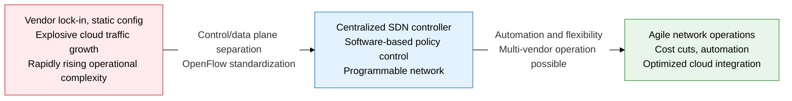
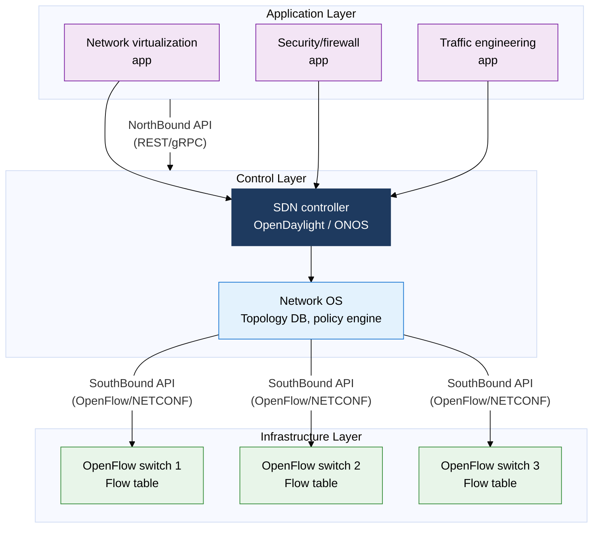
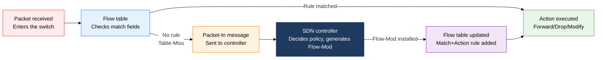

## 1. Overview of SDN — Controlling the Network in Software by Separating Control from Forwarding

**Definition**: A network architecture that separates network control (the control plane) from data forwarding (the data plane), with a centralized SDN controller programmatically controlling the whole network through a standard API (such as OpenFlow).
- Routing and policy-decision logic, once embedded separately in each network device, is separated out into a software controller.
- It realizes hierarchical abstraction through a three-layer structure: application layer (business intent) → control layer (controller) → infrastructure layer (switches/routers).
- It originated from the 2008 OpenFlow paper by Professor McKeown's team at Stanford University and was standardized under the leadership of the ONF (Open Networking Foundation).

**Characteristics**:
- **Control/forwarding separation**: Physically separates the control plane (routing decisions, QoS policy, security rules) from the data plane (packet forwarding, matching, actions), letting each layer evolve independently
- **Centralized control**: The SDN controller sees the entire network topology as a global view and applies consistent policy to every device at once
- **Programmable**: A NorthBound API (REST/gRPC) lets upper-layer applications define network behavior as code, enabling automation and orchestration integration

---

## 2. Core Structure of SDN

### A. The SDN Three-Layer Architecture

| Comparison | Traditional network | SDN |
|---|---|---|
| **Control model** | Distributed control on each device, vendor-specific CLI/API | Centralized control from one controller, standard REST API |
| **Flexibility** | Static configuration, manual per-device changes | Software-defined policy, automated rollout across all devices |
| **Scalability** | Adding a device needs manual configuration and testing | Define a controller policy once, then deploy it automatically |
| **Management** | Distributed device-by-device management, hard to keep consistent | Single network view, centralized unified policy management |
| **Vendor lock-in** | Device, OS, and protocol all vendor-dependent | Multi-vendor support via a standard SouthBound API (OpenFlow) |

> **Major SDN controllers**: OpenDaylight (ODL, Java-based, Linux Foundation), ONOS (Open Network OS, optimized for carriers and large-scale WANs), Ryu (Python, lightweight, research-oriented), Floodlight (Java, open source)

---

### B. How OpenFlow Works

**Flow table components**:
- **Match Fields**: 12 or more fields, including In-Port, Ethernet src/dst MAC, VLAN ID, IP src/dst, L4 port, and IP protocol
- **Priority**: Decides which rule wins when multiple rules match (0-65535, higher takes precedence)
- **Counters**: Statistics on packet count, byte count, and match count
- **Instructions/Actions**: Output (forward to a port), Drop (discard), Modify (rewrite the header), Meter (rate limit), Controller (send to the controller)
- **Timeout**: Hard Timeout (expires at a fixed time), Idle Timeout (expires when idle)

| Type | Direction | Key Messages | Purpose |
|---|---|---|---|
| **Controller→Switch** | Controller to switch | Flow-Mod, Packet-Out, Port-Mod, Stats-Request | Install/modify/delete flow rules, direct packet forwarding, request statistics |
| **Switch→Controller** | Switch to controller | Packet-In, Flow-Removed, Port-Status, Stats-Reply | Forward unmatched packets, report expired rules, report port status changes, reply with statistics |
| **Symmetric** | Bidirectional | Hello, Echo-Request/Reply, Error | Establish and keep the session alive, check connection status, report errors |

> **OpenFlow channel**: Uses TCP port 6633 (older versions) or TLS port 6653 (newer versions) between the controller and switch. OpenFlow 1.3 is currently the most widely deployed version, supporting multiple tables, metering, and IPv6.

---

## 3. Expected Benefits and Practical Applications of Adopting SDN

| Category | Key Benefits | Practical Applications |
|---|---|---|
| **Operational automation** | Removes manual CLI configuration, cuts policy-change time from days to minutes, minimizes human error | Integrate the SDN REST API with Ansible/Terraform, fold network provisioning into a CI/CD pipeline |
| **Cloud integration** | Network policy moves automatically with VM migration, enables logical multi-tenant isolation | Connect the SDN controller with OpenStack Neutron/VMware NSX, extend hybrid clouds with an overlay network |
| **Stronger security** | Detects anomalous traffic in real time and rolls out a block rule globally from the controller at once, making Zero Trust easier to implement | Integrate a security analytics platform (SIEM) with the NorthBound API, auto-generate a Flow-Mod that isolates an infected host |
| **Traffic optimization** | Computes optimal paths from a global topology view, centralizes control of ECMP and load balancing | Optimize East-West traffic in the data center, automate traffic engineering (TE) by combining SDN with SR-MPLS/Segment Routing |
