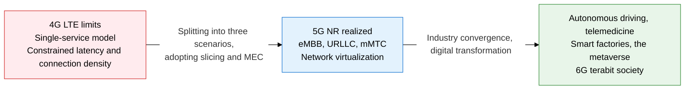
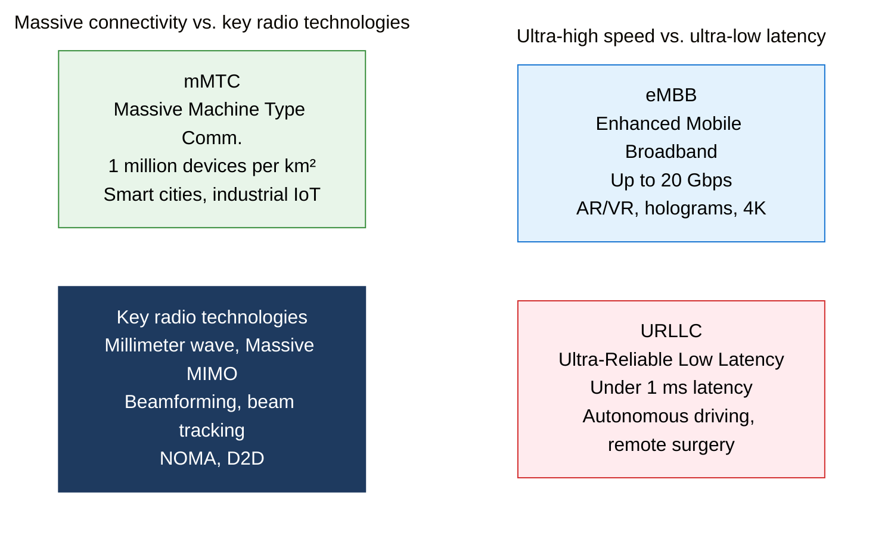
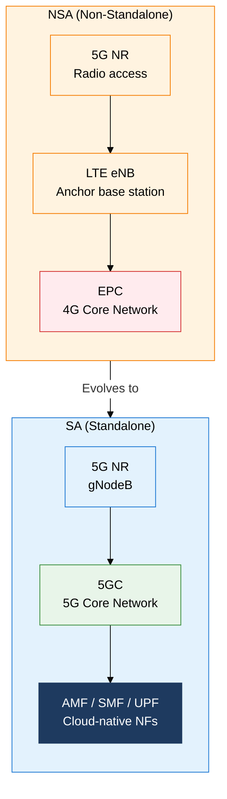

## 1. Overview of 5G/6G Mobile Communications — 5G's Core Technology for Ultra-High Speed, Ultra-Low Latency, and Massive Connectivity

**Definition**: The fifth-generation mobile standard defined by ITU-R IMT-2020, delivering ultra-high speed, ultra-low latency, and massive connectivity by using network slicing to separate three scenarios — eMBB, URLLC, and mMTC — on a single radio infrastructure.
- 3GPP Release 15 (2018) established the 5G NR (New Radio) standard, which continues to evolve through Releases 17/18
- Uses two frequency ranges: FR1 (Sub-6GHz, 450 MHz-7.125 GHz) and FR2 (mmWave, 24.25-52.6 GHz)
- The 5GC (5G Core), built on network virtualization (SDN/NFV), is implemented as a cloud-native microservices architecture

**Characteristics**:
- **Parallel support for three scenarios**: Network slicing separates QoS for eMBB (ultra-high speed), URLLC (ultra-low latency), and mMTC (massive connectivity), guaranteeing an SLA optimized per service on one physical infrastructure
- **Cloud-native core**: The 5GC is broken into NF (Network Function) microservices that scale and update independently, and integrates fully with NFV/SDN
- **mmWave massive MIMO**: Hundreds of antennas perform beamforming for spatial multiplexing in millimeter-wave bands (such as 28 GHz), maximizing frequency-resource density and dramatically increasing capacity per unit area

---

## 2. Core Structure of 5G/6G Mobile Communications

### A. 5G's Three Core Scenarios and Its Key Radio Technologies

| Scenario | Goal | Peak Speed | Latency | Connection Density | Key Applications |
|---|---|---|---|---|---|
| **eMBB** | Ultra-high-speed data service | 20 Gbps down / 10 Gbps up | 4 ms | Moderate | AR/VR, holograms, 4K/8K streaming, cloud gaming |
| **URLLC** | Ultra-low latency, high reliability | Hundreds of Mbps | Under 1 ms / 99.9999% reliability | Medium | Autonomous driving, remote surgery, smart-grid control, industrial automation |
| **mMTC** | Massive device connectivity | Tens of kbps to a few Mbps | Latency of a few seconds acceptable | 1 million devices per km² | Smart meters, environmental sensors, agricultural IoT, smart cities |

**Key radio technologies in detail**

- **Millimeter wave (mmWave)**: Uses high-frequency bands such as 28 GHz and 39 GHz to secure wide bandwidth. Highly directional with weak diffraction, requiring dense deployment of low-power small cells
- **Massive MIMO**: A base station with 64-256+ antenna elements sends independent spatial streams to many users simultaneously. 3D beamforming controls both vertical and horizontal directions
- **Beamforming**: Adjusts the phase difference across the antenna array to focus radio energy in a specific direction, improving received SNR and reducing interference
- **Beam Tracking**: Tracks and switches beam direction in real time as a mobile device's position changes, solving mmWave's mobility problem

---

### B. 5G's Core Infrastructure Technologies (Slicing, MEC), NSA/SA Architecture, and the 6G Outlook

**Network Slicing**
- Logically divides a single physical infrastructure with SDN/NFV, giving each slice its own independent QoS, security, and isolation
- Runs an eMBB slice (high bandwidth), a URLLC slice (latency-priority), and an mMTC slice (massive connections) on the same base station
- E2E slicing: manages a vertically integrated slice from RAN (radio access network) → transport network → core network

**MEC (Multi-Access Edge Computing)**
- Places compute resources near the base station or aggregation equipment for local processing without a round trip to the core network
- The key infrastructure that brings URLLC round-trip latency below 1 ms
- The mobile edge cloud (MEC server) performs AR rendering, autonomous-driving decisions, and real-time video analysis

| Category | NSA (Non-Standalone) | SA (Standalone) |
|---|---|---|
| **Radio access** | 5G NR + LTE dual connectivity | 5G NR only |
| **Core network** | 4G EPC (existing core) | 5GC (5G-dedicated core) |
| **Deployment purpose** | Leverages existing LTE investment, fast initial rollout | Full 5G functionality |
| **Slicing** | Not supported | Fully supported |
| **URLLC** | Limited | Fully supported |
| **Evolution path** | Early stage of 5G rollout | Target for mature 5G |

**5G vs. 6G comparison**

| Category | 5G (IMT-2020) | 6G (IMT-2030 outlook) |
|---|---|---|
| **Peak speed** | 20 Gbps | 1 Tbps (target) |
| **Latency** | 1 ms | Under 0.1 ms |
| **Frequency** | Sub-6GHz / mmWave (up to 100 GHz) | Terahertz (THz, 0.1-10 THz) |
| **Core technology** | Massive MIMO, slicing, MEC | AI-native, NTN satellite convergence, RIS |
| **Connection density** | 1 million devices/km² | 10 million devices/km² |
| **Role of AI** | Partially applied (automation) | AI-native (built into the design) |

**6G's key emerging technologies**
- **Terahertz (THz) band**: Uses 0.1-10 THz for terabit-class transfer, requiring ultra-small cells only tens of meters across
- **RIS (Reconfigurable Intelligent Surface)**: Software-controlled reflecting surfaces optimize the radio path and eliminate coverage dead zones
- **NTN (Non-Terrestrial Network)**: Full convergence of low-earth-orbit (LEO) satellites with terrestrial 5G/6G networks for global coverage
- **AI-native**: Builds AI into the network itself to perform autonomous optimization, self-healing, and predictive resource management

---

## 3. Expected Benefits and Practical Applications of Adopting 5G/6G Mobile Communications

| Category | Key Benefits | Practical Applications |
|---|---|---|
| **Industrial digital transformation** | eMBB's 20 Gbps ultra-high speed enables AR/VR collaboration and holographic meetings, accelerating wireless automation in smart factories | Build a 5G private network (NPN) for manufacturing, run real-time video quality inspection over MEC, control wireless AGVs and robots remotely |
| **Public safety and healthcare** | URLLC's 1 ms ultra-low latency supports remote surgery, real-time disaster-scene video transmission, and reliable emergency drone communication | Build a 5G private network inside hospitals, run an ambulance remote-diagnosis system, deploy temporary 5G base stations for disaster response |
| **Smart cities and IoT** | mMTC's 1-million-devices-per-km² density unifies a city-wide sensor network for real-time energy, traffic, and environmental monitoring | Remotely manage smart parking and smart lighting, run water/power AMI (advanced metering infrastructure), monitor air quality in real time |
| **Preparing for 6G** | THz-band Tbps-class transfer enables an immersive XR and holographic society, and an AI-native autonomous network cuts operating cost | Build an early 6G testbed, review satellite-terrestrial integrated network designs, adopt AI-driven RAN intelligence (O-RAN) |
