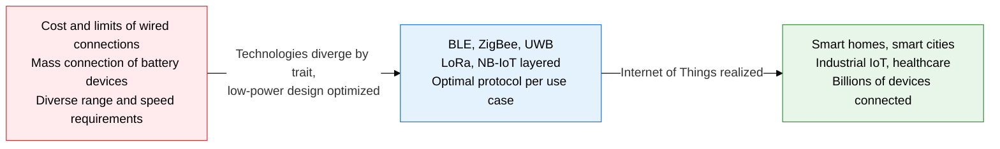
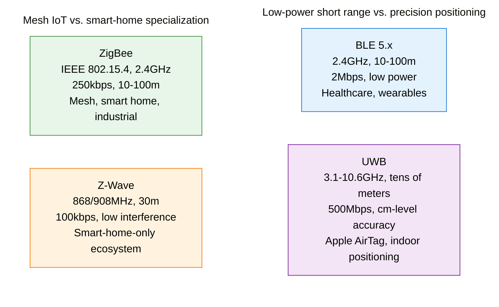
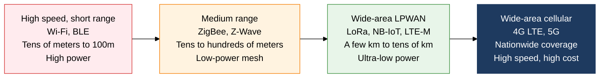
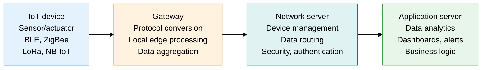

## 1. Overview of Short-Range Wireless Communication and IoT Networks — IoT Wireless Technology That Connects Things at Low Power and Low Cost



**Definition**: A collection of wireless communication protocols, each optimized for a different transfer range, speed, power draw, and frequency, that connect battery-powered devices at low power and low cost — a layered IoT connectivity ecosystem spanning short range (a few to a few hundred meters) to wide area (tens of kilometers).
- Transfer range and data rate trade off against each other, so choosing the right technology for the use case (wearables, smart home, industrial, agriculture, etc.) is the key decision
- Broadly split into short-range wireless (BLE, ZigBee, Z-Wave, UWB) and LPWAN (LoRa, NB-IoT, LTE-M), which divide responsibility by coverage and data characteristics
- The IoT architecture collects, processes, and delivers data through a four-layer structure: device → gateway → network server → application server

**Characteristics**:
- **Low-power design first**: Built to run for years on a coin-cell battery, with power-management techniques such as sleep cycles, duty cycles, and TWT baked into the core of the technology's design
- **Mesh network support**: ZigBee, Z-Wave, and BLE Mesh extend coverage with a self-healing mesh topology that routes around gaps in direct communication through relay nodes
- **Split between licensed and unlicensed bands**: BLE, ZigBee, and LoRa use unlicensed ISM bands, while NB-IoT and LTE-M use a carrier's licensed spectrum, giving each a different QoS guarantee and cost structure

---

## 2. Core Structure of Short-Range Wireless Communication and IoT Networks

### A. Short-Range Wireless Technologies (BLE, ZigBee, Z-Wave, UWB)



**Short-range wireless technologies in detail**

- **BLE (Bluetooth Low Energy)**: A low-power profile split off from Bluetooth 4.0. Broadcasts in Advertising mode; communicates 1:1 in Connection mode. Runs for years on a coin-cell battery, and is the standard connectivity technology for healthcare devices such as smartwatches, thermometers, and glucose meters.
- **ZigBee (IEEE 802.15.4)**: A low-speed mesh network based on the 2.4 GHz ISM band. Three-layer structure of one coordinator, routers, and end devices. Supports up to 65,000 nodes; the Zigbee Alliance (now the CSA) leads its evolution toward the Matter standard.
- **Z-Wave**: Uses the unlicensed 868 MHz (Europe) / 908 MHz (US) band to avoid 2.4 GHz congestion. Based on the ITU-T G.9959 standard. Low interference gives it high reliability, and it supports up to 232 nodes. A smart-home-only ecosystem led by Silicon Labs.
- **UWB (Ultra-Wideband)**: An impulse radio technology using more than 500 MHz of ultra-wide bandwidth. Achieves 10-30 cm positioning accuracy via time-of-flight (ToF) measurement even in multipath environments. Apple (AirDrop, AirTag), Samsung, and NXP lead commercialization.

| Technology | Frequency | Range | Data Rate | Power Consumption | Key Uses |
|---|---|---|---|---|---|
| **BLE 5.x** | 2.4GHz | 10-100m (Long Range: 400m) | Up to 2Mbps | Very low (a few mW) | Wearables, healthcare, beacons, smart locks |
| **ZigBee** | 2.4GHz / 868/915MHz | 10-100m (mesh-extended) | 250kbps | Low | Smart-home automation, industrial sensor networks, smart lighting |
| **Z-Wave** | 868/908MHz | 30m (100m+ with mesh) | 100kbps | Low | Smart home only (door locks, lighting, energy management) |
| **UWB** | 3.1-10.6GHz | 10-50m | 27-500Mbps | Medium | Indoor precision positioning, lost-item tracking, secure access control |

---

### B. LPWAN IoT Technologies (LoRa, NB-IoT, LTE-M)



**Core LPWAN (Low Power Wide Area Network) technologies**

- **LoRa (Long Range)**: Uses Semtech's proprietary CSS (Chirp Spread Spectrum) modulation. The spreading factor (SF) can be tuned from SF7 (fast, short range) to SF12 (slow, long range). Signals with different SFs on the same channel can be received simultaneously thanks to orthogonality.

  ```
  SF7 -> up to 5.5kbps, ~2km range
  SF12 -> up to 250bps, ~15km range (with line of sight)
  ```

- **LoRaWAN**: The MAC-layer standard that sits on top of the LoRa PHY, managed by the LoRa Alliance. Three device classes: Class A (device-initiated uplink), Class B (scheduled downlink), and Class C (always receiving). Three-layer structure of gateway → network server → app server.

- **NB-IoT (Narrowband IoT)**: Defined in 3GPP Release 13 (2016). Uses a 180 kHz narrow band within LTE spectrum. Deployable as a software upgrade to a carrier's existing cell towers. Deep indoor coverage (164 dBm MCL) and 10+ year battery life via PSM and eDRX.

- **LTE-M (LTE-MTC)**: 3GPP Release 13. 1.4 MHz bandwidth. Faster (1Mbps), supports mobility, and supports Voice compared with NB-IoT. Well suited to IoT use cases that need mobility, such as wearables and asset tracking.

**IoT network architecture**



| Category | LoRa / LoRaWAN | NB-IoT | LTE-M |
|---|---|---|---|
| **Frequency band** | Sub-GHz unlicensed (920MHz, etc.) | Licensed LTE band | Licensed LTE band |
| **Bandwidth** | 125/250/500kHz | 180kHz | 1.4MHz |
| **Peak speed** | 5.5kbps (SF7) | 250kbps (downlink) | 1Mbps |
| **Coverage** | 2-15km (with line of sight) | A few km (deep indoor penetration) | A few km |
| **Battery life** | 10+ years possible | 10+ years (PSM) | Several years (PSM/eDRX) |
| **Mobility** | Limited (low speed) | Limited | Supported (up to 100km/h) |
| **Cost structure** | Unlicensed (self-built gateway) | Carrier monthly fee | Carrier monthly fee |
| **Key uses** | Smart meters, agricultural/environmental IoT | Smart meters, parking, trackers | Wearables, asset tracking, remote metering |

---

## 3. Expected Benefits and Practical Applications of Adopting Short-Range Wireless Communication and IoT Networks

| Category | Key Benefits | Practical Applications |
|---|---|---|
| **Smart homes and buildings** | BLE, ZigBee, and Z-Wave integration gives unified control of lighting, locks, and energy devices, improving occupant convenience and energy efficiency by 15-30% | Build a multi-vendor smart-home platform on the Matter standard, adopt a BACnet/Zigbee-integrated BMS (building management system) |
| **Industrial and logistics IoT** | Self-build a full factory or warehouse sensor network with LoRaWAN (unlicensed), reach 99%+ inventory-tracking accuracy with UWB precision positioning | Vibration/temperature sensor networks for predictive maintenance in smart factories, real-time UWB asset tracking in warehouses, high-precision AGV navigation |
| **Smart cities and agriculture** | Remote metering and environmental monitoring over the nationwide cellular network with NB-IoT, irrigation and weather data collection with LoRa agricultural IoT | Nationwide rollout of AMI (advanced metering infrastructure), smart-parking and air-quality monitoring systems, precision-agriculture drone-sensor integration |
| **Healthcare and wearables** | Real-time vital-sign monitoring with BLE-based medical wearables, extended battery life enables continuous wear | Real-time patient vital-monitoring systems in hospitals, fall-detection devices for elder care, sports-performance analysis devices |
