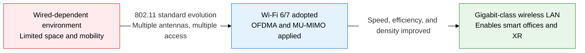
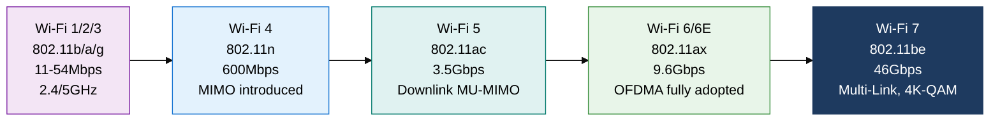
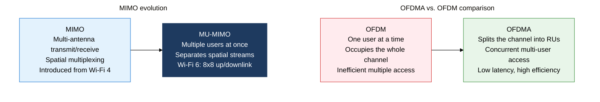

## 1. Overview of Wireless LAN Technology Standards — Maximizing Wireless Bandwidth and Efficiency Through 802.11 Standard Evolution

**Definition**: A wireless LAN technology defined by the IEEE 802.11 family of standards — a short-range wireless communication standard that maximizes transfer speed and spectral efficiency through generational advances in frequency band, modulation scheme, and multiple-access technique.
- Uses three frequency bands — 2.4 GHz, 5 GHz, and 6 GHz — with channel width and modulation improving with each generation
- The Wi-Fi Alliance provides consumer visibility through branding (Wi-Fi 4/5/6/6E/7) and performs interoperability certification
- Avoiding interference in dense deployments and serving many concurrent users are the core challenges of the latest generations

**Characteristics**:
- **Speed evolution by generation**: Speed grows roughly 4,000-fold, from 11 Mbps on 802.11b to 46 Gbps on 802.11be (Wi-Fi 7), with modulation scheme (BPSK → QAM-4096) and channel bonding acting as the key performance levers each generation
- **Multiple-access innovation**: The shift from OFDM (single user) to OFDMA (concurrent multi-user access) dramatically cuts latency and collisions in dense environments, while MU-MIMO uses spatial streams in parallel
- **Frequency diversification**: Wi-Fi 6E opens the new 6 GHz band (1.2 GHz wide) to relieve channel congestion, and Wi-Fi 7's Multi-Link Operation uses the 2.4/5/6 GHz bands at the same time

---

## 2. Core Structure of Wireless LAN Technology Standards

### A. IEEE 802.11 Standard Evolution and Wi-Fi Generations

| Wi-Fi Generation | Standard | Frequency | Peak Speed | Core Technology |
|---|---|---|---|---|
| **Wi-Fi 4** | IEEE 802.11n (2009) | 2.4 / 5GHz | 600Mbps | MIMO, channel bonding (40MHz), STBC |
| **Wi-Fi 5** | IEEE 802.11ac (2013) | 5GHz | 3.5Gbps | MU-MIMO (downlink), 80/160MHz, 256-QAM |
| **Wi-Fi 6** | IEEE 802.11ax (2019) | 2.4 / 5GHz | 9.6Gbps | OFDMA, MU-MIMO (up/downlink), BSS Coloring, TWT |
| **Wi-Fi 6E** | 802.11ax extension (2021) | 2.4 / 5 / 6GHz | 9.6Gbps | 6GHz band added, 1.2GHz channel width |
| **Wi-Fi 7** | IEEE 802.11be (2024) | 2.4 / 5 / 6GHz | 46Gbps | Multi-Link Operation, 4096-QAM, 320MHz |

**Frequency band characteristics compared**

| Band | Coverage | Channel Count | Interference | Best Suited For |
|---|---|---|---|---|
| **2.4GHz** | Wide (penetrates walls well) | 3 (non-overlapping) | High (mixes with microwaves, BT) | Large areas, IoT devices |
| **5GHz** | Medium | 25+ | Low | High-density offices, high-speed transfer |
| **6GHz** | Narrow | 59 (at 20MHz) | Very low | XR/AR, ultra-high speed, dense/congested areas |

---

### B. Wi-Fi 6/7 Core Technologies — OFDMA, MU-MIMO, Channel Bonding

**Core technologies in detail**

- **OFDMA (Orthogonal Frequency Division Multiple Access)**: Splits a channel into small Resource Units (RUs) and assigns them to multiple users at once, cutting overhead relative to OFDM and sharply improving efficiency for short packets.
- **MU-MIMO**: 802.11ac sends 4 downlink streams; 802.11ax (Wi-Fi 6) sends up to 8 streams concurrently on both uplink and downlink, greatly increasing AP throughput capacity.
- **BSS Coloring**: Assigns a color value to each nearby BSS (Basic Service Set) so devices ignore signals with a different color, improving spatial reuse and easing the hidden-node problem.
- **TWT (Target Wake Time)**: A device negotiates a send/receive schedule with the AP and sleeps during idle windows, dramatically cutting power draw for IoT and battery-powered devices.
- **Channel Bonding**: Combines adjacent 20MHz channels into 40/80/160/320MHz (Wi-Fi 7) to widen bandwidth, scaling peak speed linearly.
- **Multi-Link Operation (Wi-Fi 7)**: Uses the 2.4/5/6GHz bands at the same time to aggregate bandwidth and minimize latency, switching automatically if one link fails.

| Category | Wi-Fi 6 (802.11ax) | Wi-Fi 7 (802.11be) |
|---|---|---|
| **Standard established** | 2019 | 2024 |
| **OFDMA** | Supported on both up and downlink | Enhanced RU allocation (multi-RU) |
| **MU-MIMO** | 8x8 streams up/downlink | 16x16 streams up/downlink |
| **Max channel width** | 160MHz | 320MHz |
| **Modulation** | 1024-QAM | 4096-QAM |
| **Multi-Link** | Not supported | MLO supported (3 bands at once) |
| **Peak speed** | 9.6Gbps | 46Gbps |
| **Key improvement** | Dense-environment efficiency, IoT power savings | Ultra-high speed, ultra-low latency, MLO |

---

## 3. Expected Benefits and Practical Applications of Adopting Wireless LAN Technology Standards

| Category | Key Benefits | Practical Applications |
|---|---|---|
| **Performance and speed** | Wi-Fi 7's 46 Gbps can replace gigabit wired links, supporting wireless 4K/8K streaming and XR content | Minimize wired infrastructure in smart offices, adopt AR/VR collaboration solutions, build wireless workstation environments |
| **Dense environments** | OFDMA and BSS Coloring minimize collisions and latency even with hundreds of concurrent devices | Large public Wi-Fi infrastructure for conference centers, airports, and stadiums; smart-campus buildouts |
| **IoT and power savings** | TWT extends battery-device lifespan more than 10x, enabling mass connectivity for smart-home and industrial IoT devices | Smart-building sensor networks, medical wearable devices, integrated RFID/tag systems in logistics warehouses |
| **Security and management** | WPA3-based personal encryption (OWE), stronger enterprise 802.1X authentication, automatic RF environment optimization | Integrate wireless security into a SASE architecture, adopt an AI-driven wireless network management system (WNMS) |
