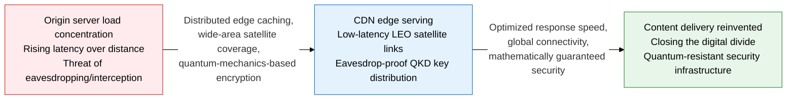
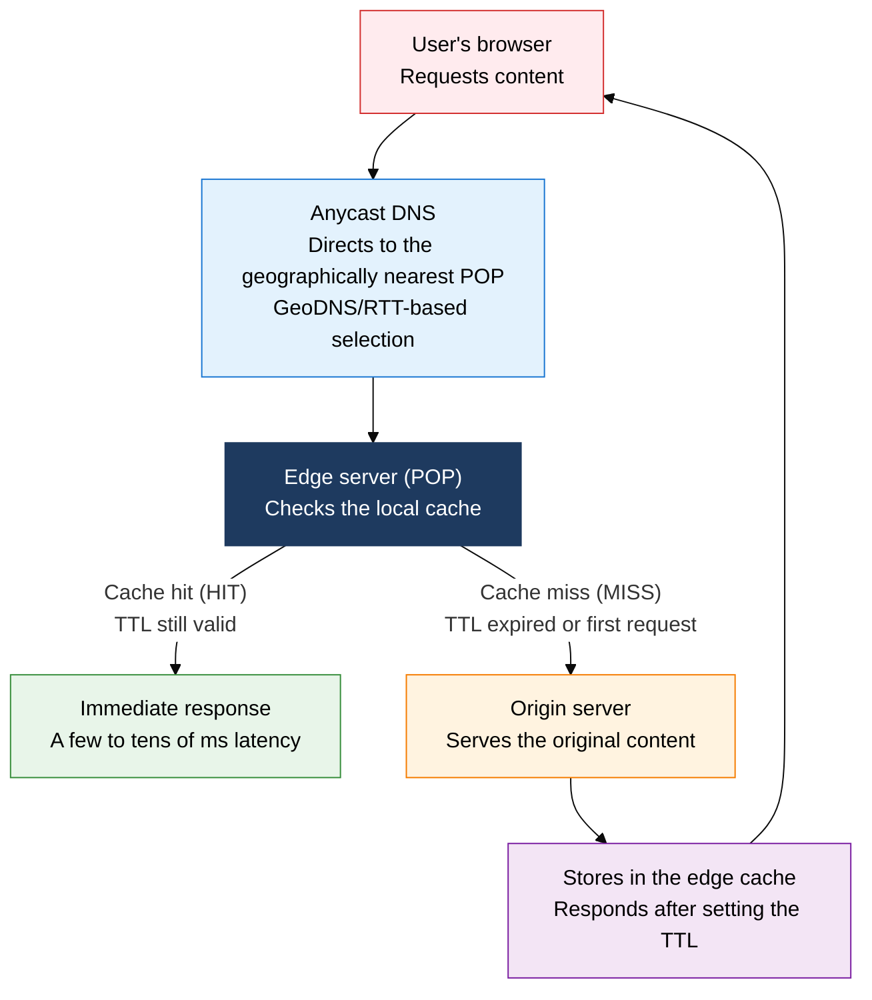
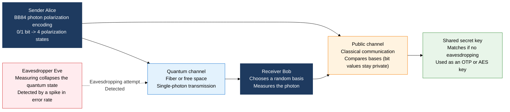

## 1. Overview of CDN, Satellite, and QKD — Optimized Content Delivery, Wide-Area Satellite Networks, and Quantum-Secure Communication

**Definition**: A next-generation networking technology that combines geographically distributed edge-server caching (CDN), low-earth-orbit satellite constellations (LEO), and quantum-mechanics-based key distribution (QKD) to simultaneously minimize transfer latency, achieve global connectivity, and deliver mathematically proven security.
- CDN caches Origin server content at edge POPs (Points of Presence) close to users, cutting RTT (Round-Trip Time) to tens of milliseconds.
- LEO satellite communication drops orbital altitude to 1/18 that of traditional GEO (geostationary orbit), cutting propagation delay to 20-40 ms; Starlink, OneWeb, and others are building constellations of thousands to tens of thousands of satellites.
- QKD (Quantum Key Distribution) uses quantum superposition, entanglement, and the uncertainty principle to guarantee that eavesdropping collapses the quantum state and is always detected — a physical security property that complements PQC (Post-Quantum Cryptography).

**Characteristics**:
- **Distributed edge architecture**: CDN protects the Origin server through Anycast-DNS-based selection of the geographically nearest server, dynamic content acceleration (ESI, API caching), and DDoS-absorption capacity
- **LEO constellation satellites**: Starlink's inter-satellite laser links (ISL) route directly between satellites without relying on ground relay stations, enabling broadband service in remote, maritime, and airborne areas that terrestrial networks cannot reach
- **Layered quantum defense**: QKD makes current key exchange quantum-resistant, while PQC algorithms (CRYSTALS-Kyber, CRYSTALS-Dilithium, etc.) add software-level quantum resistance in parallel, forming a layered security posture

---

## 2. Core Structure of CDN, Satellite Communication, and Quantum Cryptographic Communication

### A. CDN (Content Delivery Network) Architecture

| Category | Before CDN | After CDN | Key CDN Service |
|---|---|---|---|
| **Response latency** | RTT of 100-300ms to Origin (for an overseas Origin) | 5-30ms RTT to the nearest edge POP | Cloudflare (300+ POPs worldwide) |
| **Origin load** | All requests concentrate on the Origin server, bottlenecking at peak | 90%+ cache hit rate cuts Origin traffic by 90% | Akamai (20,000+ servers, the largest CDN) |
| **DDoS response** | Origin IP exposed, vulnerable to direct attack | Edge POPs absorb and block attack traffic, hiding the Origin IP | AWS CloudFront (integrates with S3/ALB, Lambda@Edge) |
| **HTTPS acceleration** | TLS handshake handled at Origin, concentrating load | TLS terminated at the edge with HTTP/2/QUIC and OCSP stapling | Fastly (real-time cache purge, Edge Compute support) |

> **Static CDN vs. dynamic CDN**: A static CDN caches unchanging assets — images, CSS, JavaScript, fonts — and serves them for the TTL period. A dynamic CDN also processes personalized content at the edge through ESI (Edge Side Includes), edge computing (Cloudflare Workers, Lambda@Edge), and API acceleration, reducing dependence on the Origin.

---

### B. LEO Satellite Communication and Quantum Cryptographic Communication (QKD)

| Comparison | GEO (geostationary) | MEO (medium earth orbit) | LEO (low earth orbit) |
|---|---|---|---|
| **Orbital altitude** | 35,786km | 2,000-20,000km | 200-2,000km |
| **Propagation delay** | About 600ms (round trip) | 40-200ms | 20-40ms (Starlink figures) |
| **Coverage** | 3 satellites cover the whole globe except the poles | Moderate coverage, best suited for GPS | A single satellite's coverage is small, so a constellation is required |
| **Key uses** | Broadcasting, weather, legacy satellite internet | GPS/GNSS, O3b (maritime) | Starlink, OneWeb, Project Kuiper |
| **Drawback** | High latency, unfit for real-time communication | Affected by the Van Allen radiation belt | Needs a constellation of thousands to tens of thousands, raising space-debris concerns |

| Comparison | QKD (Quantum Key Distribution) | PQC (Post-Quantum Cryptography) |
|---|---|---|
| **Principle** | Physical security based on quantum mechanics (BB84, etc.) | Computational security based on hard math problems (lattice-, hash-, code-based) |
| **Basis of security** | Cannot be broken without violating physical law — information-theoretically secure | Math problems believed hard even for quantum computers (not proven) |
| **Infrastructure** | Requires a dedicated quantum channel (fiber or free space) and specialized equipment | Implementable with existing internet infrastructure and software libraries |
| **Distance limit** | 100-150km over fiber (research into quantum repeaters is extending this) | No distance limit, applicable across the whole internet |
| **Standards** | ITU-T Y.3800, ETSI QKD standards | Standardized by NIST in 2024 (ML-KEM, ML-DSA, SLH-DSA) |

> **The BB84 protocol in brief**: Alice encodes photons into 4 polarization states (horizontal, vertical, 45 degrees, 135 degrees) and sends them; Bob measures each one after randomly choosing a rectilinear or diagonal basis. Over the public channel they compare only whether their bases matched, never the bit values, and keep only the bits where the bases agree as the key. If eavesdropper Eve measures the photons, Heisenberg's uncertainty principle collapses the quantum state, spiking the bit error rate (QBER) above 25% — so eavesdropping is always detected.

---

## 3. Expected Benefits and Practical Applications of Adopting CDN, Satellite Communication, and Quantum Cryptographic Communication

| Category | Key Benefits | Practical Applications |
|---|---|---|
| **Performance and user experience** | Cuts content response time by more than 80%, achieves sub-2-second page loads, improves Core Web Vitals and SEO ranking | Tune TTL and cache keys for a 95% CDN cache-hit target, run A/B testing and personalization at the edge with edge computing (Lambda@Edge), apply QUIC/HTTP3 to strengthen mobile performance |
| **Connectivity and inclusion** | Delivers 100Mbps-class broadband to areas terrestrial networks can't reach, closes the digital divide, sets up emergency communication in disaster or conflict zones | Connect schools and clinics in remote islands and mountains via Starlink/LEO satellite internet, provide in-flight Wi-Fi for ships and aircraft, run mobile satellite communication stations for disaster response |
| **Security and cryptographic resilience** | Preemptively addresses the quantum-computer vulnerability of today's RSA/ECC key exchange, secures state secrets and financial data for the long term | Protect financial payment networks and critical government communication links with a dedicated QKD fiber network, replace TLS 1.3 key exchange with PQC CRYSTALS-Kyber, build layered defense with hybrid cryptography (QKD+PQC) |
| **Cost and operational efficiency** | Cuts Origin server traffic and server cost, cuts OPEX 80% versus dedicated satellite links, avoids the massive cost of a breach through prevention | Automate CDN cache invalidation (Cache Invalidation API) to cut operational effort, run a hybrid satellite-terrestrial setup for link redundancy and cost optimization, adopt the open-source NIST PQC library (liboqs) to minimize migration cost |
