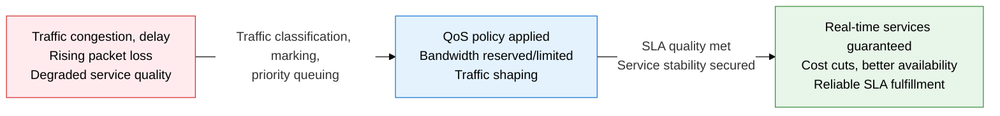
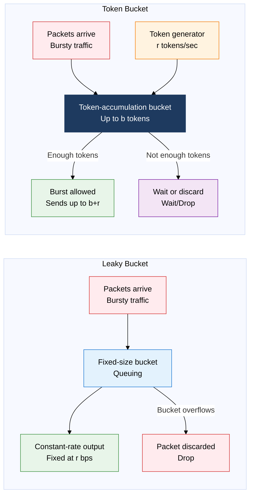
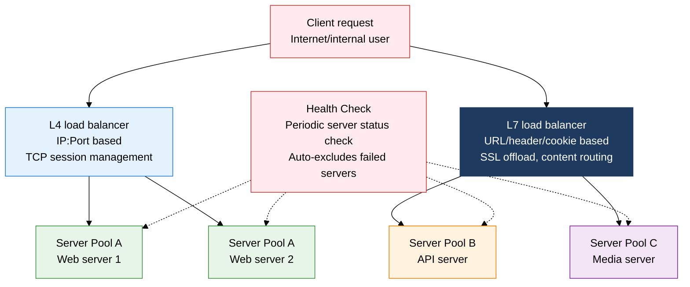

## 1. Overview of QoS — Traffic Quality Control That Guarantees Bandwidth, Latency, and Loss

**Definition**: A traffic-control mechanism that classifies, marks, and queues network traffic to guarantee differentiated quality parameters — bandwidth, latency, and packet loss — per service.
- Latency-sensitive services such as voice (VoIP), video streaming, and real-time gaming get high priority, while latency-tolerant services such as file transfer and email use whatever bandwidth remains.
- Applied end to end, from edge to core, based on standard protocols such as IETF RFC 2475 (DiffServ) and RFC 2210 (IntServ/RSVP).
- Combined with slicing technology in cloud, SD-WAN, and 5G core networks, it forms the core foundation for isolated, per-service quality guarantees.

**Characteristics**:
- **Traffic differentiation**: DSCP/IP Precedence marking distinguishes service classes, and routers/switches recognize the marking to perform per-class queuing and scheduling
- **Congestion control**: WRED (Weighted Random Early Detection) and TailDrop preemptively discard packets before a queue saturates, triggering TCP backoff to prevent bufferbloat
- **End-to-end guarantee**: A cooperative mechanism in which SLA quality holds only if every network device from source to destination recognizes the same QoS policy

---

## 2. Core Structure of QoS and Traffic Management

### A. QoS Guarantee Models and Traffic Shaping

| Comparison | IntServ (Integrated Services) | DiffServ (Differentiated Services) |
|---|---|---|
| **Resource reservation** | Per-connection RSVP signaling reserves bandwidth/buffers at every router along the path | No advance resource reservation; only defines Per-Hop Behavior (PHB) based on DSCP marking |
| **Scalability** | Keeps state proportional to the number of connections, hard to scale the core | Manages only a handful of traffic classes (6-8), scales easily to internet size |
| **Complexity** | Exchanges RSVP PATH/RESV messages; every device on the path must support IntServ | Edge routers mark and classify; the core only needs to read the DSCP value |
| **RSVP** | The core signaling protocol; requires explicit signaling to set up and tear down a connection | Not used; operated with static policy inside the DS domain |
| **Best fit** | Small internal enterprise networks, MPLS TE where VoIP needs guarantees | ISP backbones, CDNs, enterprise WANs, internet-scale services |

> **Traffic shaping compared**: A Leaky Bucket removes bursts entirely, smoothing output to a constant rate (r bps), while a Token Bucket allows an instantaneous burst up to its accumulated tokens (max b), adapting more flexibly to real application traffic patterns. In practice, the Token Bucket variants **srTCM** (Single-rate Three Color Marker) and **trTCM** (Two-rate Three Color Marker) are the ones mainly used.

---

### B. Load Balancing

| Algorithm | Distribution Basis | Characteristics | Best Fit |
|---|---|---|---|
| **Round Robin** | Cycles through servers in order | Simple to implement, ignores server performance differences | Identical-spec servers, simple web services |
| **Weighted Round Robin** | Ratio of per-server weight | Routes more requests to higher-performance servers | Mixed environments with heterogeneous servers |
| **IP Hash** | Hash of the client IP | Same IP always routes to the same server, keeps session affinity | Shopping-cart, session-based services |
| **Least Connection** | Server with the fewest active connections | Effective for long-running requests, reflects dynamic load | API servers, services with variable processing time |
| **Least Response Time** | Combined metric of response time and connection count | Prefers the server that responds fastest | High-availability financial/payment services |

> **L4 vs. L7 comparison**: An L4 load balancer operates at the OSI transport layer (IP/port), giving fast processing with no SSL handshake overhead, but it cannot do content-based routing. An L7 load balancer parses HTTP headers, URLs, and cookies to enable advanced routing — microservice API gateways, A/B testing, blue-green deployment — and removes the encryption burden from backend servers via SSL/TLS offload.

---

## 3. Expected Benefits and Practical Applications of Adopting QoS and Traffic Management

| Category | Key Benefits | Practical Applications |
|---|---|---|
| **Service quality** | Keeps VoIP/video-conferencing jitter under 50ms, holds packet loss below 1%, meets real-time service SLAs | Assign the DiffServ DSCP EF (Expedited Forwarding) class to VoIP, preemptively control TCP congestion with WRED, tie QoS policy into enterprise WAN/MPLS segments |
| **Availability and scalability** | Automatically reroutes traffic on server failure, delivers zero-downtime service, scales peak-traffic handling horizontally | Set the L7 load balancer's Health Check interval to 5 seconds, auto-exclude a failed server within 30 seconds, integrate an Auto Scaling group with the load balancer API for elastic scale-out |
| **Security and stability** | Protects servers with rate limiting on DDoS traffic, secures network stability by shaping anomalous traffic | Rate-limit requests per client IP with Token-Bucket-based limiting, integrate a WAF into the L7 load balancer, demote attack traffic priority through QoS policy |
| **Cost optimization** | Prevents overprovisioning through traffic-pattern visibility, maximizes link utilization, cuts cloud transfer cost | Maximize use of cheap internet links via SD-WAN QoS policy, route critical traffic over MPLS and ordinary traffic over broadband separately, optimize bandwidth with a monthly QoS report |
