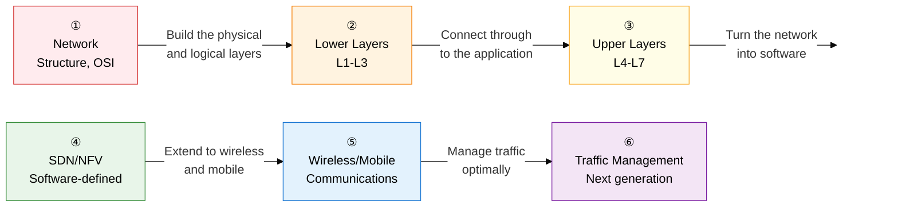

Networking is a systematic answer to one question: **"How do we deliver data safely and quickly?"**  
From the mathematical foundations of the OSI 7-layer model to the latest paradigms in 5G, SDN, and quantum cryptographic communication, this section covers the entire path data takes.

## Learning Roadmap — A 6-Stage Flow

---

## ① Network Structure and the OSI 7-Layer Reference Model

> This is **"the standard, foundational skeleton of all network theory."**  
> You need to memorize each layer's role, PDU, representative protocols, and devices together, and be able to sketch the encapsulation flow at a glance.

| Order | Topic | Key Keywords | Importance |
|:---:|---|---|:---:|
| 1 | [Network Architecture Fundamentals](01-osi-model/network-architecture) | Circuit switching vs. packet switching, virtual circuit vs. datagram, Mesh/Star/Bus/Ring/Tree topologies | ★★☆ |
| 2 | [The OSI 7 Layers and TCP/IP](01-osi-model/osi-tcpip) | Function/PDU/protocol/device mapping for each of the 7 layers, the TCP/IP 4-layer model, encapsulation and decapsulation | ★★★ |

**→ Key study points**: Fully memorize the OSI 7-layer table (layer number, PDU, protocol, device) across all 7 rows, and practice drawing the header-addition process at each encapsulation stage by hand.

---

## ② Lower-Layer (L1-L3) Protocols and Technologies

> Covers everything **"from physical transmission to path selection."**  
> The difference between CSMA/CD and CSMA/CA, STP port roles, the OSPF Area concept, and how ARP works are frequently tested areas.

| Order | Topic | Key Keywords | Importance |
|:---:|---|---|:---:|
| 3 | [L1/L2 MAC, Error Control, and Flow Control](02-lower-layers/l1-l2-mac-error) | CSMA/CD (wired) vs. CSMA/CA (wireless), Stop-and-Wait, Go-Back-N, Selective Repeat ARQ | ★★★ |
| 4 | [L2 Switches, VLAN, and STP](02-lower-layers/l2-switch-vlan-stp) | The 5 MAC operations (Learning/Forwarding/Filtering/Flooding/Aging), IEEE 802.1Q, STP/RSTP/MSTP | ★★★ |
| 5 | [L3 IP Addressing](02-lower-layers/l3-ip-addressing) | Classful vs. CIDR, subnetting/supernetting, IPv4 vs. IPv6, dual-stack/tunneling/translation, NAT/PAT | ★★★ |
| 6 | [L3 Routing Protocols](02-lower-layers/l3-routing) | IGP vs. EGP, RIP (Bellman-Ford), OSPF (Dijkstra, Area), BGP (AS Path), ARP/ICMP/IGMP | ★★★ |

**→ Key study points**: Build a comparison table of the three routing protocols (RIP/OSPF/BGP) covering their **algorithm, metric, scope, and convergence speed**, and trace the ARP Request/Reply flow from the MAC table's perspective.

---

## ③ Upper-Layer (L4-L7) Protocols and Transport Control

> Handles **end-to-end reliable data transfer and application services.**  
> The TCP 3-Way Handshake, the 4 stages of congestion control, and HTTP/3 QUIC are among the most frequently tested essay topics.

| Order | Topic | Key Keywords | Importance |
|:---:|---|---|:---:|
| 7 | [L4 Transport Layer (TCP/UDP)](03-upper-layers/l4-tcp-udp) | TCP vs. UDP, 3-Way/4-Way Handshake, state transitions, sliding window, Slow Start/CA/Fast Retransmit | ★★★ |
| 8 | [Evolution of the HTTP Protocol](03-upper-layers/l7-http-evolution) | HTTP/1.1 (Keep-Alive, Pipelining, HOL Blocking), HTTP/2 (multiplexing, HPACK), HTTP/3 (QUIC, 0-RTT) | ★★★ |
| 9 | [DNS, DHCP, and Application Protocols](03-upper-layers/l7-dns-dhcp) | DNS recursive/iterative queries and 8 record types, DHCP DORA, FTP Active/Passive, SMTP, SNMP | ★★☆ |

**→ Key study points**: Draw TCP congestion control's **cwnd graph** (the Slow Start → CA → Fast Retransmit cycle) on a time axis by hand, and be able to explain in one sentence how HTTP/1.1, HTTP/2, and HTTP/3 differ in **how they solve HOL Blocking**.

---

## ④ Next-Generation Software-Defined Networking (SDN/NFV)

> This is **the modern network paradigm at the core of cloud computing infrastructure.**  
> SDN's control-plane/data-plane separation and how OpenFlow works are very frequently tested.

| Order | Topic | Key Keywords | Importance |
|:---:|---|---|:---:|
| 10 | [SDN and OpenFlow](04-sdn-nfv/sdn-openflow) | Control plane/data plane separation, 3-layer architecture (NorthBound/SouthBound API), flow tables | ★★★ |
| 11 | [NFV, VxLAN, and SD-WAN](04-sdn-nfv/nfv-vxlan-sdwan) | ETSI NFV (VNF/NFVI/MANO), VxLAN's 24-bit VNI, SD-WAN vs. MPLS | ★★★ |

**→ Key study points**: Draw the SDN 3-layer architecture as a TD diagram, and explain the OpenFlow Packet-In/Flow-Mod message flow in order. Memorize the key reasoning behind how VxLAN overcomes VLAN's 4096-segment limit (the 24-bit VNI).

---

## ⑤ Wireless and Mobile Communication Technologies

> **"The wireless communication standards underpinning mobile and IoT environments."**  
> 5G's three scenarios (eMBB/URLLC/mMTC) with network slicing, and Wi-Fi 6's OFDMA, are the latest testing trends.

| Order | Topic | Key Keywords | Importance |
|:---:|---|---|:---:|
| 12 | [Wireless LAN (Wi-Fi) Technology Standards](05-wireless-mobile/wifi-standards) | IEEE 802.11 generational evolution, MIMO/Massive MIMO, OFDMA, MU-MIMO, BSS Coloring | ★★☆ |
| 13 | [5G / Next-Generation 6G](05-wireless-mobile/5g-6g) | eMBB/URLLC/mMTC, network slicing, MEC, NSA vs. SA, 6G (THz, NTN, RIS) | ★★★ |
| 14 | [Short-Range Wireless Communication and IoT](05-wireless-mobile/iot-wireless) | BLE/ZigBee/Z-Wave/UWB, LoRa (SF, LoRaWAN), NB-IoT, LTE-M | ★★☆ |

**→ Key study points**: Memorize the **target speed, latency, connection density, and applications** of 5G's three scenarios as a table, and explain the difference between NSA (5G NR + LTE Core) and SA (5G NR + 5GC) using an architecture diagram.

---

## ⑥ Traffic Management and Next-Generation Network Architecture

> Covers **large-scale traffic control and the next-generation network tied to emerging technology.**  
> QoS model comparisons, how CDNs work, and QKD quantum cryptography are practical, current-trend testing areas.

| Order | Topic | Key Keywords | Importance |
|:---:|---|---|:---:|
| 15 | [QoS and Traffic Management](06-traffic-management/qos-traffic) | IntServ (RSVP) vs. DiffServ (DSCP), Leaky Bucket vs. Token Bucket, L4/L7 load-balancing algorithms | ★★☆ |
| 16 | [CDN, Satellite Communication, and Quantum Cryptography](06-traffic-management/cdn-satellite-quantum) | CDN Anycast DNS and edge caching, LEO (Starlink, low latency), QKD BB84, PQC | ★★☆ |

**→ Key study points**: Whether **bursts are allowed** is the key difference between Leaky Bucket and Token Bucket. Be able to explain in one sentence how the QKD BB84 protocol detects eavesdropping (quantum state collapse).

---

## Exam Strategy for the Professional Engineer Test

| Question Pattern | Key Response Strategy |
|---|---|
| **Trace-the-flow essay** | Diagram "what happens when you enter a URL" layer by layer, in the order DNS → ARP → TCP 3-Way → HTTP |
| **Comparison questions** | Memorize comparison tables for CSMA/CD vs. CSMA/CA, TCP vs. UDP, RIP vs. OSPF vs. BGP, IntServ vs. DiffServ, NSA vs. SA |
| **Header structure essay** | TCP header (sequence number, ACK, window, flags), IP header (TTL, protocol, address), IEEE 802.1Q (VID field) |
| **Current trends** | How HTTP/3 QUIC works, SDN OpenFlow operation, 5G network slicing, QKD BB84, LEO satellites |
| **Definition + characteristics** | Practice writing each topic's definition (one sentence) plus 3 characteristics, with **keywords** in bold |
