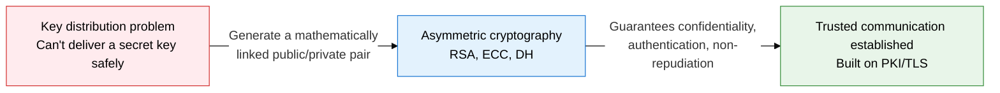
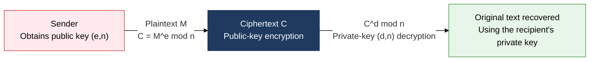
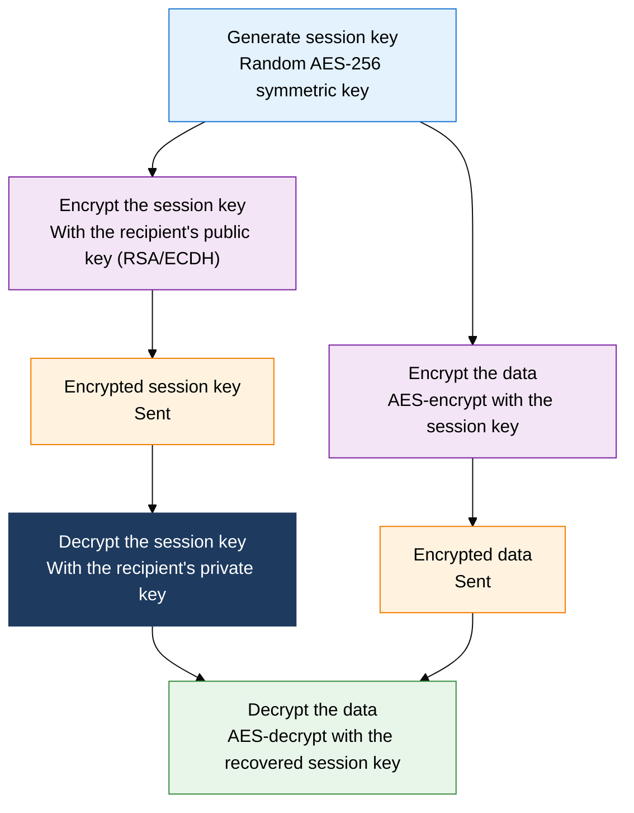

## 1. Overview of Asymmetric Cryptography — Solving the Key Distribution Problem with Public/Private Key Pairs

**Definition**: An encryption scheme that uses a mathematically linked public/private key pair to solve the key distribution problem and guarantee confidentiality, authentication, and non-repudiation.
- An asymmetric structure: the public key is shared with anyone, while only the owner holds the private key
- Built on hard mathematical problems: RSA (integer factorization), DH (discrete logarithm), ECC (elliptic-curve discrete logarithm)
- Slower than symmetric encryption, so it is mainly used for key exchange, digital signatures, and authentication rather than encrypting bulk data

**Characteristics**:
- **Solves key distribution**: Sharing the public key in advance lets a secure communication session be established without a separate secret channel
- **Multi-purpose security properties**: Encryption (public key → private key) and signing (private key → public key) run in opposite directions, together supporting both confidentiality and non-repudiation
- **Mathematical security**: Relies on the computational complexity of factorization and discrete-logarithm problems; migration to PQC is underway to address the quantum-computing threat

---

## 2. Core Structure of Asymmetric Cryptography

### A. Principles and Comparison of the RSA, DH, and ECC Algorithms

| Algorithm | Mathematical Basis | Main Use | Recommended Key Length | Performance |
|---|---|---|---|---|
| **RSA** | Difficulty of integer factorization | Encryption, digital signatures, key exchange | 2048 / 4096 bits | Slow, general-purpose standard |
| **DH / ECDH** | Discrete logarithm problem | Key exchange only (not encryption) | DH 2048 bits, ECDH 256 bits | Medium, used for TLS session-key exchange |
| **ECC / ECDSA** | Elliptic-curve discrete logarithm | Digital signatures, key exchange | 256 bits (equivalent to RSA 3072 bits) | Fast, well suited to mobile/IoT |

---

### B. The Structure of a Hybrid Cryptosystem

| Comparison | Symmetric Cryptography | Asymmetric Cryptography |
|---|---|---|
| **Number of keys** | Needs a separate secret key for every communicating pair | One public/private key pair supports communication with many parties |
| **Speed** | Very fast (AES: several Gbps) | Slow (RSA: on the order of a few Kbps) |
| **Key distribution** | Needs a separate secure channel to deliver the key | Solves key distribution by publishing the public key |
| **Use** | Encrypting bulk data | Key exchange, digital signatures, certificates |
| **Representative examples** | AES, SEED, ARIA, LEA | RSA, ECC, DH, ECDSA |

---

## 3. Expected Benefits and Practical Applications of Adopting Asymmetric Cryptography

| Category | Key Benefits | Practical Applications |
|---|---|---|
| **Key management** | Establishes a secure communication session just by distributing the public key, eliminating key-delivery risk | Build a PKI-based public key infrastructure, secure forward secrecy with TLS 1.3 ECDHE |
| **Authentication and signing** | Proves identity and secures legally valid non-repudiation through private-key signing | ECDSA signing for e-contracts and e-invoices, code-signing certificates |
| **Hybrid optimization** | Exchanges a session key with RSA/ECDH, then handles data with AES, balancing performance and security | Apply a hybrid structure across HTTPS, SSH, and VPN alike; use JWT RS256 for API authentication |
| **Preparing for the future** | Migrating to ECC shortens key length relative to RSA, laying the groundwork for a PQC transition | Evaluate NIST PQC standards (CRYSTALS-Kyber) in parallel, protect keys with an HSM |
