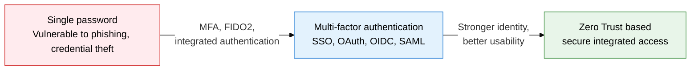

## 1. Strengthening Identity Verification with Multi-Factor, Biometric, and Integrated Authentication: Overview of User Authentication Technology

**Definition**: An authentication technology framework that verifies a user's identity using one or a combination of 4 factors: knowledge, possession, inherence, and behavior.
- MFA combines 2 or more authentication factors so security holds even if a single factor is stolen
- FIDO2/WebAuthn and Passkey provide passwordless authentication that blocks phishing attacks at the source
- OAuth 2.0, OIDC, and SAML standardize identity federation and authorization delegation across multi-service environments

**Characteristics**:
- **Multi-factor combination**: combining knowledge, possession, and biometric factors protects the account even if a single factor is compromised
- **Password elimination**: FIDO2 and Passkey authenticate via an on-device private key, making phishing and replay attacks impossible
- **Federated authentication**: SSO, OIDC, and SAML let a single authentication grant access to multiple services, improving user experience

---

## 2. Core Structure of User Authentication Technology

### A. The 4 Authentication Factors, MFA, FIDO2/Passkey

| Authentication factor | Example | Advantages | Limitations |
|---|---|---|---|
| **Knowledge (Know)** | Password, PIN, security question | Simple to implement, minimal cost | Vulnerable to phishing, brute force |
| **Possession (Have)** | OTP, smart card, security token | Requires physical theft, stronger security | Inaccessible if lost or stolen |
| **Inherence (Are)** | Fingerprint, iris, face, vein recognition | Hard to replicate, good usability | Biometric data cannot be changed, privacy concerns |
| **Behavior (Do)** | Signature pattern, gait, typing rhythm | Enables continuous authentication | Sensitive to environmental change, accuracy varies |

---

### B. Integrated Authentication (SSO, OAuth 2.0, OIDC, SAML)

| Protocol | Purpose | Format | Usage environment | Key characteristics |
|---|---|---|---|---|
| **SSO** | Single authentication, multiple services | Session/token based | Enterprise internal portal | Central authentication, better UX |
| **OAuth 2.0** | Authorization delegation, resource access | Access token (Bearer) | Social login, API | No identity authentication, delegation only |
| **OIDC** | Identity authentication + authorization delegation | JWT (ID token) | Web/mobile services | Layer on top of OAuth 2.0, standard claims |
| **SAML 2.0** | Enterprise federated authentication (SSO) | XML assertion | Enterprise, education, public sector | IdP/SP federation, strong legacy compatibility |

---

## 3. Expected Benefits and Practical Applications of Adopting User Authentication Technology

| Category | Key benefits | Use and practical application |
|---|---|---|
| **Security** | MFA and FIDO2 sharply reduce credential-based attacks | Mandate MFA for admin accounts, move to passwordless with Passkey |
| **Usability** | SSO and OIDC allow smooth access to multiple services after a single login | Build SSO integrated with Azure AD/Okta, improve employee experience |
| **Standardization** | OAuth 2.0, OIDC, and SAML unify authentication across heterogeneous systems | Run a unified IdP across in-house SaaS and on-premises systems, standardize API security |
| **Regulatory compliance** | Meets authentication requirements under electronic financial supervision regulations and personal data protection law | Mandate 2FA for financial services, apply FIDO authentication for public-sector integration |
