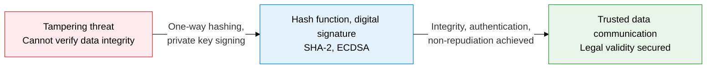
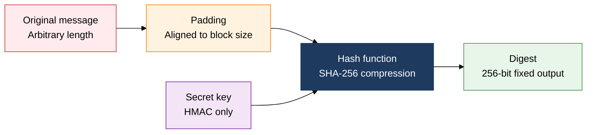
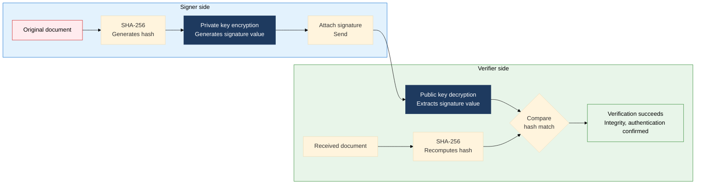

## 1. Guaranteeing Integrity and Non-repudiation with One-way Hashing and Signatures: Overview of Hash Functions and Digital Signatures

**Definition**: A one-way function that converts an input of arbitrary length into a fixed-length digest, a cryptographic technique that guarantees data integrity, authentication, and non-repudiation.
- A hash function has three core properties: it cannot be inverted, the same input always yields the same output, and it resists collisions
- HMAC combines a hash function with a secret key to guarantee integrity and authentication at the same time
- A digital signature encrypts a hash value with a private key, providing legal non-repudiation

**Characteristics**:
- **One-way**: the original text cannot be recovered from the digest, used for password storage and file integrity verification
- **Collision resistance**: finding two inputs that produce the same digest must be computationally infeasible
- **Legal non-repudiation**: under the Digital Signature Act, an accredited digital signature carries the same legal validity as a handwritten signature

---

## 2. Core Structure of Hash Functions and Digital Signatures

### A. Hash Function Structure and MAC/HMAC

| Algorithm | Output length | Security strength | Collision status | Primary use |
|---|---|---|---|---|
| **MD5** | 128 bits | Weak | Collisions found | Legacy, checksum only (not for security use) |
| **SHA-1** | 160 bits | Weak | Collisions found | Older TLS, code signing (being phased out) |
| **SHA-2** | 256/384/512 bits | Strong | None found | TLS 1.3, JWT, digital signatures, file integrity |
| **SHA-3** | 224/256/384/512 bits | Very strong | None found | Next-generation standard, Keccak sponge construction |

---

### B. Digital Signature Generation and Verification Mechanism

| Security property | How it's guaranteed | Applied mechanism |
|---|---|---|
| **Integrity** | A hash mismatch detects tampering | Recipient recomputes SHA-256 and compares it against the decrypted signature hash |
| **Authentication** | A public key certificate confirms the signer's identity | A CA-issued X.509 certificate proves the identity of the public key owner |
| **Non-repudiation** | Only the private key holder can generate the signature | A TSA (Time Stamp Authority) timestamp reinforces proof of signing time |

---

## 3. Expected Benefits and Practical Applications of Adopting Hash Functions and Digital Signatures

| Category | Key benefits | Use and practical application |
|---|---|---|
| **Data integrity** | SHA-256 hash comparison detects file/message tampering instantly | Software distribution checksum verification, integrity guarantees for blockchain transactions |
| **Stronger authentication** | HMAC guarantees message authentication and integrity together | HMAC-SHA256 for API authentication, TLS MAC, JWT HS256 signing |
| **Legal non-repudiation** | Accredited digital signatures under the Digital Signature Act prevent contract disputes | ECDSA signing for electronic contracts, e-tax invoices, and public electronic documents |
| **Algorithm modernization** | Retiring MD5/SHA-1 in favor of SHA-2/SHA-3 blocks collision attacks | Mandate SHA-256 for TLS certificates, migrate code-signing policy to SHA-2 |
