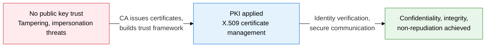
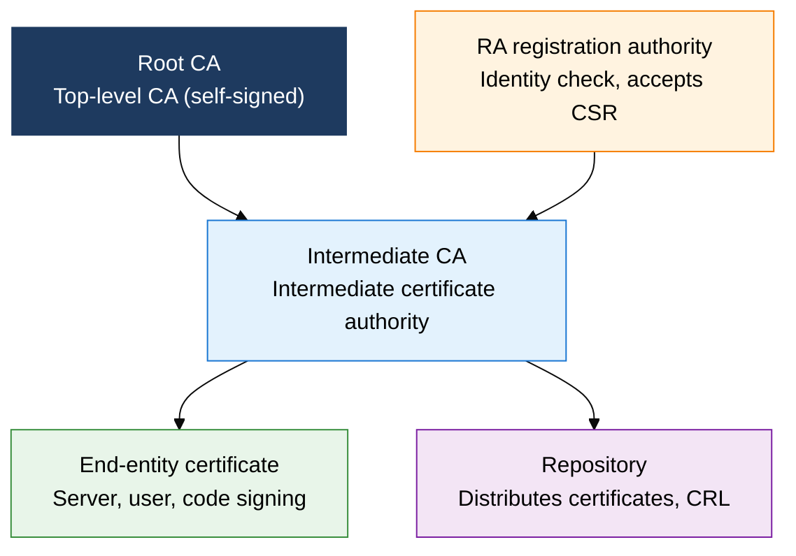
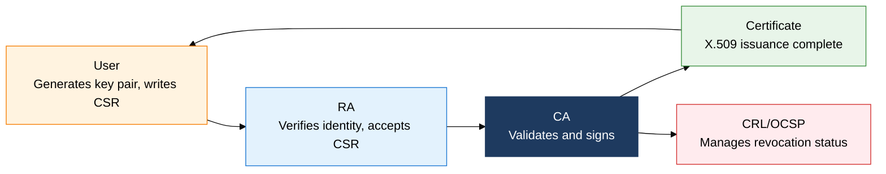

## 1. Certificate Management Infrastructure for Public Key Trust: Overview of PKI

**Definition**: A trust infrastructure built on public key cryptography that issues, manages, and revokes digital certificates to provide secure identity assurance.
- Made up of 4 elements: CA, RA, users, and repository, and uses X.509 standard certificates
- Manages the entire certificate life cycle through validity periods, CRL, and OCSP
- The foundational technology behind TLS/SSL, digital signatures, e-government, and many other authentication services

**Characteristics**:
- **Trust hierarchy**: a hierarchical chain of trust running from Root CA to Intermediate CA to end-entity certificate
- **Asymmetric verification**: signing with a private key and verifying with a public key guarantees non-repudiation and integrity together
- **Life cycle management**: CRL and OCSP track certificate status in real time, from issuance through renewal to revocation

---

## 2. Core Structure of PKI

### A. PKI Components and Trust Model

| Component | Role | Key function |
|---|---|---|
| **CA (Certificate Authority)** | Signs and issues certificates | Generates X.509 certificates, publishes CRL, manages policy |
| **RA (Registration Authority)** | Verifies applicant identity on the CA's behalf | Reviews CSR, forwards issuance requests to the CA |
| **User (entity)** | Holds and uses a certificate | Generates key pair, submits CSR, uses the certificate |
| **Repository** | Server that distributes certificates and CRL | Publishes CRL/certificates over LDAP or HTTP |

---

### B. Certificate Issuance and Revocation Process

| Revocation method | Timeliness | Traffic load | Key drawback |
|---|---|---|---|
| **CRL** | Low (periodic distribution) | Medium (file download) | Stale data, file grows large |
| **OCSP** | High (on-request lookup) | High (concentrated on CA server) | Depends on CA availability, exposes privacy |
| **OCSP Stapling** | High (server provides cached response) | Low (server attaches the response) | Timeliness can degrade when the cache expires |

---

## 3. Expected Benefits and Practical Applications of Adopting PKI

| Category | Key benefits | Use and practical application |
|---|---|---|
| **Security** | Public-key-based identity verification blocks tampering and impersonation at the source | Issue TLS certificates, apply S/MIME email signing and encryption |
| **Trustworthiness** | The CA hierarchy establishes a verifiable chain of trust | Build a private CA in-house, operate code-signing certificates |
| **Operational efficiency** | CRL and OCSP Stapling automate revocation status management | Automate certificate expiry monitoring, auto-renew via the ACME protocol |
| **Regulatory compliance** | Meets legal requirements such as the Digital Signature Act and personal data protection law | Link to e-government accredited certification, apply public key infrastructure in finance |
