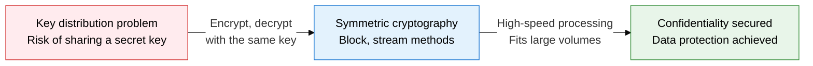
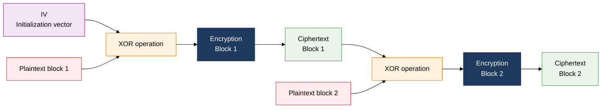
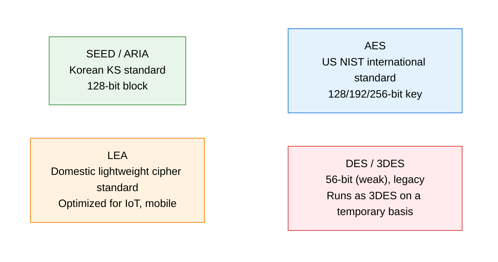

## 1. High-speed Symmetric Encryption Using the Same Key to Encrypt and Decrypt: Overview of Symmetric Cryptography

**Definition**: An encryption method that uses the same secret key for both encryption and decryption to guarantee data confidentiality.
- Divided into block ciphers, which process data in blocks, and stream ciphers, which process it bit by bit or byte by byte
- Standardized internationally and domestically through algorithms such as AES, SEED, ARIA, and LEA
- 10 to 100 times faster than asymmetric-key encryption, making it well suited to encrypting large volumes of data

**Characteristics**:
- **High speed**: built on simple XOR, substitution, and permutation operations, so both hardware and software implementations run fast
- **Key management complexity**: n parties communicating with each other need n(n-1)/2 keys, which increases the key management burden
- **Variety of operation modes**: modes such as ECB, CBC, CFB, OFB, and CTR let you tune security strength against performance

---

## 2. Core Structure of Symmetric Cryptography

### A. Block Cipher Structure and Modes of Operation

| Mode of operation | Parallelizable | IV needed | Error propagation | Key characteristics |
|---|---|---|---|---|
| **ECB** | Yes | No | None | Blocks processed independently, identical plaintext yields identical ciphertext, weak against pattern exposure |
| **CBC** | No | Yes | 1 block | Chains via XOR with the previous ciphertext block, the most commonly used mode |
| **CFB** | No | Yes | Limited | Behaves like a stream cipher, well suited to real-time processing |
| **OFB** | No | Yes | None | Keystream generated independently, no error propagation |
| **CTR** | Yes | No | None | Encrypts a counter value, supports parallel and random access |

---

### B. Comparing the Major Algorithms

| Algorithm | Block size | Key size | Developer | Key characteristics |
|---|---|---|---|---|
| **AES** | 128 bits | 128/192/256 bits | NIST (US) | Based on Rijndael, the current global standard |
| **SEED** | 128 bits | 128 bits | KISA (Korea) | Mandatory in Korean e-finance and public sector |
| **ARIA** | 128 bits | 128/192/256 bits | NSR (Korea) | Domestic standard counterpart to AES, supported in TLS |
| **LEA** | 128 bits | 128/192/256 bits | ETRI (Korea) | Built on 32-bit operations, fast in software |

---

## 3. Expected Benefits and Practical Applications of Adopting Symmetric Cryptography

| Category | Key benefits | Use and practical application |
|---|---|---|
| **Data protection** | AES-256 encrypts large files and databases at high speed | Encrypt stored e-finance and medical records, full disk encryption (FDE) |
| **Standards compliance** | Using SEED/ARIA meets domestic legal requirements (personal data protection law) | Financial payment systems, encryption of public-sector electronic documents |
| **Performance optimization** | CTR mode's parallel processing speeds up TLS 1.3 streaming encryption | Encryption at the CDN/API gateway layer, LEA lightweight cipher for IoT environments |
| **Security strength** | Choosing the right mode of operation removes pattern-exposure and error-propagation risk | Migrate CBC to GCM, use AEAD authenticated encryption to guarantee integrity at the same time |
