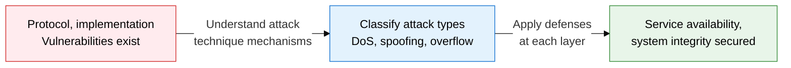
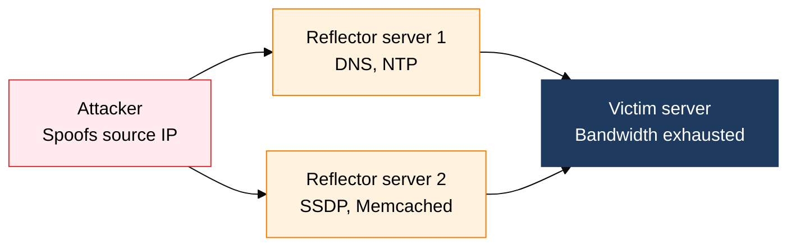
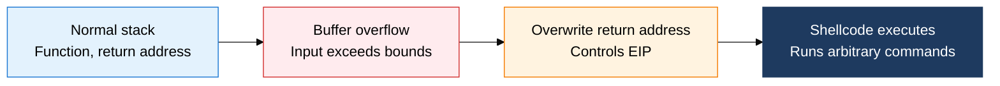

## 1. Spear and Shield: Attack Mechanisms and Layered Defense Strategy, Overview of Network and System Attack Techniques

**Definition**: Attack techniques that exploit weaknesses in network protocol structure or system implementation to compromise availability, confidentiality, and integrity, along with the layered defense framework that counters them.
- By layer, attacks split into network-layer (L3/L4) attacks and application-layer (L7) attacks
- The core attack types are DoS/DDoS, IP spoofing, sniffing, session hijacking, and buffer overflow
- Understanding attack mechanics drives layered defenses such as IPS, WAF, ASLR, and Stack Canary

**Characteristics**:
- **Combined attacks**: attackers evade detection by chaining techniques rather than using one alone, such as IP spoofing plus DRDoS, or ARP spoofing plus sniffing
- **Amplification effect**: DRDoS can amplify original traffic tens to hundreds of times through DNS/NTP reflection
- **Memory safety**: buffer-overflow-family attacks are mitigated by the triple defense of ASLR, DEP, and Stack Canary

---

## 2. Core Structure of Network and System Attack Techniques

### A. DoS/DDoS Attack Types and the DRDoS Flow

| Attack | Layer | Mechanism | Countermeasure |
|---|---|---|---|
| **SYN Flooding** | L4 (TCP) | Mass SYN traffic exhausts half-open connections | SYN cookie, shorter connection timeout |
| **UDP/ICMP Flooding** | L3/L4 | High-volume packets saturate bandwidth | ISP-level upstream filtering, rate limiting |
| **DRDoS** | L3/L4 | Spoofed IP plus reflector amplification concentrates traffic on the victim | BCP38 ingress filtering, anti-DDoS scrubbing |
| **HTTP GET Flooding** | L7 | Mass legitimate-looking HTTP requests overload the server | WAF request rate limiting, CAPTCHA |
| **Slowloris** | L7 | Incomplete HTTP requests exhaust web server connection resources | Set connection timeouts, limit concurrent connections |

---

### B. Attack Techniques Targeting System and Network Vulnerabilities

| Attack | Layer | Mechanism | Defense |
|---|---|---|---|
| **IP Spoofing** | L3 | Forges source IP to exploit trust relationships and bypass filtering | BCP38 ingress filtering, RFC 2827 |
| **ARP Spoofing** | L2 | Poisons the MAC table with forged ARP replies to eavesdrop on traffic | DAI (Dynamic ARP Inspection), static ARP |
| **Sniffing** | L2/L3 | Captures packets to eavesdrop on plaintext data | End-to-end TLS encryption, switch port security |
| **Session Hijacking** | L4/L7 | Steals session cookies or tokens to bypass authentication | HttpOnly/Secure cookies, CSRF tokens, session regeneration |
| **Stack Overflow** | L7/App | Overruns the stack boundary, overwrites the return address, executes shellcode | ASLR, DEP/NX, Stack Canary, use strncpy |
| **Race Condition** | App | TOCTOU (time-of-check to time-of-use) race on a shared resource | Mutex/semaphore, atomic operations, least privilege |

---

## 3. Expected Benefits and Practical Applications of Defending Against Network and System Attack Techniques

| Category | Key benefits | Use and practical application |
|---|---|---|
| **Availability assurance** | Anti-DDoS keeps service running even under volumetric attacks | Integrate with a CDN scrubbing center, apply ISP blackhole routing and BGP FlowSpec |
| **Blocking network threats** | BCP38, DAI, and port security block spoofing and sniffing attacks | Ingress filters at the switch layer, VLAN segmentation, 802.1X port authentication |
| **System robustness** | Combining ASLR, DEP, and Stack Canary blocks exploitation of memory vulnerabilities | Harden compiler options (PIE, Stack Protector), automate fuzz testing |
| **Incident response capability** | Classifying attack types sharpens SIEM detection rules and shortens response time | Update IPS rulesets from attack signatures, run Red Team penetration exercises on a regular cadence |
