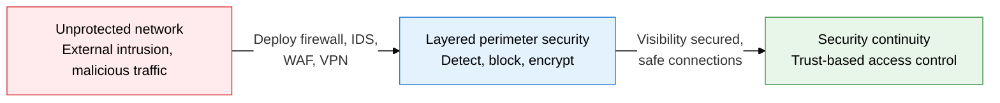
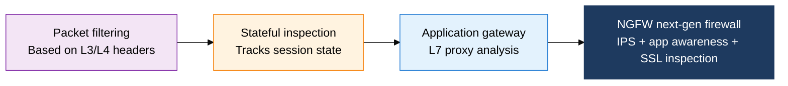
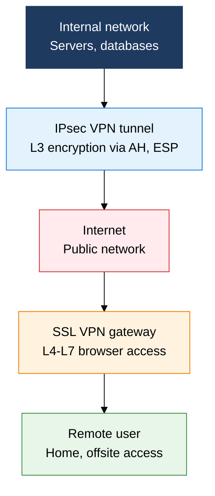

## 1. The Core Network Security Device Stack for Perimeter Security: Overview of Firewall, IDS, WAF, and VPN

**Definition**: A security device stack that layers firewall, IDS/IPS, WAF, and VPN at the network perimeter to detect and block external threats while guaranteeing secure communication.
- The firewall provides the first line of perimeter control, allowing or blocking traffic; the WAF is L7 defense dedicated to web applications
- IDS detects and alerts, while IPS sits inline and blocks in real time
- VPN provides secure remote access and site-to-site connections over public networks through an encrypted tunnel

**Characteristics**:
- **Defense in depth**: layering firewall, IPS, and WAF keeps additional defense lines standing even if a single device is bypassed
- **Visibility**: IDS/IPS logs, WAF events, and VPN connection records support threat analysis and forensics
- **Secure remote access**: IPsec and SSL VPN guarantee confidentiality and integrity when accessing the internal network from outside

---

## 2. Core Structure of Firewall, IDS, WAF, and VPN

### A. Firewall Evolution and IDS/IPS

| Firewall type | OSI layer | Advantages | Limitations |
|---|---|---|---|
| **Packet filtering** | L3/L4 | Fast processing, simple to implement | Cannot analyze the application layer |
| **Stateful** | L3/L4 | Tracks sessions, supports dynamic port control | Memory burden from the session table |
| **Application gateway** | L7 | Precise content-level analysis | Processing delay, performance bottleneck |
| **NGFW** | L3 through L7 | Integrates IPS, app awareness, and user authentication | High cost, configuration complexity |

---

### B. WAF and VPN

| Comparison | IPsec VPN | SSL VPN |
|---|---|---|
| **Operating layer** | L3 (network layer) | L4 through L7 (transport to application) |
| **Key protocols** | AH (authentication), ESP (encryption + authentication), IKE | TLS/DTLS |
| **Client** | A dedicated VPN client is required | Browser or a lightweight agent |
| **Security level** | Encrypts the entire IP packet, strong integrity | Selective encryption at the application layer |
| **Best fit** | Site-to-site connections (S2S), enterprise infrastructure | Individual access for remote workers, BYOD |

---

## 3. Expected Benefits and Practical Applications of Adopting Firewall, IDS, WAF, and VPN

| Category | Key benefits | Use and practical application |
|---|---|---|
| **Perimeter security** | NGFW-based layered defense strengthens blocking of external intrusion and malicious traffic | Deploy NGFW in the DMZ, operate fine-grained inbound/outbound policies |
| **Web security** | WAF defense against the OWASP Top 10 blocks web attacks such as SQLi, XSS, and CSRF | Integrate cloud WAF (AWS WAF, CloudFlare), update signatures on a regular schedule |
| **Intrusion detection** | IDS/IPS anomaly detection identifies and blocks known and unknown threats early | Analyze IPS logs integrated with SIEM, establish a tuning process that minimizes false positives |
| **Remote access** | IPsec/SSL VPN guarantees internal-network-level secure access when working from home or traveling | Build a roadmap to replace VPN with ZTNA, apply conditional access policies |
