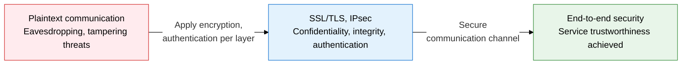
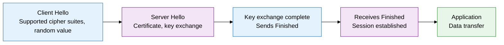
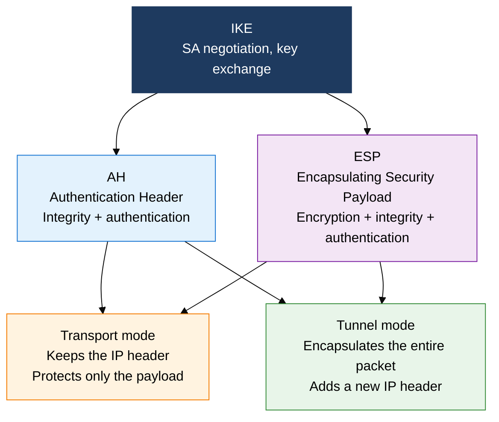

## 1. Securing Communication Paths with Transport- and Network-Layer Encryption: Overview of SSL/TLS and IPsec

**Definition**: A network security protocol stack that provides encryption, integrity, and authentication at the transport layer (TLS) and network layer (IPsec) to secure the communication path.
- TLS runs on top of TCP and protects application protocols such as HTTPS, SMTP, and IMAP
- IPsec protects at the IP packet level and is used for VPN, remote access, and site-to-site connections
- TLS 1.3 largely removes prior versions' weaknesses through a 1-RTT handshake and perfect forward secrecy (PFS)

**Characteristics**:
- **Layered security**: dual protection at L4 (TLS) and L3 (IPsec) defends both the application and infrastructure layers at once
- **Forward secrecy**: ECDHE-based ephemeral key exchange protects past traffic even if a session key is exposed
- **Interoperability**: built on international standards (RFC), enabling secure communication across heterogeneous vendors, devices, and platforms

---

## 2. Core Structure of SSL/TLS and IPsec

### A. The SSL/TLS Handshake and TLS 1.3 Improvements

| Category | TLS 1.2 | TLS 1.3 | Notes |
|---|---|---|---|
| **RTT count** | 2-RTT | 1-RTT | 50% less latency |
| **Key exchange** | Choice of RSA, DHE, ECDHE | ECDHE required | PFS mandatory |
| **Forward secrecy** | Optional | Always guaranteed | Session key independence |
| **Supported algorithms** | Allows RC4, DES, 3DES, MD5, SHA-1 | Weak algorithms fully removed | Smaller attack surface |
| **0-RTT resumption** | Not supported | Session resumption supported | Faster repeat connections |

---

### B. IPsec Structure and Operating Modes

| Category | AH | ESP | Notes |
|---|---|---|---|
| **Encryption** | Not provided | Provides AES, 3DES | ESP is generally preferred |
| **Integrity/authentication** | Provided via HMAC | Provided via HMAC | Differ in whether the IP header is covered |
| **Header position** | Inserted after the IP header | After the IP header, before the payload | Protocol numbers 51/50 |
| **Best use** | Internal traffic that needs integrity only | Traffic that needs confidentiality and integrity | VPN standardizes on ESP tunnel mode |

---

## 3. Expected Benefits and Practical Applications of Adopting SSL/TLS and IPsec

| Category | Key benefits | Use and practical application |
|---|---|---|
| **Transport security** | TLS 1.3 blocks HTTPS eavesdropping and tampering at the source | Force web services onto TLS 1.3, apply HSTS/HPKP headers |
| **VPN infrastructure** | IPsec ESP tunnel mode builds a dedicated encrypted link for site-to-site connections | IPsec VPN between headquarters and branches, client VPN for remote workers |
| **Stronger authentication** | Mutual certificate verification blocks phishing and MITM attacks in advance | mTLS-based API gateway authentication, Zero Trust client authentication |
| **Regulatory compliance** | Requiring TLS 1.2 or later meets PCI-DSS and personal data protection law | Audit TLS versions in financial/healthcare systems, disable weak cipher suites |
