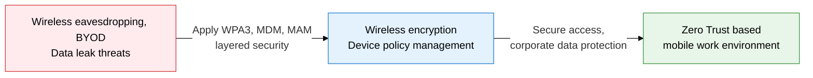
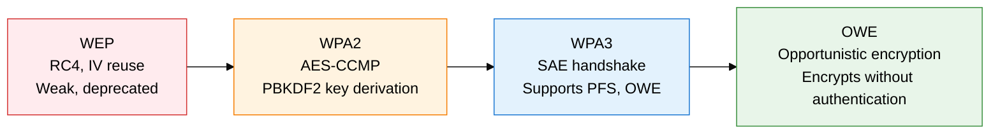
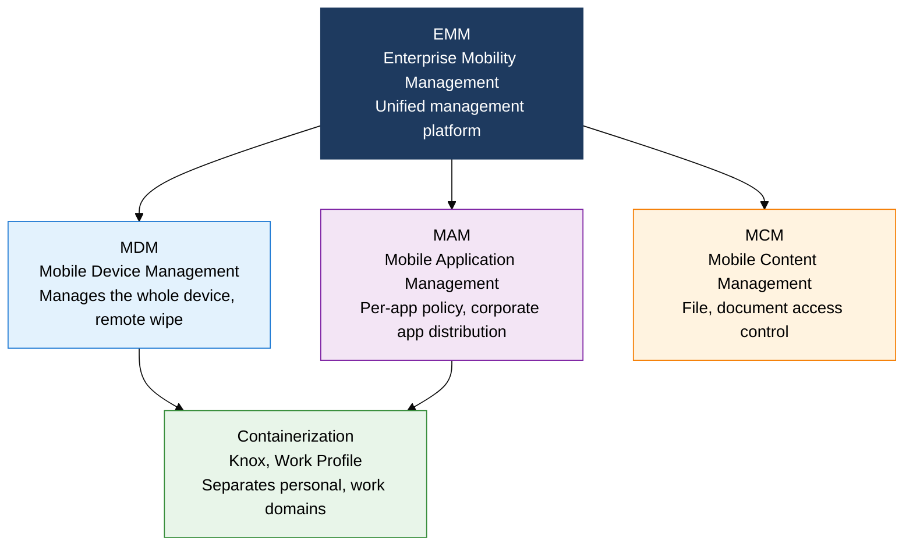

## 1. Access Control and Device Management Security for Wireless and Mobile Environments: Overview of Wireless and Mobile Security

**Definition**: A security framework that combines wireless LAN encryption standards (WPA2/WPA3) with mobile device management (MDM, MAM, containerization) to deliver confidentiality and access control in wireless and BYOD environments.
- The WPA3 SAE handshake blocks offline dictionary attacks at the source and guarantees forward secrecy
- MDM manages the entire device, while MAM applies policy at the app level, balancing management against privacy
- EMM (Enterprise Mobility Management) unifies MDM, MAM, and MCM to manage enterprise mobility as a whole

**Characteristics**:
- **SAE authentication**: WPA3's Dragonfly handshake makes password-based offline dictionary attacks impossible
- **Container separation**: Knox and Android Work Profile fully separate the personal and work domains, blocking data leaks
- **Dynamic trust evaluation**: with Zero Trust integration, a trust score based on device state, location, and behavior adjusts access rights in real time

---

## 2. Core Structure of Wireless and Mobile Security

### A. Comparing Wireless LAN Security Standards (WPA2/WPA3)

| Category | WEP | WPA2 | WPA3 |
|---|---|---|---|
| **Encryption** | RC4 stream cipher | AES-CCMP (128-bit) | AES-GCMP (128/256-bit) |
| **Key exchange** | Static key, IV reuse | PBKDF2 PSK, 4-way handshake | SAE Dragonfly handshake |
| **Offline dictionary attack** | Vulnerable | Vulnerable (PMKID attack possible) | Defended (each session independently proven) |
| **Forward secrecy** | Not supported | Not supported | Supported (ephemeral session key) |

---

### B. Mobile Security Management Framework for a BYOD Environment

| Category | MDM | MAM | Containerization |
|---|---|---|---|
| **Management scope** | Entire device (OS, settings, apps) | Corporate apps and data only | Logical separation of the work domain |
| **Privacy** | Low (access to the whole device) | High (no interference with the personal domain) | Very high (fully separated) |
| **Best fit** | Corporate-owned devices (COBO) | BYOD, personally owned devices | BYOD, environments with high security needs |

---

## 3. Expected Benefits and Practical Applications of Adopting Wireless and Mobile Security

| Category | Key benefits | Use and practical application |
|---|---|---|
| **Wireless-segment security** | Moving to WPA3 blocks wireless eavesdropping, Evil Twin, and KRACK attacks at the source | Move enterprise Wi-Fi to WPA3-Enterprise (EAP-TLS), integrate with an 802.1X authentication server |
| **Device management** | MDM remote wipe protects corporate data immediately after loss or theft | Enroll every work device in MDM, apply automatic quarantine for jailbreak/root detection |
| **Data protection** | Containerization blocks copy and share between personal apps and work data | Deploy Knox/Android Work Profile, apply DRM encryption inside corporate apps |
| **Access control** | Zero Trust integration grants dynamic access rights based on a device trust score | Integrate SASE/ZTNA solutions with MDM, auto-quarantine vulnerable devices to a restricted network |
