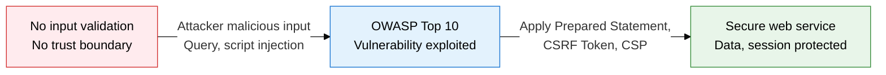
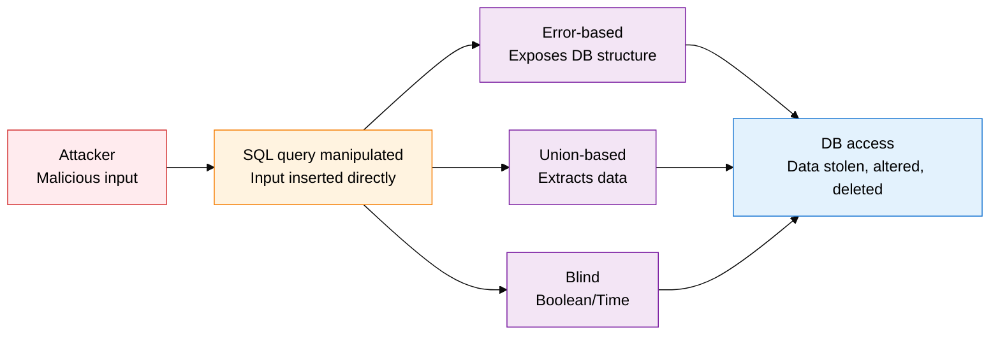
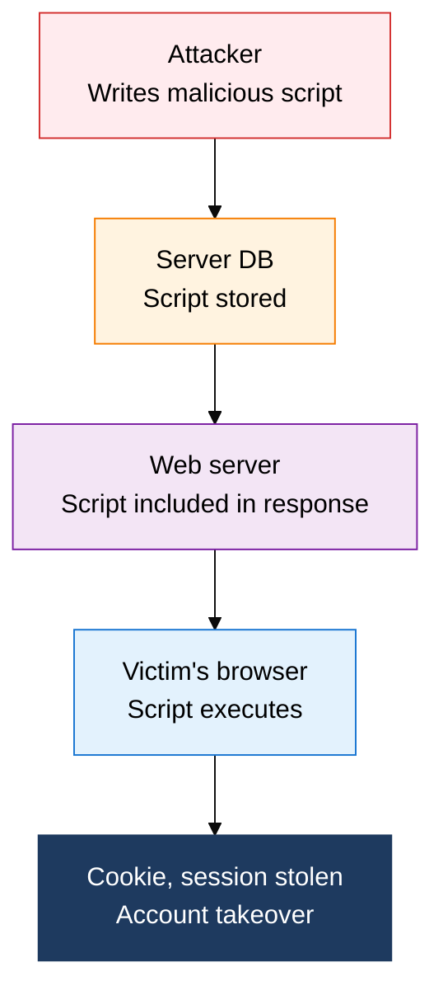

## 1. Common Web Application Vulnerabilities and Defenses: Overview of OWASP

**Definition**: An OWASP-based vulnerability management framework that categorizes web application flaws in input handling, authentication, and access control, and lays out both how each attack works and how to defend against it.
- OWASP (Open Web Application Security Project) updates its Top 10 vulnerability list every 3 to 4 years, and it is used as an international standard
- SQL Injection, XSS, and CSRF are the 3 core vulnerabilities, high in both frequency and impact, and mandatory exam topics
- Defense rests on 4 pillars: input validation, output encoding, session management, and token-based verification

**Characteristics**:
- **Risk-based classification**: the Top 10 is selected by combining CVSS scores with actual exploitation frequency, so it can be used directly to set security priorities
- **Dual attack/defense perspective**: each vulnerability is presented symmetrically, covering both how the attack works and what defends against it
- **Integrated across the development lifecycle**: provides a layered defense that can be applied at the coding standard, framework configuration, and server configuration levels

---

## 2. Core Structure of OWASP Web Vulnerabilities

### A. OWASP Top 10 (2021) and SQL Injection

| Type | Mechanism | Detection method | Countermeasure |
|---|---|---|---|
| **Error-based** | Deliberately triggers a syntax error to extract structure from DB error messages | Monitor abnormal error responses, error messages | Hide error messages, use Prepared Statement |
| **Union-based** | Uses UNION SELECT to merge another table's data into the result | Detect a mismatched column count, extra data | Whitelist input validation, use an ORM |
| **Blind** | Infers data from true/false response differences or response delay | Detect repeated request patterns, abnormal response time | Parameter binding, least-privilege DB account |

**Key items in the OWASP Top 10 (2021)**

| Rank | Item | Main vulnerability types |
|---|---|---|
| A01 | Broken Access Control | Horizontal/vertical privilege escalation, IDOR |
| A02 | Cryptographic Failures | Plaintext transmission, weak encryption algorithms |
| A03 | Injection | SQL, OS, LDAP injection |
| A05 | Security Misconfiguration | Default accounts, unnecessary features enabled |
| A07 | Identification & Authentication Failures | Session fixation, brute force |
| A10 | SSRF | Server-side request forgery |

---

### B. XSS and CSRF

| XSS type | Where stored | When it runs | Severity | Defense |
|---|---|---|---|---|
| **Stored XSS** | Persisted in the DB | When the victim visits the page | Highest | HTML encoding, input validation, CSP |
| **Reflected XSS** | URL parameter | Immediately on clicking a malicious link | Medium | Output encoding, escape user input |
| **DOM-based XSS** | DOM manipulation (server not involved) | When client-side script runs | Medium | Use textContent instead of innerHTML |

| Category | XSS | CSRF |
|---|---|---|
| **Attack goal** | Run a script in the victim's browser | Execute an unintended request using the victim's session |
| **Resource exploited** | The victim's browser DOM | The victim's authenticated session/cookie |
| **Core defense** | Output encoding, CSP | CSRF Token, SameSite cookie (Strict/Lax), Referer validation |

---

## 3. Expected Benefits and Practical Applications of Defending Against OWASP Web Vulnerabilities

| Category | Key benefits | Use and practical application |
|---|---|---|
| **Security** | Blocking SQL Injection, XSS, and CSRF removes the risk of data leaks and session theft | Adopt Prepared Statement everywhere, standardize an HTML encoding library, apply a common CSRF Token filter |
| **Regulatory compliance** | Addressing the OWASP Top 10 meets the technical safeguard requirements of personal data protection law and ISMS-P | Run an OWASP-based vulnerability assessment at least once a year, feed results back into development guidelines |
| **Development quality** | Removing security flaws early in coding cuts the cost of patching in production | Fold OWASP items into the code review checklist, integrate SAST tools into the CI/CD pipeline |
| **Response capability** | Detection rules built on an understanding of attack mechanics improve WAF/IDS detection accuracy | Keep WAF SQL Injection/XSS signatures current, verify defense effectiveness with penetration testing |
