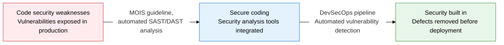
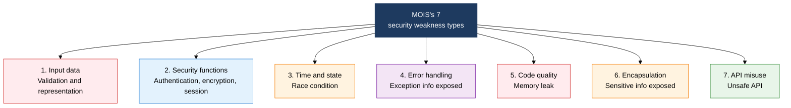
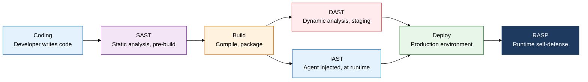

## 1. Detecting Code-Level Security Weaknesses with Automated Analysis Tools: Overview of Secure Coding and SAST/DAST

**Definition**: A code-level security framework that writes source code to the 7 security weakness criteria set by Korea's Ministry of the Interior and Safety (MOIS), then detects and removes vulnerabilities with automated SAST, DAST, and IAST tools.
- MOIS's "Software Development Security Guide" is mandatory for public-sector software development and defines 7 vulnerability categories
- SAST (static), DAST (dynamic), IAST (interactive), and RASP (self-defending) are 4 complementary tools that differ in detection timing and approach
- In a DevSecOps environment, each tool is integrated into the CI/CD pipeline to automate security analysis

**Characteristics**:
- **Layered detection**: a layered structure that detects different vulnerability types at 3 points: pre-build (SAST), at runtime under test (DAST), and in production runtime (IAST, RASP)
- **Automation integration**: embedding security analysis tools in the CI/CD pipeline enables continuous security verification without relying on manual effort
- **Feedback loop**: feeding detected vulnerabilities back to developers immediately achieves both a fix and a learning effect at the coding stage

---

## 2. Core Structure of Secure Coding and Security Analysis Tools

### A. MOIS's 7 Secure Coding Weaknesses

| Type | Representative vulnerability | Root cause | Countermeasure |
|---|---|---|---|
| **Input data validation/representation** | SQL Injection, XSS, path manipulation, OS command injection | External input used directly in a query or command without validation | Prepared Statement, whitelist input validation, encoding |
| **Security functions** | Weak encryption algorithm, session fixation, hardcoded password | Using an unvetted crypto library, session ID not regenerated | Use AES-256/SHA-256 or stronger, reissue the session after login |
| **Time and state** | TOCTOU (time-of-check to time-of-use), race condition | State changes between checking and using a file | Atomic operations, synchronization locks, secure temp-file handling |
| **Error handling** | Stack trace or DB info exposed in error messages | Returning the raw exception to the user | Generic error messages for users, log internal details separately |
| **Code quality** | Null pointer dereference, memory leak, use-after-free | Careless pointer/memory management | Static analysis tools, code review, memory-safe languages |
| **Encapsulation** | Private fields directly exposed, debug info shipped | Weak access-control design, build configuration error | Minimize access modifiers, strip debug info from production builds |
| **API misuse** | Vulnerable library version, unsafe random number function | Poor management of outdated dependencies, careless use of risky functions | SCA (software composition analysis), maintain a list of safe APIs |

---

### B. Comparing SAST/DAST/IAST/RASP Security Analysis Tools

| Tool | Detection timing | Analysis approach | False positive rate | Advantages | Representative tools |
|---|---|---|---|---|---|
| **SAST** | Pre-build (source code) | Static analysis of source/bytecode (white-box) | High | Fast feedback, easy CI integration, full code coverage | SonarQube, Checkmarx, Fortify |
| **DAST** | At runtime | Simulates HTTP attacks from outside (black-box) | Low | Tests the real running environment, detects auth/session vulnerabilities | OWASP ZAP, Burp Suite, Nessus |
| **IAST** | At runtime (agent) | Traces code flow via an in-app agent (gray-box) | Very low | Combines SAST and DAST strengths, pinpoints vulnerability location precisely | Contrast Security, Seeker |
| **RASP** | Runtime (production) | Analyzes execution context to detect and block attacks instantly | Low | Real-time self-defense ahead of patching, can respond to 0-days | Sqreen, Hdiv Security, OpenRASP |

---

## 3. Expected Benefits and Practical Applications of Adopting Secure Coding and SAST/DAST

| Category | Key benefits | Use and practical application |
|---|---|---|
| **Early vulnerability removal** | SAST automation scans 100% of coding-stage security weaknesses before deployment, sharply cutting production patching cost | Integrate SonarQube/Fortify into the CI pipeline's build stage, auto-abort the build when a critical vulnerability is found |
| **Regulatory/mandatory compliance** | Meets the assessment-report submission requirement for public agencies bound by MOIS's Software Development Security Guide | Adopt a secure coding assessment tool based on the 7 weakness categories (e.g. SPARROW), produce a results report at least once a year |
| **DevSecOps integration** | An automated SAST (build), DAST (staging), IAST (runtime) chain builds security in without slowing development | Insert a security analysis stage at each step of the GitHub Actions/Jenkins pipeline, integrate automatic vulnerability ticket creation |
| **Security skill building** | Giving developers immediate feedback on a vulnerability's location, cause, and fix builds up security knowledge | Run weekly secure coding sessions, analyze per-developer vulnerability patterns from SAST results and provide tailored training |
