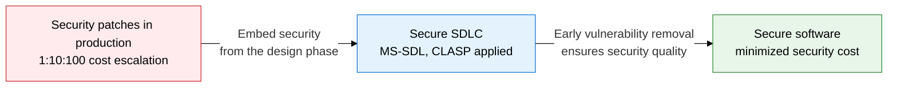
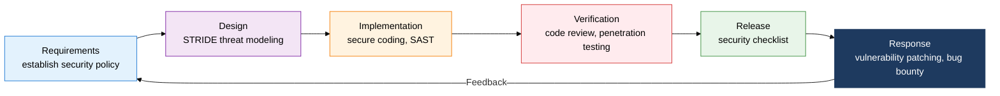
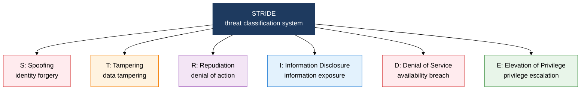

## 1. Secure SDLC, Which Embeds Security from the Design Phase — Overview of Secure SDLC

**Definition**: A security-centered development life cycle framework that systematically integrates security activities across every phase of software development to identify and remove vulnerabilities early.
- The 1:10:100 rule applies: if the cost to fix a vulnerability found at the requirements stage is 1, the cost to fix the same vulnerability found in production reaches 100.
- MS-SDL, Seven Touchpoints, and CLASP are the three representative methodologies; organizations can choose one or combine them based on their size and environment.
- Performing threat modeling (STRIDE) at the design stage removes architecture-level security flaws in advance.

**Characteristics**:
- **Proactive Security**: Mandates defining security requirements and performing threat modeling before development begins, removing design flaws at an early stage.
- **Process Integration**: Installs a security gate at each stage of the existing SDLC and manages it as a release condition.
- **Iterative Improvement**: A cyclical structure that includes a post-deployment vulnerability Response stage and feeds that feedback into the next development cycle.

---

## 2. Core Structure of Secure SDLC

### A. The Three Secure SDLC Methodologies

| Methodology | Approach | Strengths | Suitable Environment |
|---|---|---|---|
| **MS-SDL** | Sequential security integration through 7 gate-based stages, Microsoft's official process | Requires clear security deliverables at each stage, easy audit trail | Large enterprises, regulated environments |
| **Seven Touchpoints** | Inserts 7 security activities, such as code review and vulnerability testing, into the SDLC (McGraw) | Adds security to the existing development process with minimal disruption | Organizations that need minimal process change |
| **CLASP** | A lightweight process based on a 24-item security activity checklist | Clarifies security responsibilities by role, easy to apply in Agile and small teams | Startups, Agile teams, small and mid-sized development organizations |

---

### B. Threat Modeling — STRIDE and DREAD

| Threat | Description | Violated Security Property | Countermeasure |
|---|---|---|---|
| **Spoofing** | Impersonating another user or system | Authentication | MFA, strong authentication tokens, digital signatures |
| **Tampering** | Violating the integrity of data in transit or at rest | Integrity | Digital signatures, HMAC, encrypted transport (TLS) |
| **Repudiation** | Denying an action that was performed | Non-repudiation | Audit logs, timestamps, digital signatures |
| **Information Disclosure** | Exposing information to unauthorized parties | Confidentiality | Encryption, access control, least privilege principle |
| **Denial of Service** | Blocking legitimate users from accessing the service | Availability | Rate limiting, load balancing, fault tolerance |
| **Elevation of Privilege** | Gaining higher privileges from a lower privilege level | Authorization | RBAC, least privilege, separation of duties |

**DREAD Risk Scoring**: Rates threat priority by scoring 5 factors — Damage, Reproducibility, Exploitability, Affected Users, and Discoverability — each from 1 to 10.

---

## 3. Expected Benefits and Practical Applications of Adopting Secure SDLC

| Category | Key Benefit | Practical Application |
|---|---|---|
| **Cost Reduction** | Early removal of vulnerabilities at the design and implementation stages cuts production patch costs by up to 100x | Mandate security gates at the requirements and design stages, build a system to measure cost by discovery stage |
| **Security Quality** | STRIDE threat modeling removes architecture-level security flaws before they reach the design stage | During design review, create a DFD (data flow diagram), classify it with STRIDE, and manage priority using DREAD scores |
| **Regulatory Compliance** | Applying MS-SDL and CLASP satisfies the development security requirements of ISO 27001, ISMS-P, and the Personal Information Protection Act | Retain each methodology's deliverables (threat models, security requirements, test results) as audit evidence |
| **Organizational Capability** | Raises security awareness across the development team and builds a culture of embedded security | Run Secure SDLC training at least twice a year, and introduce a Security Champion program to build security anchors within each team |
