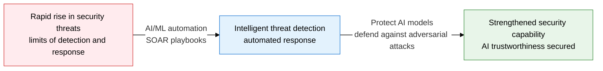
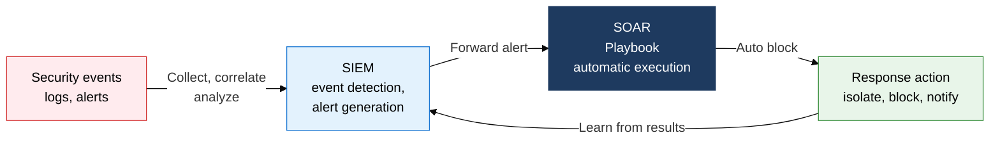
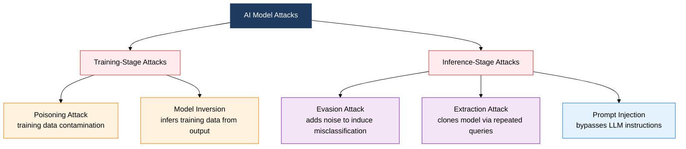

## 1. Strengthening Security with AI While Defending the AI Model Itself — Overview of AI and Security

**Definition**: A two-way security framework that uses AI/ML for security detection and automated response (defensive AI) while also protecting the AI model itself from adversarial attacks.
- SOAR and UEBA automatically classify and respond to large volumes of security events, maximizing SOC operational efficiency.
- Adversarial attacks (evasion, poisoning, extraction, inversion) manipulate an AI model's judgment or steal its training data.
- As LLMs spread, security threats unique to generative AI, such as prompt injection and RAG poisoning, are emerging.

**Characteristics**:
- **Automated Response**: SOAR playbook-based automation of repetitive responses shortens mean time to detect and respond (MTTD/MTTR).
- **Behavioral Analysis**: UEBA uses ML to detect abnormal user and device behavior patterns, catching zero-day and insider threats early.
- **AI Trustworthiness**: Adversarial defense techniques (input validation, differential privacy, model watermarking) guarantee AI model integrity.

---

## 2. Core Structure of AI and Security

### A. AI-Driven Security (Defensive Perspective)

| Category | SIEM | SOAR |
|---|---|---|
| **Function** | Log collection, correlation analysis, alert generation | Alert classification, playbook-based automated response |
| **Automation** | Rule-based alerting, manual response | Automates repetitive tasks: ticketing, isolation, blocking |
| **Response Method** | Manual handling after analyst judgment | Automatic handling within seconds via playbook execution |
| **Use** | Threat intelligence integration, audit logs | SOC operational efficiency, shortened MTTD/MTTR |

---

### B. Attacks on AI Models and LLM Security

| Attack Type | Timing | Target | Goal | Defense Method |
|---|---|---|---|---|
| **Evasion** | Inference stage | Input data | Induce misclassification with subtle noise | Input validation, adversarial training |
| **Poisoning** | Training stage | Training dataset | Insert model bias or a backdoor | Data integrity verification, cleansing |
| **Extraction** | Inference stage | Model API | Clone the model via repeated queries | Query throttling, output noise addition |
| **Inversion** | Inference stage | Model output | Infer training data from output | Differential privacy, output restriction |

---

## 3. Expected Benefits and Practical Applications of AI and Security

| Category | Key Benefit | Practical Application |
|---|---|---|
| **Advanced Detection** | ML-based anomaly detection catches zero-day and unknown threats early | Adopt UEBA, apply ML analysis to network traffic, integrate NDR solutions |
| **Response Automation** | SOAR playbooks cut MTTD/MTTR from tens of minutes to seconds | Automate repetitive SOC tasks, integrate SIEM-SOAR ticketing |
| **AI Model Security** | Adversarial defense secures the trustworthiness and integrity of AI-based security systems | Apply adversarial training, differential privacy, model watermarking |
| **LLM Governance** | Countering prompt injection and RAG poisoning keeps generative AI services running safely | Apply input filtering and output validation, review against the OWASP LLM Top 10 |
