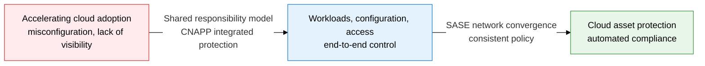
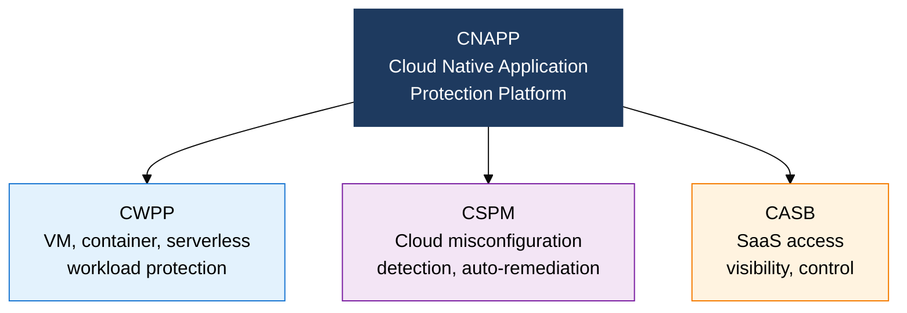
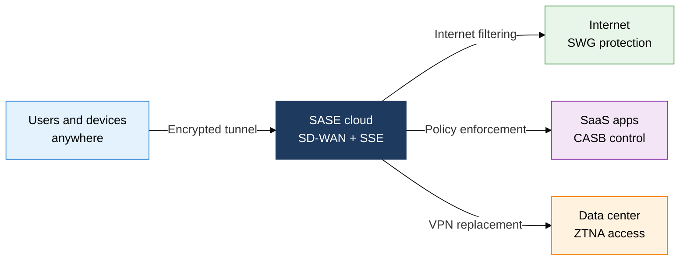

## 1. Protecting Cloud Assets End to End with Shared Responsibility and CNAPP — Overview of Cloud Security Architecture

**Definition**: A security framework, built on the shared responsibility model between the CSP and the customer, that protects cloud assets end to end through a CNAPP architecture integrating CWPP, CSPM, and CASB, together with SASE.
- The line dividing security responsibility between the CSP and the customer shifts depending on the cloud service type (IaaS, PaaS, SaaS).
- Gartner is driving the trend of consolidating fragmented cloud security tools into CNAPP.
- In remote-work and multi-cloud environments, SASE converges networking and security delivery in the cloud.

**Characteristics**:
- **Clarified Shared Responsibility**: The customer's responsibility narrows moving from IaaS to PaaS to SaaS, with security roles clearly divided for each model.
- **CNAPP Integration**: Consolidates workload protection (CWPP) and configuration management (CSPM) into a single platform, eliminating security blind spots.
- **SASE Convergence**: Delivers SD-WAN and SSE (CASB, SWG, ZTNA) together from the cloud, applying consistent policy across distributed environments.

---

## 2. Core Structure of Cloud Security Architecture

### A. Shared Responsibility Model and Gartner Cloud Security Solutions

| Solution | Protection Target | Key Function | When Applied |
|---|---|---|---|
| **CWPP** | VM, container, serverless workloads | Vulnerability scanning, runtime protection, malware detection | At workload deployment |
| **CSPM** | Cloud infrastructure configuration | Misconfiguration detection, auto-remediation, compliance audit | Continuous monitoring |
| **CASB** | SaaS application access | Shadow IT detection, DLP, access control | When using SaaS |
| **CNAPP** | The entire cloud-native application | CWPP + CSPM integration, consistent protection from code to runtime | Across development through operations |

---

### B. SASE and SSE Architecture

| Category | Traditional Network Security | SASE |
|---|---|---|
| **Location** | Data-center-centric appliances | Distributed cloud edge |
| **Policy Management** | Individual per-device configuration | Unified in a single cloud console |
| **Scalability** | Requires hardware expansion | Elastic cloud scale |
| **Remote Work** | VPN bottlenecks, degraded performance | ZTNA guarantees the optimal path |

---

## 3. Expected Benefits and Practical Applications of Adopting Cloud Security Architecture

| Category | Key Benefit | Practical Application |
|---|---|---|
| **Visibility** | Gains full visibility into multi-cloud assets, automatically detects misconfigurations | Adopt CSPM for unified configuration management across AWS, Azure, and GCP |
| **Workload Protection** | Blocks container and serverless runtime threats in real time | CWPP-based Kubernetes runtime security, CI/CD image scanning |
| **Access Control** | Detects and blocks SaaS shadow IT, prevents data leaks | CASB-integrated DLP policy, replacing remote-access VPN with ZTNA |
| **Compliance** | Automatically produces regulatory compliance evidence for the cloud environment, reduces audit burden | Automated CIS Benchmark and ISO 27017 checks based on CNAPP |
