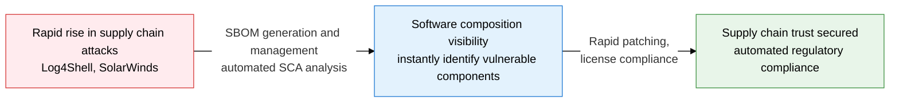
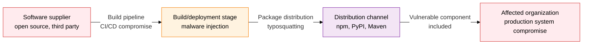

## 1. Tracking Vulnerabilities Through Software Supply Chain Visibility and SBOM — Overview of Supply Chain Security and SBOM

**Definition**: A security framework that catalogs every open-source and third-party component making up a piece of software into an SBOM, tracking and managing supply chain attacks and open-source vulnerabilities.
- The SolarWinds, Log4Shell, and XZ Utils incidents demonstrated the reach and detection difficulty of supply chain attacks.
- An SBOM records component name, version, license, and dependencies in a machine-readable format.
- The U.S. Executive Order (EO 14028) and CISA guidelines are moving to mandate SBOM submission for federal procurement.

**Characteristics**:
- **Supply Chain Visibility**: Transparently tracks every component and dependency included in the software, instantly identifying the scope of a vulnerability's impact.
- **Rapid Response**: When a new CVE is disclosed, immediately looks up affected components in the SBOM to prioritize patching or replacement.
- **License Compliance**: Automatically verifies obligations under licenses such as GPL, MIT, and Apache based on the SBOM, reducing legal risk.

---

## 2. Core Structure of Supply Chain Security and SBOM

### A. Supply Chain Security Threats and Open-Source Vulnerabilities

| Attack | Infiltration Path | Damage | Response |
|---|---|---|---|
| **SolarWinds** | Build server compromised → backdoor inserted into update files | Over 18,000 organizations breached | Build environment integrity verification, code signing |
| **Log4Shell** | JNDI injection via a Log4j vulnerability (CVE-2021-44228) | Remote code execution on hundreds of millions of servers | Detect and patch Log4j usage immediately with SCA |
| **Typosquatting** | Registering a malicious package under a similar name in a public repository | Malware executes when developers install it | Package hash verification, supply chain policy |
| **XZ Utils** | Posing as an open-source contributor to insert a long-running backdoor | Potential authentication bypass in the SSH daemon | Contributor verification, stronger code review |

---

### B. SBOM (Software Bill of Materials)

```mermaid
%%{init: { 'theme': 'base', 'themeVariables': { 'edgeLabelBackground': '#fff' }}}%%
flowchart LR
    SRC["Source code<br/>includes open source"] --"SCA tool<br/>analysis"--> SCA["SCA analysis<br/>Syft, Trivy, FOSSA"]
    SCA --"Auto generate"--> SBOM["SBOM<br/>SPDX, CycloneDX"]
    SBOM --"CVE mapping"--> VDB["Vulnerability DB<br/>NVD, OSV"]
    VDB --"Affected components<br/>instant lookup"--> RESP["Vulnerability response<br/>patch, replace, isolate"]
    style SRC fill:#E3F2FD,stroke:#1976D2,color:#000
    style SCA fill:#F3E5F5,stroke:#7B1FA2,color:#000
    style SBOM fill:#1E3A5F,stroke:#1E3A5F,color:#fff
    style VDB fill:#FFF3E0,stroke:#F57C00,color:#000
    style RESP fill:#E8F5E9,stroke:#388E3C,color:#000
```

| Category | SPDX | CycloneDX |
|---|---|---|
| **Developing Organization** | Linux Foundation | OWASP |
| **Format** | RDF, TV, JSON, YAML | XML, JSON, Protocol Buffers |
| **Focus** | License compliance, ISO/IEC 5962 standard | Security vulnerabilities, VEX integration |
| **Primary Use** | Open-source license audits, supply chain transparency | CI/CD security gates, vulnerability tracking |

---

## 3. Expected Benefits and Practical Applications of Adopting Supply Chain Security and SBOM

| Category | Key Benefit | Practical Application |
|---|---|---|
| **Visibility** | Fully identifies software components, exposes hidden vulnerable components | Integrate SCA tools into the CI/CD pipeline, auto-generate SBOMs |
| **Rapid Response** | Looks up affected components the moment a new CVE is published, auto-determines patch priority | Integrate with the NVD/OSV vulnerability database, auto-alert on affected SBOM entries |
| **License Management** | Automatically detects copyleft obligations such as GPL and LGPL, removes legal risk in advance | Automatically apply license policy based on FOSSA and Black Duck |
| **Regulatory Compliance** | Addresses the U.S. EO 14028 and CISA guidelines, meets public sector and financial procurement requirements | Attach CycloneDX SBOMs to deliverables, produce audit evidence based on the SPDX ISO standard |
