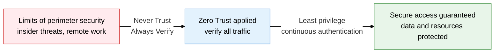
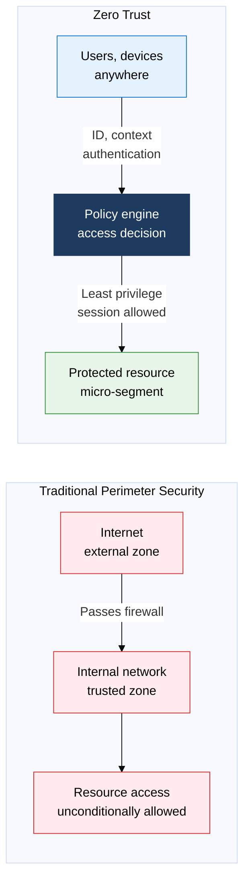
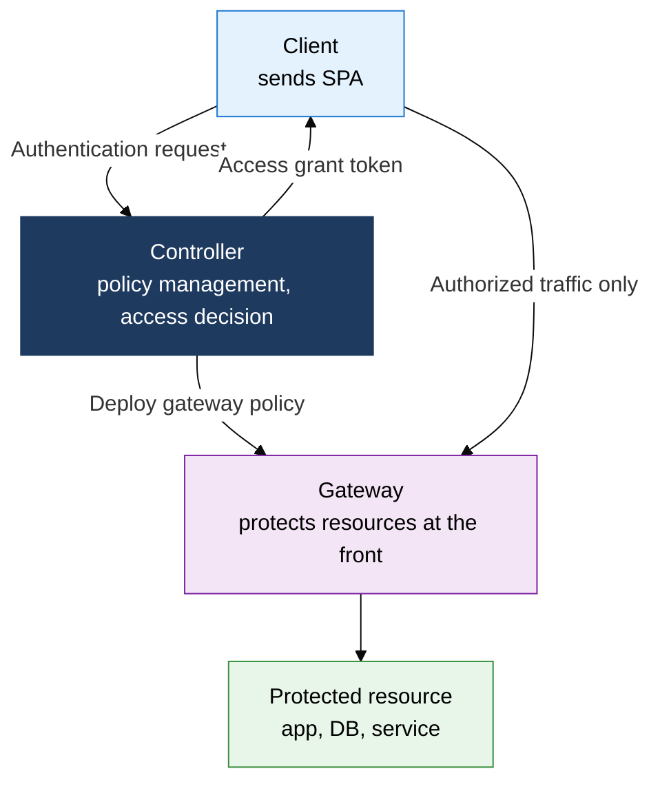

## 1. Perimeterless Security That Never Trusts and Always Verifies — Overview of Zero Trust

**Definition**: A perimeterless security model that continuously verifies every access attempt, internal or external, under the "Never Trust, Always Verify" principle, blocking insider threats and lateral movement.
- John Kindervag (Forrester) proposed the concept in 2010; it spread domestically through the Ministry of Science and ICT's 5 core guidelines.
- In cloud and remote-work environments, it fundamentally resolves the flawed assumption of internal trust in VPN-based perimeter security.
- Applies fine-grained controls across 5 areas: users, devices, networks, data, and applications.

**Characteristics**:
- **Explicit Verification**: Authenticates and authorizes identity, device state, and context on every request, regardless of location or network.
- **Least Privilege**: Grants only the minimum resources needed for the task, on a time-limited basis, blocking privilege abuse.
- **Assume Breach**: Assumes the internal network is already compromised, encrypting and logging all traffic.

---

## 2. Core Structure of Zero Trust

### A. Zero Trust Concepts and 3 Core Principles

| Category | Traditional Perimeter Security (VPN) | Zero Trust |
|---|---|---|
| **Trust Model** | Automatic trust for the internal network | Both internal and external verified |
| **Access Basis** | Network location (IP) | Identity, device, context |
| **Insider Threat** | Hard to detect, allows lateral movement | Blocked via micro-segmentation |
| **Cloud Suitability** | Limited by an unclear perimeter | Optimal for cloud-native environments |

---

### B. SDP (Software Defined Perimeter) Implementation Model

| Component | Role | Function | Characteristics |
|---|---|---|---|
| **Controller** | Manages authentication policy | Verifies users and devices, makes access decisions | Centralizes policy, separates PEP and PDP |
| **Gateway** | Protects resources at the front | Passes only authorized traffic, keeps ports hidden | Blocks port scanning before SPA receipt |
| **Client** | User endpoint agent | Sends SPA, requests authentication from the controller | Replaces VPN with a ZTNA app |

---

## 3. Expected Benefits and Practical Applications of Adopting Zero Trust

| Category | Key Benefit | Practical Application |
|---|---|---|
| **Strengthened Security** | Blocks insider threats and lateral movement, minimizes the spread of a breach | Apply micro-segmentation, encrypt and log all traffic |
| **Access Control** | The least-privilege principle prevents excessive privilege abuse | IAM-integrated RBAC/ABAC policy, JIT (Just-In-Time) privilege grants |
| **Cloud Readiness** | Applies consistent security policy in a perimeterless environment | Replace VPN with ZTNA, integrate CASB and CSPM for cloud access control |
| **Regulatory Compliance** | Logging every access attempt secures audit and compliance evidence | Phased adoption across the 5 areas of the Ministry of Science and ICT's Zero Trust guidelines |
