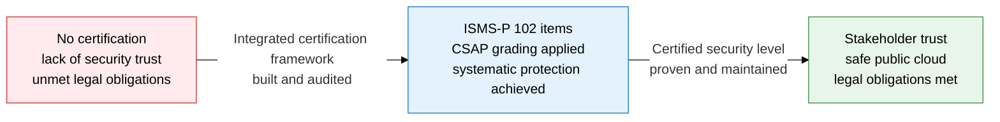
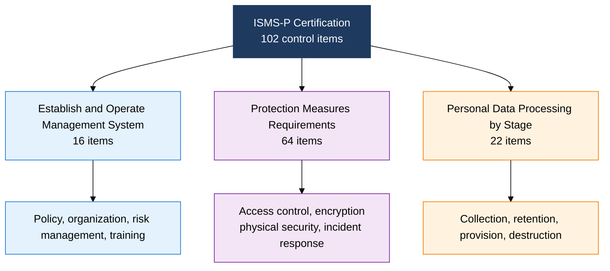
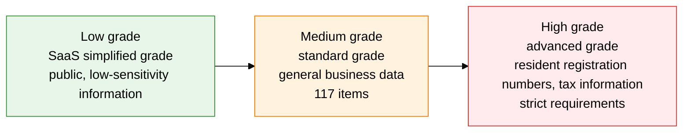

## 1. The Two Pillars of Domestic Information Security Certification — Overview of ISMS-P and CSAP

**Definition**: A certification framework that certifies security levels based on ISMS-P — which merges the domestic Information Security Management System (ISMS) with the Personal Information Management System (PIMS) — and the CSAP grading system for public cloud security.
- ISMS-P is Korea's flagship certification, formed in 2019 by merging ISMS and PIMS to eliminate the burden of duplicate audits.
- CSAP applies 3 grades — high, medium, and low — based on data sensitivity when public institutions adopt cloud services.
- Both certifications involve the Korea Internet & Security Agency (KISA) as the certifying body and carry a 3-year validity period.

**Characteristics**:
- **Integrated Management**: ISMS-P audits technical, managerial, and physical security along with the entire personal data processing lifecycle as a single framework.
- **Tiered Grading**: CSAP applies differentiated security requirements based on data sensitivity, reducing the adoption burden.
- **Mandatory Certification**: Information and communication service providers above a certain size are legally required to obtain ISMS-P certification.

---

## 2. Core Structure of ISMS-P and CSAP

### A. ISMS-P Certification Framework

| Certification Area | Control Items | Key Content |
|---|---|---|
| **Establish and Operate Management System** | 16 | Information security policy and organization, risk management, security training, legal compliance |
| **Protection Measures Requirements** | 64 | Access control, encryption, physical security, breach detection and response, supply chain security |
| **Personal Data Processing by Stage** | 22 | Personal data collection and use, retention and destruction, third-party provision, data subject rights |

---

### B. CSAP Cloud Security Certification Grading System

| Grade | Target Data | Security Requirements | Key Characteristics |
|---|---|---|---|
| **Low (Simplified)** | Low-sensitivity public information, administrative support tasks | Minimum requirements | SaaS-focused, fast certification lowers the barrier to public sector entry |
| **Medium (Standard)** | General business data, internal administrative information | 117 items | Covers IaaS and SaaS, applied to most public institution operations |
| **High (Advanced)** | Resident registration numbers, tax information, nationally critical data | Over 117, plus additional requirements | Physical network separation and secure zone requirements, applied to core national systems |

---

## 3. Expected Benefits and Practical Applications of Adopting ISMS-P and CSAP Certification

| Category | Key Benefit | Practical Application |
|---|---|---|
| **Legal Obligation** | Fulfills the mandate for providers with revenue over 10 billion won or over 1 million users | Build an ISMS-P certification roadmap, self-check mandatory status annually |
| **Trust Building** | The certification mark raises trust among customers, partners, and regulators | Publish and maintain the certificate, use it for bonus points in B2G bids |
| **Public Cloud** | Grade-specific CSAP certification enables entry into the public sector cloud market | Analyze data sensitivity to select the right grade, optimize audit costs |
| **Internal Capability** | Preparing for certification strengthens overall security controls | Perform a gap analysis across the 102 control items, focus improvement on weak areas, and build a dedicated team |
