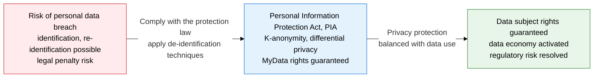
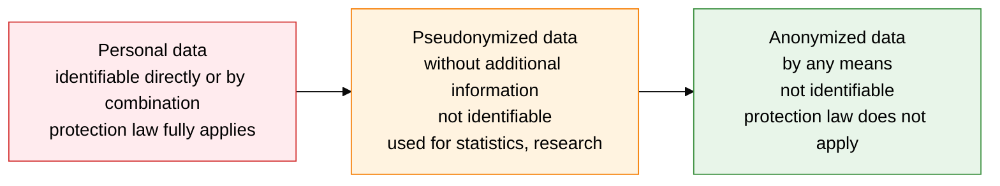
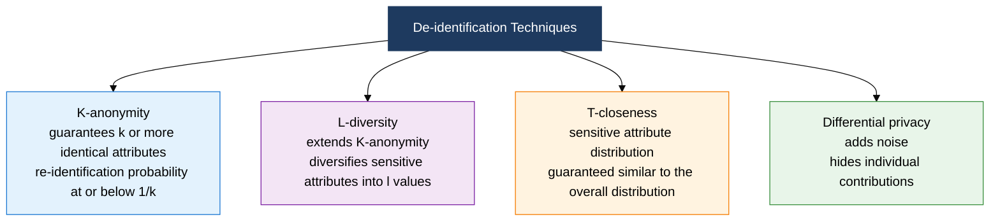

## 1. Guaranteeing Privacy Through the Personal Information Protection Act and De-identification Techniques — Overview of Personal Data Protection

**Definition**: A legal and technical framework that protects identifiable information about a living individual and balances privacy with data use through de-identification techniques and Privacy Impact Assessment (PIA).
- Defines protection scope and permitted use clearly across 3 categories: personal data, pseudonymized data, and anonymized data.
- Public institutions must conduct a PIA when building a system that processes personal data for 100,000 or more people.
- MyData (the right to data portability) lets individuals directly manage and use their own data.

**Characteristics**:
- **3-Tier Classification**: Applies differentiated protection by classifying data as personal, pseudonymized, or anonymized based on identifiability.
- **Proactive PIA**: Assesses privacy risk before a system is built, feeding controls back into the design stage.
- **Diverse De-identification Techniques**: Offers techniques of varying strength, including K-anonymity, L-diversity, and differential privacy.

---

## 2. Core Structure of the Personal Information Protection Act and PIA

### A. The Personal Information Protection Act Framework and MyData

| Category | Identifiability | Purpose of Use | Protection Law Application | Example |
|---|---|---|---|---|
| **Personal Data** | Identifiable directly or by combination | Processed for its original purpose based on consent | Fully applies | Name, resident registration number, phone number |
| **Pseudonymized Data** | Not identifiable without additional information | Usable for statistics, research, and public-interest purposes | Partially applies (safeguard obligations) | Pseudonymized medical records, purchase history |
| **Anonymized Data** | Not identifiable by any means | Used freely without restriction | Does not apply | Aggregate statistics, fully anonymized data |

---

### B. Privacy Impact Assessment (PIA) and De-identification Techniques

| Technique | Principle | Protection Level | Limitation |
|---|---|---|---|
| **K-anonymity** | Maintains k or more identical quasi-identifier attribute combinations | Limits re-identification probability to at most 1/k | Vulnerable to homogeneity and background-knowledge attacks |
| **L-diversity** | Diversifies sensitive attributes within a K-anonymity group into l or more values | Defends against homogeneity attacks | Vulnerable to skewness attacks |
| **T-closeness** | Keeps the sensitive attribute distribution within a group similar to the overall distribution within t | Addresses L-diversity's limitations, high-level protection | Reduced data utility |
| **Differential Privacy** | Adds mathematical noise to query results, hiding individual contributions | Mathematically guaranteed privacy (used by Apple and Google) | Data accuracy degrades as noise increases |

---

## 3. Expected Benefits and Practical Applications of Adopting the Personal Information Protection Act and PIA

| Category | Key Benefit | Practical Application |
|---|---|---|
| **Legal Compliance** | Removes the risk of fines and criminal penalties for violating the Personal Information Protection Act | Publish the privacy policy, refine the consent framework, conduct annual self-checks |
| **Data Utilization** | Pseudonymization and anonymization enable data analysis without violating privacy | Build a pseudonymization pipeline for research and statistics, assess de-identification adequacy |
| **Public Service** | Fulfilling the PIA mandate removes privacy risk from public systems in advance | Submit the PIA report to the Ministry of the Interior and Safety, apply Privacy by Design at the design stage |
| **MyData** | Supporting the right to data portability in finance and healthcare builds customer trust | Build API-based data portability infrastructure, operate a portal for exercising data subject rights |
