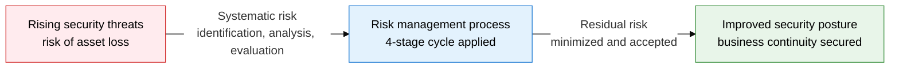
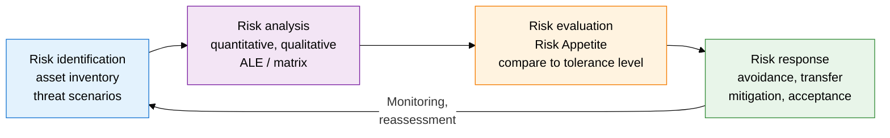
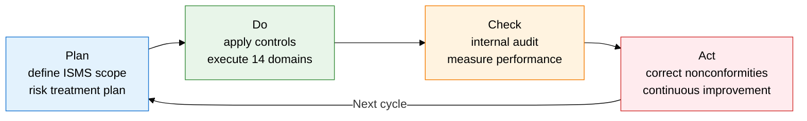

## 1. The Security Risk Management Cycle of Identification, Analysis, Evaluation, and Response — Overview of Security Risk Management

**Definition**: An information security management framework that comprehensively analyzes threats, vulnerabilities, and asset value to identify, evaluate, and respond to risk.
- Quantifies risk with the formula Risk = Threat × Vulnerability × Asset Value.
- Applies quantitative (ALE-based) and qualitative (risk matrix) analysis techniques together.
- Builds a continuous improvement system by combining with the ISO/IEC 27001 PDCA cycle.

**Characteristics**:
- **Proactive Response**: Identifies risk before a breach occurs and selects cost-effective controls.
- **Quantifiable**: The formula ALE = SLE × ARO allows calculating return on investment (ROI).
- **Flexible Response Strategy**: Uses 4 strategies — avoidance, transfer, mitigation, acceptance — for the optimal response to each situation.

---

## 2. Core Structure of Security Risk Management

### A. The 4-Stage Risk Management Process

| Response Strategy | Definition | Example | Applicable Condition |
|---|---|---|---|
| **Avoidance** | Stops the activity that causes the risk entirely | Decommission the risky system, discontinue the service | When risk far exceeds the tolerance level |
| **Transfer** | Shifts the financial responsibility for the risk to a third party | Purchase cyber insurance, outsourcing contract | When frequency is low but impact is large |
| **Mitigation** | Applies security controls to reduce the risk level | Implement firewalls, encryption, access control | When cost-effective |
| **Acceptance** | Recognizes the residual risk and accepts it as is | Document risk acceptance, obtain management approval | When risk is within the tolerance level or the cost of response is excessive |

---

### B. ISO/IEC 27001 Information Security Management System

| Control Domain | Key Controls | Purpose |
|---|---|---|
| **Information Security Policy** | Document the policy, obtain management approval and review | Establish security direction across the organization |
| **Human Resource Security** | Pre-employment screening, security training, termination procedures | Prevent insider threats and raise security awareness |
| **Access Control** | Least privilege, account management, privileged account control | Block information leaks from unauthorized access |
| **Encryption** | Establish encryption policy and key management procedures | Guarantee confidentiality and integrity of data at rest and in transit |
| **Business Continuity (BCP/DR)** | Define RTO/RPO, establish and drill the disaster recovery plan | Quickly restore core operations when an incident occurs |

---

## 3. Expected Benefits and Practical Applications of Adopting Security Risk Management

| Category | Key Benefit | Practical Application |
|---|---|---|
| **Strategic** | Raises management's risk awareness and supports decision-making | Prioritize security investment using ALE, build a board reporting system |
| **Operational** | Prevents security incidents and minimizes damage in a breach | Maintain a risk register, apply a quarterly risk reassessment process |
| **Technical** | Earning ISO 27001 certification builds customer and partner trust | Build a PDCA-based ISMS, institutionalize internal audits and management review |
| **Regulatory Response** | Meets legal obligations under the Personal Information Protection Act and the Information Security Act | Document a risk treatment plan (RTP), prepare submission evidence for regulators |
