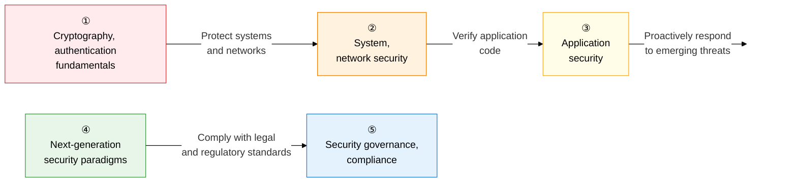

Security is a comprehensive answer to the question, **"How do we systematically protect information assets from threats?"**  
It covers the entire domain of information security, from the mathematical foundations of cryptography to next-generation security built on Zero Trust, cloud, and AI, and the ISMS-P governance framework.

## Learning Roadmap — 5-Stage Flow

---

## ① Cryptography and Authentication Fundamentals

> It is the **"mathematical backbone of every security technology."**  
> You must be able to draw the AES/RSA algorithm principles, the PKI trust hierarchy, and digital signature non-repudiation by hand.

| Order | Topic | Key Keywords | Importance |
|:---:|---|---|:---:|
| 1 | [Symmetric-Key Encryption](01-cryptography/symmetric-crypto) | AES-128/256, ECB/CBC/CTR/GCM modes, SEED, ARIA, LEA | ★★★ |
| 2 | [Asymmetric-Key Encryption](01-cryptography/asymmetric-crypto) | RSA prime factorization, ECC elliptic curves, DH key exchange, hybrid encryption | ★★★ |
| 3 | [Hash Functions and Digital Signatures](01-cryptography/hash-digital-signature) | SHA-2/SHA-3, HMAC, digital signature non-repudiation, rainbow table | ★★★ |
| 4 | [PKI Certificate System](01-cryptography/pki) | X.509 certificates, CA hierarchy, CRL/OCSP, certificate life cycle | ★★★ |
| 5 | [Authentication Protocols](01-cryptography/authentication) | OTP, Kerberos, OAuth 2.0/OIDC, MFA, Zero Trust authentication | ★★☆ |

**→ Key Study Point**: Explain the **difference in purpose** (confidentiality/key exchange/integrity) among symmetric-key, asymmetric-key, and hash in one line, and draw the flow from PKI certificate issuance to verification along with the roles of CA, RA, and OCSP.

---

## ② System and Network Security

> It covers **"everything from perimeter defense to transport-layer encryption."**  
> The 5 generations of firewall evolution, the SSL/TLS handshake, and DDoS/APT attack types are frequently tested essay topics.

| Order | Topic | Key Keywords | Importance |
|:---:|---|---|:---:|
| 6 | [Firewall, IDS, WAF, VPN](02-network-security/firewall-ids-waf-vpn) | Packet filtering, SPI, NGFW, false positives/negatives, WAF OWASP rule sets, SSL VPN | ★★★ |
| 7 | [SSL/TLS, IPsec](02-network-security/ssl-tls-ipsec) | TLS 1.3 handshake, ECDHE forward secrecy, IPsec AH/ESP/IKE | ★★★ |
| 8 | [Cyberattack Techniques](02-network-security/attack-techniques) | DDoS (volumetric, protocol, L7), APT kill chain, ransomware | ★★★ |
| 9 | [Wireless and Mobile Security](02-network-security/wireless-mobile-security) | WPA3, 802.1X EAP, evil twin, KRACK, MDM/MAM, 5G security | ★★☆ |

**→ Key Study Point**: You must be able to diagram the **0-RTT vs. 1-RTT difference** in the TLS 1.3 handshake and why it guarantees forward secrecy, and the **difference in header position** between IPsec tunnel and transport mode.

---

## ③ Application Security

> It covers **"security at the level of code and the development process."**  
> The principles behind the OWASP Top 10 vulnerabilities, the 3 Secure SDLC methodologies, and the SAST/DAST comparison are high-frequency essay topics.

| Order | Topic | Key Keywords | Importance |
|:---:|---|---|:---:|
| 10 | [OWASP Web Vulnerabilities](03-application-security/owasp-web-vulnerabilities) | SQL Injection, XSS (Stored, Reflected, DOM), CSRF, IDOR, SSRF | ★★★ |
| 11 | [Secure SDLC](03-application-security/secure-sdlc) | MS-SDL, Seven Touchpoints, CLASP, STRIDE, DREAD | ★★★ |
| 12 | [Secure Coding, SAST/DAST](03-application-security/secure-coding-sast-dast) | The Ministry of the Interior and Safety's 7 major vulnerabilities, SAST, DAST, IAST, RASP, DevSecOps | ★★★ |

**→ Key Study Point**: Memorize the **attack vector and defense method** for each of SQL Injection, XSS, and CSRF side by side, and organize the difference between SAST and DAST in a table by **analysis timing (static/dynamic), false-positive rate, and speed**.

---

## ④ Next-Generation and Modern Security Paradigms

> It is the **"security architecture standard for the cloud and AI era."**  
> The 3 Zero Trust principles, the 4 CNAPP tools (CWPP, CSPM, CASB), and the SBOM/EO 14028 background are the latest frequently tested topics.

| Order | Topic | Key Keywords | Importance |
|:---:|---|---|:---:|
| 13 | [Zero Trust](04-modern-security/zero-trust) | Never Trust Always Verify, SDP, ZTNA, micro-segmentation | ★★★ |
| 14 | [Cloud Security Architecture](04-modern-security/cloud-security) | Shared responsibility model, CWPP, CSPM, CASB, CNAPP, SASE, SSE | ★★★ |
| 15 | [AI and Security](04-modern-security/ai-security) | SOAR/UEBA automation, adversarial attacks (Evasion, Poisoning), LLM prompt injection | ★★☆ |
| 16 | [Supply Chain Security, SBOM](04-modern-security/supply-chain-sbom) | SCA, CVE/CVSS, SPDX, CycloneDX, EO 14028, open-source vulnerabilities | ★★★ |

**→ Key Study Point**: Compare Zero Trust's 3 principles — **"explicit verification, least privilege, assume breach"** — against traditional perimeter security, and draw the architecture showing how SASE integrates SD-WAN + SSE.

---

## ⑤ Security Governance and Compliance

> It covers **"the security management system and legal/regulatory compliance."**  
> You must memorize the 102 control items across ISMS-P's 3 areas, the CSAP grading system, and the 3-tier personal data classification system.

| Order | Topic | Key Keywords | Importance |
|:---:|---|---|:---:|
| 17 | [Security Risk Management](05-governance-compliance/risk-management) | Risk identification, analysis, evaluation, response, ALE=SLE×ARO, ISO 27001 PDCA, BCP/DR | ★★★ |
| 18 | [ISMS-P and CSAP Certification](05-governance-compliance/isms-p-csap) | ISMS-P's 102 control items (management, protection, personal data), CSAP high/medium/low grades | ★★★ |
| 19 | [Personal Information Protection Act and PIA](05-governance-compliance/privacy-law-pia) | Personal data, pseudonymized data, anonymized data, K-anonymity, differential privacy, PIA, MyData | ★★★ |

**→ Key Study Point**: Memorize the numbers for ISMS-P's 3 areas (management system 16, protection measures 64, personal data 22 = 102 total), and organize the 3-tier personal data classification (identifiable → pseudonymized → anonymized) by connecting it to **whether the protection law applies and the purpose of use**.

---

## Professional Engineer Exam Strategy

| Question Pattern | Key Response Strategy |
|---|---|
| **Describing Algorithm Principles** | Explain RSA prime factorization, ECC elliptic curves, and the SHA-3 sponge structure in plain language, without formulas |
| **Comparison Questions** | Memorize comparison tables for symmetric-key vs. asymmetric-key, SAST vs. DAST, IDS vs. IPS vs. WAF, TLS vs. IPsec |
| **Attack-Defense Pairs** | Organize detection and defense techniques as pairs for each attack (SQL Injection, XSS, DDoS, APT) |
| **Latest Trends** | Zero Trust SDP implementation, CNAPP integrated security, SBOM/EO 14028, LLM prompt injection |
| **Legal and Regulatory Connections** | ISMS-P mandatory targets (revenue over 10 billion won, over 1 million users), Personal Information Protection Act requirements for using pseudonymized data |
