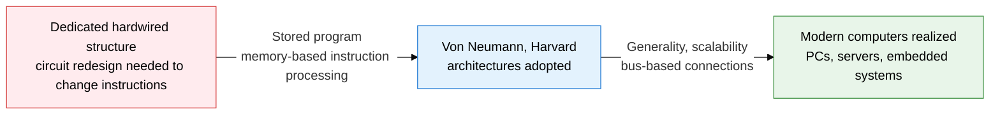
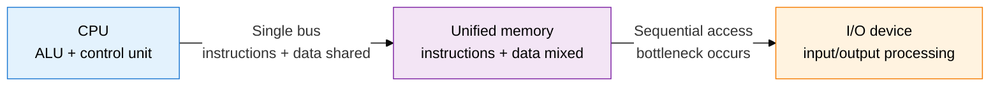
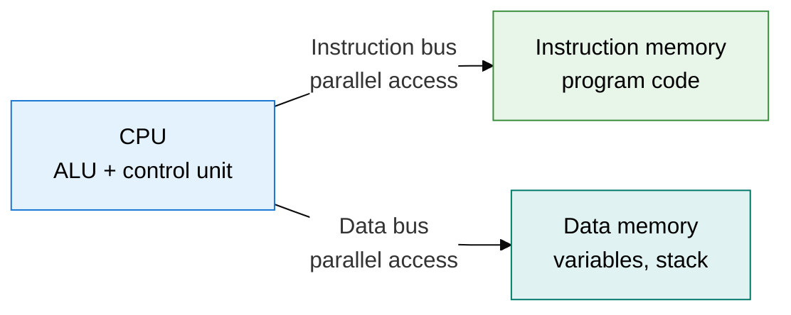
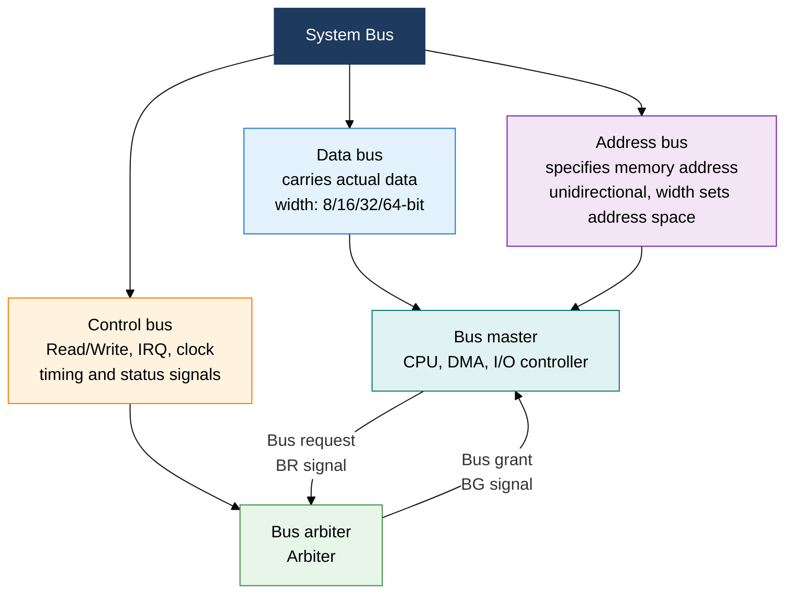

## 1. Realizing General-Purpose Computing Through the Stored-Program Concept — Overview of Basic Computer System Architecture

**Definition**: A hardware configuration for a digital computer that connects the CPU, memory, and I/O devices via a system bus and processes instructions using the stored-program concept.
- The Von Neumann architecture is a simple, general-purpose model that processes instructions and data through the same memory and bus.
- The Harvard architecture separates instruction memory from data memory to maximize parallel-access performance.
- The system bus (data, address, control) is the communication path for every component, and the bus arbitration method determines the bottleneck.

**Characteristics**:
- **Stored Program**: Stores instructions in memory, allowing the computer's function to change simply by swapping software.
- **Bus-Centered Connectivity**: A standardized system bus structure unifies data exchange among the CPU, memory, and I/O devices.
- **Von Neumann Bottleneck**: Instructions and data share the same bus, so memory bandwidth sets the performance limit.

---

## 2. Core Structure of Basic Computer System Architecture

### A. Von Neumann vs. Harvard Architecture Comparison

| Comparison | Von Neumann Architecture | Harvard Architecture |
|---|---|---|
| **Memory Structure** | Unified instruction and data memory | Separate instruction and data memory |
| **Bus Structure** | Single bus (instructions + data shared) | Dual bus (instructions/data independent) |
| **Processing Method** | Cannot access data while fetching an instruction | Can fetch an instruction and access data simultaneously |
| **Performance** | Bottleneck occurs, simple design | Bottleneck removed, higher hardware complexity |
| **Self-Modifying Code** | Possible (instructions can be treated as data) | Not possible (instructions and data are separate) |
| **Primary Use** | x86/ARM general-purpose CPUs, PCs, servers | AVR/PIC microcontrollers, DSPs, inside cache |

---

### B. System Bus Structure and Bus Arbitration Methods

| Bus Arbitration Method | Operating Principle | Advantages | Disadvantages | Application Example |
|---|---|---|---|---|
| **Daisy Chain** | Propagates the BG signal serially; the device that receives it first claims the bus | Simple to implement, low hardware cost | Fixed priority, starvation for lower-priority devices | ISA bus, early I/O |
| **Centralized** | An arbiter collects requests, then decides priority and grants access | Flexible priority policy, can guarantee fairness | Arbiter bottleneck, single point of failure | PCI bus, memory controller |
| **Distributed** | Every device monitors bus state and decides autonomously | No arbiter needed, high reliability | Complex protocol, must resolve simultaneous request collisions | IEEE 1394, CAN bus |
| **Polling** | The CPU periodically checks device request status in sequence | Priority can be changed dynamically with ease | CPU overhead, response delay | Embedded systems, legacy I/O |

---

## 3. Expected Benefits and Practical Applications of Basic Computer System Architecture

| Category | Key Benefit | Practical Application |
|---|---|---|
| **Design Optimization** | Choosing an architecture (Von Neumann/Harvard) achieves the optimal balance of performance, cost, and power | Apply a modified Harvard architecture (separate cache) in embedded systems, keep Von Neumann for general-purpose servers |
| **Performance Improvement** | Improving bus width, clock, and arbitration method eases memory bandwidth bottlenecks | Adopt high-speed DDR5/PCIe 5.0 buses, work around the Von Neumann bottleneck with cache hierarchy design |
| **Reliability** | Choosing the right bus arbitration method prevents deadlock and starvation and guarantees real-time response | Priority-based centralized arbitration in RTOS environments, real-time vehicle control via CAN bus |
| **Scalability Management** | Standard bus protocols (PCIe, USB, I2C) make it easy to connect heterogeneous devices | PCIe Gen5-based GPU/NVMe expansion, integrate IoT sensor modules via I2C/SPI |
