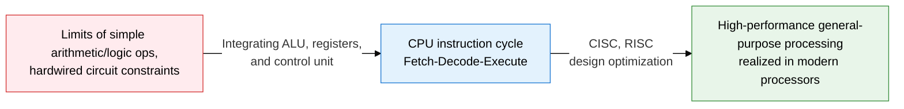
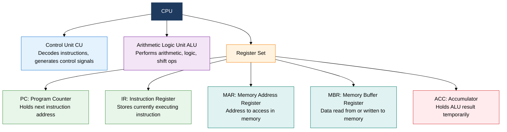
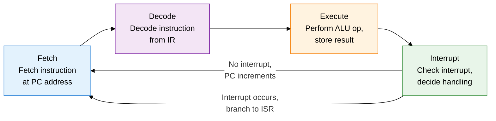
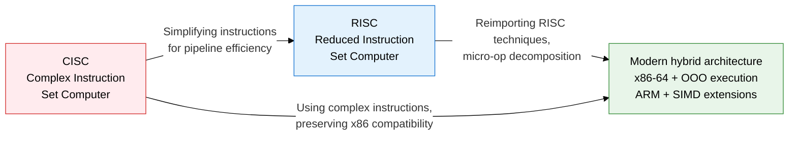

## 1. Overview of CPU Architecture and Operating Principles, the Central Processing Unit that Executes Programs via the Fetch-Decode-Execute Cycle

**Definition**: The central processing unit of a computer, composed of an ALU, control unit, and register set, that fetches, decodes, and executes instructions from memory.
- Repeats the instruction cycle (Fetch-Decode-Execute-Interrupt) to run programs sequentially
- Special-purpose registers such as PC, IR, MAR, and MBR control the instruction-processing flow
- CISC raises code density with complex instructions; RISC maximizes pipelining efficiency with simple instructions

**Characteristics**:
- **Von Neumann execution model**: A repeating cycle that fetches instructions sequentially from memory and updates internal state (registers)
- **High-speed register access**: Operands are processed directly in registers, hundreds of times faster than memory, minimizing latency
- **CISC/RISC divide**: Two design philosophies coexist — microcode-based complex instructions (x86 CISC) and hardwired simple instructions (ARM RISC)

---

## 2. Core Structure of CPU Architecture and Operating Principles

### A. CPU Internal Components and the 4-Stage Instruction Cycle

| Cycle Stage | Operation | Related Registers | Control Signals |
|---|---|---|---|
| **Fetch** | Loads the instruction at the address the PC points to from memory into the IR, then increments the PC | PC, MAR, MBR, IR | Memory read, MAR←PC, IR←MBR |
| **Decode** | The control unit analyzes the opcode and operand of the IR | IR, internal CU decoder | Generates control signals, computes operand address |
| **Execute** | The ALU performs the operation and stores the result in a register or memory | ACC, general-purpose registers, MBR | ALU control, result write |
| **Interrupt** | Checks for external or internal interrupts; if one occurs, redirects the PC to the ISR address | PC, PSW (status register) | Checks interrupt flag, handles branch |

---

### B. CISC vs RISC Comparison

| Comparison | CISC | RISC |
|---|---|---|
| **Instruction count** | Hundreds to thousands of complex instructions | Tens to about 100 simple instructions |
| **Instruction length** | Variable length (1-17 bytes) | Fixed length (4 bytes) |
| **Execution cycles** | 1 to dozens of clocks per instruction | Mostly 1 clock (single cycle) |
| **Memory access** | Memory-register operations allowed | Only Load/Store instructions access memory |
| **Pipelining** | Variable-length instructions make pipelining hard | Fixed length makes pipeline optimization easy |
| **Register count** | Few (x86: 8-16) | Many (RISC-V: 32, ARM: 31) |
| **Compiler burden** | Low (complex instructions used directly) | High (built from combinations of instructions) |
| **Representative architectures** | Intel x86, x86-64, AMD | ARM, RISC-V, MIPS, SPARC |

---

## 3. Expected Benefits and Practical Applications of Adopting CPU Architecture and Operating Principles

| Category | Key Benefits | Practical Applications |
|---|---|---|
| **Design optimization** | Understanding CISC/RISC characteristics enables choosing the right processor for the purpose | x86-64 for high-performance servers, ARM Cortex-M for low-power mobile and IoT |
| **Performance analysis** | Identifying bottlenecks at each instruction-cycle stage enables strategies to minimize CPI | Removing hotspots with cache-miss and branch-misprediction analysis tools (perf, VTune) |
| **Software optimization** | Understanding register and instruction structure enables compiler optimization and assembly tuning | Compiler optimization flags (-O2/-O3), inline assembly to accelerate critical paths |
| **Embedded development** | Direct control of microcontroller register maps and interrupt vectors enables real-time response | RTOS (FreeRTOS) with ARM Cortex-M interrupt priority design, sleep-mode control for battery savings |
