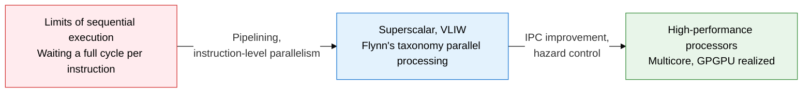
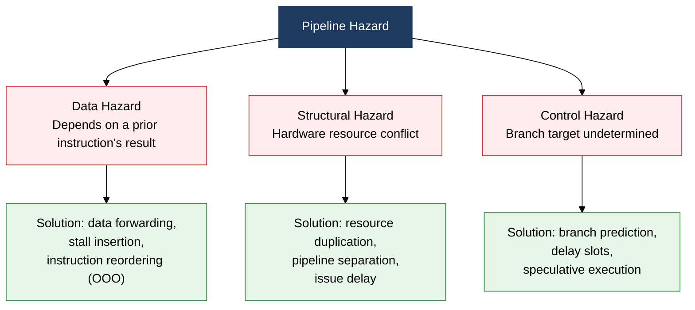
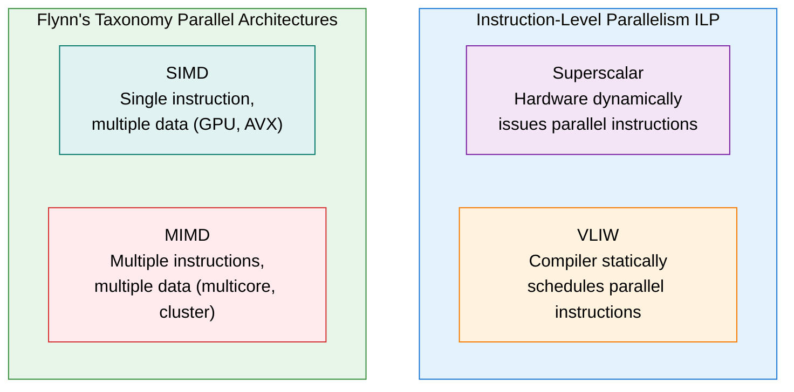

## 1. Overview of Parallel Processing and Processor Performance Improvement, which Overlaps Instruction Execution to Maximize Throughput

**Definition**: A processor design technique that raises instructions processed per unit time (IPC) by overlapping instruction execution stages (pipelining) or by running multiple execution units simultaneously (superscalar, VLIW).
- Pipelining splits instructions into stages such as Fetch, Decode, Execute, and Write-Back so several instructions advance concurrently
- Superscalar loads multiple execution units to issue several instructions per cycle; VLIW has the compiler statically schedule parallel instructions
- Flynn's taxonomy (SISD, SIMD, MISD, MIMD) systematically classifies parallel computer architectures by instruction and data stream counts

**Characteristics**:
- **Pipeline hazard management**: Data, structural, and control hazards are suppressed via forwarding, stalling, and branch prediction to preserve effective IPC
- **Instruction-level parallelism (ILP)**: Superscalar, out-of-order (OOO) execution, and register renaming let hardware automatically parallelize independent instructions
- **Data-level parallelism (DLP)**: SIMD extensions (SSE, AVX, NEON) process vector operations in a single instruction, accelerating multimedia and AI workloads

---

## 2. Core Structure of Parallel Processing and Processor Performance Improvement

### A. Pipelining Concept and the 3 Major Hazards with Solutions

| Hazard Type | Cause | Concrete Example | Key Solutions |
|---|---|---|---|
| **Data hazard (RAW)** | A subsequent instruction reads a prior instruction's result before its Write-Back completes | `ADD R1, R2, R3` immediately followed by `MOV R4, R1` — R1's value is not yet finalized | Data forwarding (pipeline bypass), pipeline stall (bubble), out-of-order execution |
| **Data hazard (WAW, WAR)** | Write-write or write-after-read order is reversed | A later instruction writes to a register before an earlier one, under out-of-order execution | Register renaming, reorder buffer (ROB) |
| **Structural hazard** | Two instructions request the same hardware resource (memory, FPU, etc.) at once | The IF and MEM stages access a single memory port simultaneously | Separate instruction/data caches, duplicate execution units, issue delay |
| **Control hazard** | The next instruction is fetched before a branch instruction's target address is computed | Executing `JNZ label` fetches the wrong instruction because the branch direction is undecided | Branch prediction (BTB, BHT), speculative execution, delay slots |

---

### B. Comparing Superscalar, VLIW, and Superpipelining, and Flynn's Taxonomy

| Category | Superscalar | VLIW | Superpipeline |
|---|---|---|---|
| **Parallelization agent** | Hardware (dynamic scheduling) | Compiler (static scheduling) | Hardware (finer stage division) |
| **Issue method** | Dynamically selects multiple instructions per cycle | Packs multiple operations into one long instruction | Splits a single instruction into more stages |
| **Hazard handling** | Hardware checks dependencies, inserts stalls | Compiler pre-pads with NOPs | Branch penalty grows as stages increase |
| **Hardware complexity** | High (OOO, ROB, scheduler) | Low (simple multiple execution units) | Medium (extra registers for finer stages) |
| **Representative products** | Intel Core, AMD Ryzen | Intel Itanium, DSP | Some ARM Cortex-A, early MIPS |

| Flynn Category | Instruction Stream | Data Stream | Characteristics | Representative Examples |
|---|---|---|---|---|
| **SISD** | Single | Single | Sequential processing, traditional single core | Single-core x86, early CPUs |
| **SIMD** | Single | Multiple | Vector operations, GPU shaders, media processing | GPU (NVIDIA), Intel AVX, ARM NEON |
| **MISD** | Multiple | Single | Different operations on the same data, fault tolerance | Spacecraft and aviation fault-tolerant systems |
| **MIMD** | Multiple | Multiple | Fully independent parallel processing, general-purpose parallel computing | Multicore CPUs, clusters, SMP |

---

## 3. Expected Benefits and Practical Applications of Adopting Parallel Processing and Processor Performance Improvement

| Category | Key Benefits | Practical Applications |
|---|---|---|
| **Throughput improvement** | Pipelining and superscalar raise IPC without increasing clock speed, improving power efficiency | Leveraging Intel Core's OOO superscalar design, compiling with dependency-minimizing optimizations (-O3, LTO) |
| **Hazard minimization** | Branch prediction and data forwarding reduce pipeline stalls, raising real-world performance | Loop unrolling for branch-heavy code, profile-guided optimization (PGO) to improve prediction accuracy |
| **Data parallelization** | SIMD instructions process vector operations in a single cycle, accelerating AI and multimedia workloads | AVX-512 for accelerated deep-learning inference, GPGPU (CUDA, OpenCL) for large-scale SIMD matrix operations |
| **Scalable design** | MIMD multicore and cluster architectures scale thread-level parallelism (TLP) horizontally | OpenMP/MPI-based parallel programming, managing MIMD distributed workloads with Kubernetes clusters |
