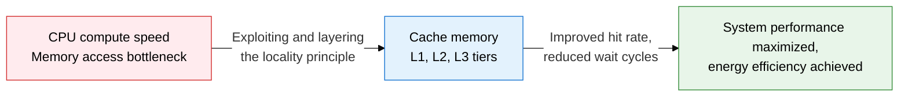
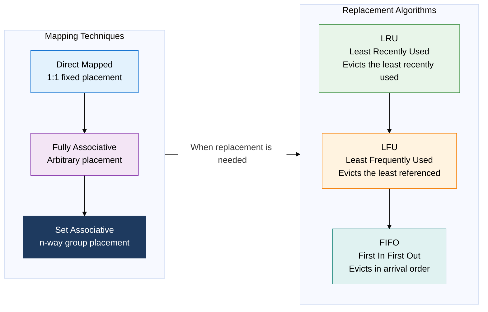
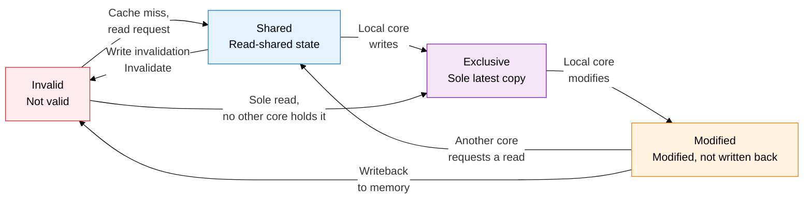

## 1. Overview of Cache Memory, the High-Speed Buffer that Overcomes the CPU-Memory Speed Gap via the Locality Principle

**Definition**: A high-speed, low-capacity buffer memory positioned between the CPU and main memory that shortens average memory access time by exploiting temporal and spatial locality.
- Composed of multiple tiers: L1 (inside the core, a few KB), L2 (near the core, hundreds of KB), L3 (shared, several MB)
- Mapping technique, replacement algorithm, and write policy are optimized to improve the hit rate
- Maintaining cache coherence in multicore environments is essential for correctness

**Characteristics**:
- **Locality exploitation**: Temporal locality (recently referenced data reaccessed) and spatial locality (nearby data prefetched) maximize the hit rate
- **Tier separation**: The capacity, speed, and cost trade-off is distributed across the L1-L3 tiers for an optimal balance
- **Coherence guarantee**: The MESI protocol keeps shared data consistent across cores at the hardware level

---

## 2. Core Structure of Cache Memory

### A. Cache Mapping Techniques and Replacement Algorithms

| Category | Direct Mapped | Fully Associative | Set Associative |
|---|---|---|---|
| **Placement** | Fixed by address mod cache size | Any empty line | Arbitrary within a designated set |
| **Hardware complexity** | Low (one comparator) | High (all comparators in parallel) | Medium (comparators within a set) |
| **Collision likelihood** | High (contention for the same line) | None | Low |
| **Performance** | Simple to implement, many conflict misses | Best hit rate, highest cost | Practical best balance |
| **Replacement algorithm** | Unnecessary — fixed line | LRU, LFU, FIFO applicable | LRU, FIFO applicable |
| **Real-world use** | Older L1 caches | TLB, small caches | Standard for modern L1-L3 caches |

| Replacement Algorithm | Selection Criteria | Advantages | Disadvantages |
|---|---|---|---|
| **LRU** | Workloads with high temporal locality | Best real-world hit rate | Timestamp-tracking overhead |
| **LFU** | Workloads with skewed reference frequency | Preserves popular data | Cold-start cache pollution |
| **FIFO** | Environments favoring implementation simplicity | Minimal hardware cost | Susceptible to Belady's anomaly |

---

### B. Cache Coherence: MESI Protocol and Write Policies

| MESI State | Cache Line State | Memory Sync | Copies in Other Cores |
|---|---|---|---|
| **Modified** | Modified, holds the latest data | Not written back (Dirty) | None |
| **Exclusive** | Unmodified, holds the latest data | Same (Clean) | None |
| **Shared** | Unmodified, holds the latest data | Same (Clean) | One or more exist |
| **Invalid** | Not valid | Not applicable | Not applicable |

| Category | Write-Through | Write-Back | Notes |
|---|---|---|---|
| **Behavior** | Cache write immediately propagated to memory | Only the cache is modified, propagated on eviction | Difference lies in the Dirty Bit |
| **Consistency** | Always in sync with memory | Cache-memory mismatch allowed | Uses the MESI Modified state |
| **Bus traffic** | Occurs on every write | Occurs only on eviction | Write-Back saves bandwidth |
| **Implementation complexity** | Simple | Requires Dirty Bit management | Write-Back is more complex |
| **Suitable environment** | Small embedded systems, I/O buffers | General-purpose CPU L1-L3 caches | Write-Back is the modern CPU standard |

---

## 3. Expected Benefits and Practical Applications of Cache Memory Optimization

| Category | Key Benefits | Practical Applications |
|---|---|---|
| **Performance improvement** | 1-4 cycles on an L1 hit, over 100x faster than DRAM | Optimizing n-way set-associative cache size, maximizing spatial locality with loop tiling |
| **Coherence guarantee** | The MESI protocol automatically guarantees multicore data consistency in hardware | Cache-line-aligned padding to avoid false sharing, NUMA-aware cache topology design |
| **Energy efficiency** | The Write-Back policy minimizes memory bus traffic and reduces power consumption | Tuning server CPU prefetcher settings, converting to cache-friendly data layouts (AoS to SoA) |
| **System scalability** | Combining a shared L3 cache with the coherence protocol sustains performance as core count grows | Monitoring Last-Level Cache miss rates, PMU-counter-based cache performance profiling |
