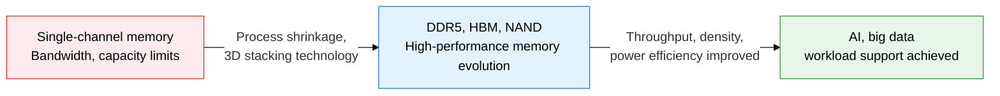
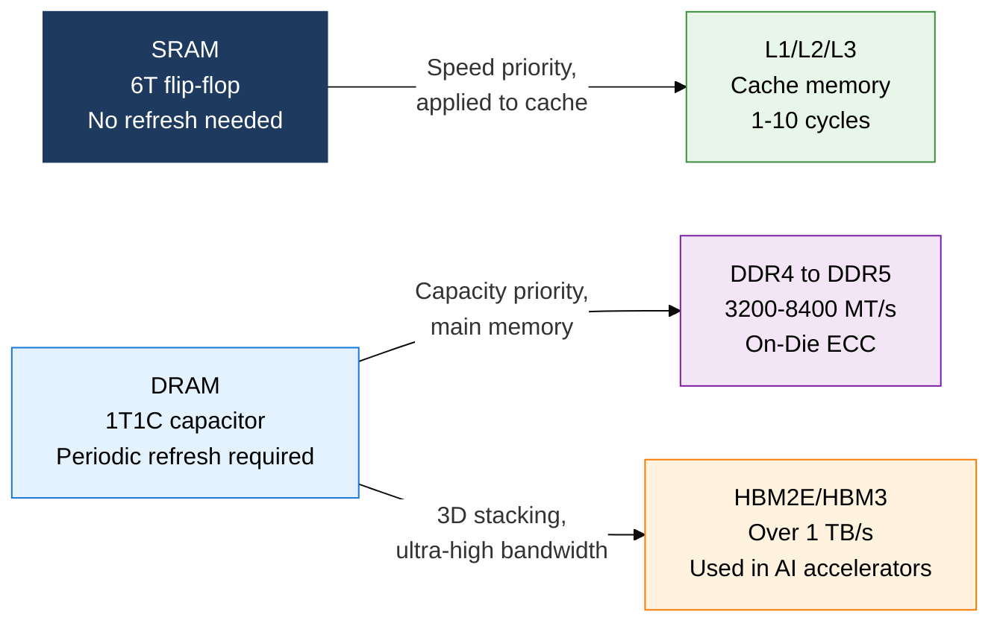
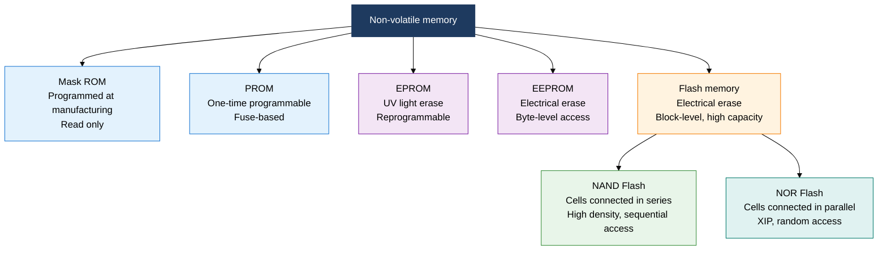

## 1. Overview of Main Memory: the Evolution of Volatile and Non-Volatile Semiconductor Memory and High-Bandwidth Innovation

**Definition**: A semiconductor-based memory system directly addressed by the CPU to store programs and data, divided into volatile (SRAM, DRAM) and non-volatile (ROM, Flash) technology types.
- SRAM uses flip-flop circuits for high-speed operation and is used in caches; DRAM is capacitor-based and used in main memory
- DDR5 delivers over 64 Gbps of bandwidth; HBM achieves TB/s-class bandwidth through 3D stacking
- NAND flash is used for SSDs and storage; NOR flash is used for firmware and embedded code execution

**Characteristics**:
- **Optimization by use case**: Specialized tiers by priority — speed first (SRAM to cache), capacity first (DRAM to main memory), non-volatility (Flash to storage)
- **Technology evolution**: Cell shrinkage (DDR4 to DDR5), 3D stacking (HBM), and multi-level cells (MLC/TLC/QLC) improve density and performance
- **Power balance**: Low-voltage operation (LPDDR5) alongside high-bandwidth architecture (HBM) covers both mobile and AI server extremes

---

## 2. Core Structure of Main Memory

### A. SRAM vs DRAM Structure Comparison and High-Performance DRAM Evolution

| Category | SRAM | DRAM | Notes |
|---|---|---|---|
| **Cell structure** | 6-transistor flip-flop | 1 transistor + 1 capacitor | SRAM cell area is 6x larger |
| **Refresh** | Not needed | Periodic refresh every few ms | A factor increasing DRAM power draw |
| **Access speed** | 0.5-2 ns | 10-50 ns | SRAM is about 10-20x faster |
| **Density** | Low (large capacity not feasible) | High (tens of GB feasible) | DRAM is the main memory standard |
| **Use** | L1-L3 cache, registers | Main memory | Roles separated by tier |

| Category | DDR4 | DDR5 | HBM3 |
|---|---|---|---|
| **Data rate** | 1600-3200 MT/s | 3200-8400 MT/s | Over 819 GB/s |
| **Voltage** | 1.2 V | 1.1 V | 1.2 V |
| **ECC** | Optional | On-Die ECC by default | ECC built in |
| **Channel** | 64-bit single | 32-bit dual channel | 1024-bit wide |
| **Primary use** | General-purpose servers, PCs | Next-generation servers, AI | GPU, AI accelerators |

---

### B. ROM Types and NAND vs NOR Flash Memory Structure Comparison

| Category | NAND Flash | NOR Flash | Notes |
|---|---|---|---|
| **Cell connection** | Series | Parallel | NAND has better area efficiency |
| **Access method** | Page-based sequential read | Byte-based random read | NOR supports XIP |
| **Write unit** | Page (4-16 KB) | Byte-level possible | NAND requires erase before write |
| **Erase unit** | Block (128-512 KB) | Block (64-128 KB) | NAND's block is larger |
| **Density/cost** | High (low cost, high capacity) | Low (high cost, low capacity) | NAND has lower cost per GB |
| **Endurance** | 10K-100K P/E cycles | 100K-1M P/E cycles | NOR has better endurance |
| **Primary use** | SSD, eMMC, UFS, USB | Firmware, BIOS, MCU code | Clearly separated by use case |

---

## 3. Expected Benefits and Practical Applications of Adopting Main Memory Technology

| Category | Key Benefits | Practical Applications |
|---|---|---|
| **Performance improvement** | DDR5 adoption more than doubles memory bandwidth, resolving bottlenecks | DDR5 dual-channel configuration for AI training servers, large-capacity DRAM expansion for database servers |
| **AI acceleration** | HBM3 delivers over 1 TB/s of GPU memory bandwidth | LLM inference servers using NVIDIA H100/AMD MI300X HBM, dedicated AI inference accelerator design |
| **Storage reliability** | NAND wear leveling and ECC secure SSD lifespan and reliability | NVMe SSD TLC/QLC tiered storage, NOR flash firmware update design for embedded systems |
| **Power efficiency** | LPDDR5 and HBM low-voltage design optimizes power for mobile and edge devices | Applying LPDDR5X in smartphones and edge AI devices, managing data center memory power density |
