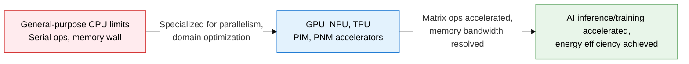
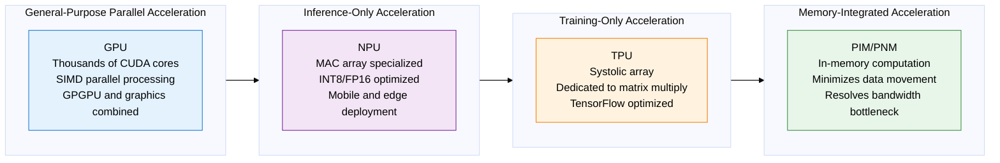
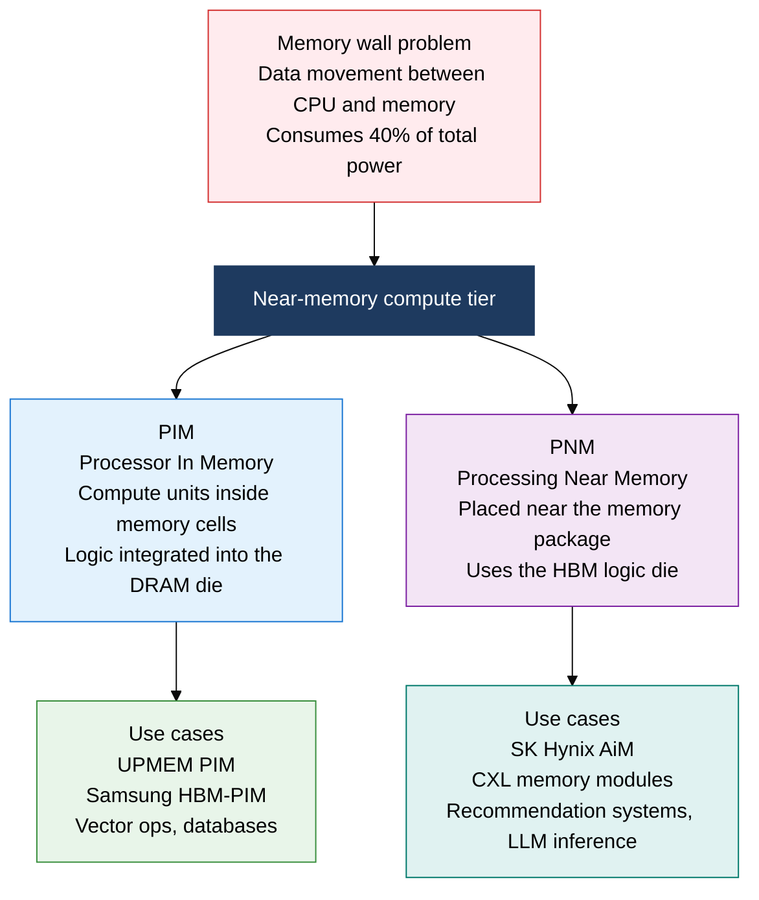

## 1. Overview of AI Semiconductors, which Accelerate AI Inference and Training via Parallel Matrix Operations and Near-Memory Processing

**Definition**: A domain-specific semiconductor architecture that combines massively parallel compute units with high-bandwidth memory to accelerate deep-learning matrix operations and inference.
- GPUs use thousands of CUDA/Shader cores for GPGPU general-purpose parallel computation; NPUs use MAC arrays optimized purely for inference
- TPUs are Google-designed systolic arrays dedicated to matrix multiplication, optimized for TensorFlow workloads
- PIM/PNM place compute units inside or near memory to fundamentally eliminate the data-movement bottleneck

**Characteristics**:
- **Massive parallelism**: Thousands to tens of thousands of lightweight compute units process DNN layers in parallel, hundreds of times the throughput of a CPU
- **Memory optimization**: Combining HBM/LPDDR5 high-bandwidth memory with on-chip SRAM buffers eases the memory bandwidth bottleneck
- **Energy efficiency**: Domain-specific design removes unnecessary control logic, maximizing TOPS/W (Tera OPS per Watt)

---

## 2. Core Structure of AI Semiconductors

### A. GPU vs NPU vs TPU Architecture Comparison

| Category | GPU | NPU | TPU | Notes |
|---|---|---|---|---|
| **Compute unit** | FP32/FP16 SIMD cores | INT8/FP16 MAC array | BF16 systolic array | Precision-efficiency trade-off |
| **Optimization target** | General-purpose training, inference, graphics | Lightweight, inference only | Large-scale matrix multiplication for training | Specialized design per use case |
| **Memory** | HBM2E/HBM3 (80 GB+) | LPDDR5 (a few GB) | HBM (16-32 GB/chip) | Differs in capacity and bandwidth |
| **Power** | 300-700 W | Single- to tens of watts | Hundreds of watts | NPU has the best energy efficiency |
| **Representative products** | NVIDIA H100, AMD MI300X | Apple ANE, Qualcomm Hexagon | Google TPU v4/v5 | Separated across server, mobile, cloud |
| **TOPS/W** | Tens of TOPS/W | Hundreds of TOPS/W | Medium | NPU dominates in mobile efficiency |

---

### B. PIM and PNM Principles and Resolving the Memory Bandwidth Bottleneck

| Category | Traditional Architecture | PIM | PNM | Notes |
|---|---|---|---|---|
| **Compute location** | Inside CPU/GPU | Inside DRAM cells | Near the memory package | Distinguished by distance |
| **Data movement** | Round trips over the CPU-memory bus | Minimized | Substantially reduced | Saves memory bandwidth |
| **Bandwidth use** | Limited by external bus bandwidth | Uses internal memory bandwidth | Uses internal HBM bandwidth | 10-100x improvement |
| **Implementation difficulty** | Conventional approach | Logic integrated into the DRAM process | Separate die stacking | PNM is more practical to implement |
| **Power savings** | Baseline | 60-80% reduction in data-movement power | 40-60% reduction | Significant effect on LLM inference |
| **Representative technology** | DDR5 systems | Samsung HBM-PIM, UPMEM | SK Hynix AiM, CXL PNM | Commercialization in progress |

---

## 3. Expected Benefits and Practical Applications of Adopting AI Semiconductors

| Category | Key Benefits | Practical Applications |
|---|---|---|
| **Training acceleration** | GPU cluster parallelism shortens LLM training time from weeks to days | NVIDIA H100 NVLink cluster configuration, MegatronLM tensor-parallel training, mixed-precision training pipelines |
| **Inference efficiency** | NPU INT8 quantization boosts inference throughput 10-100x over CPU while cutting power by 90% | On-device AI NPU inference engines (TFLite, ONNX), edge-server NPU cluster inference deployment |
| **Memory bottleneck resolution** | PIM/PNM fundamentally resolves the memory bandwidth bottleneck in recommendation systems and LLM inference | CXL memory expansion server configuration, HBM-PIM-based embedding table lookup acceleration, AiM-based graph neural networks |
| **Energy savings** | Combining domain-specific accelerators optimizes power density for data center AI workloads | CPU+GPU+NPU heterogeneous compute orchestration, accelerator workload scheduling to improve PUE |
