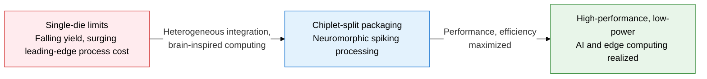
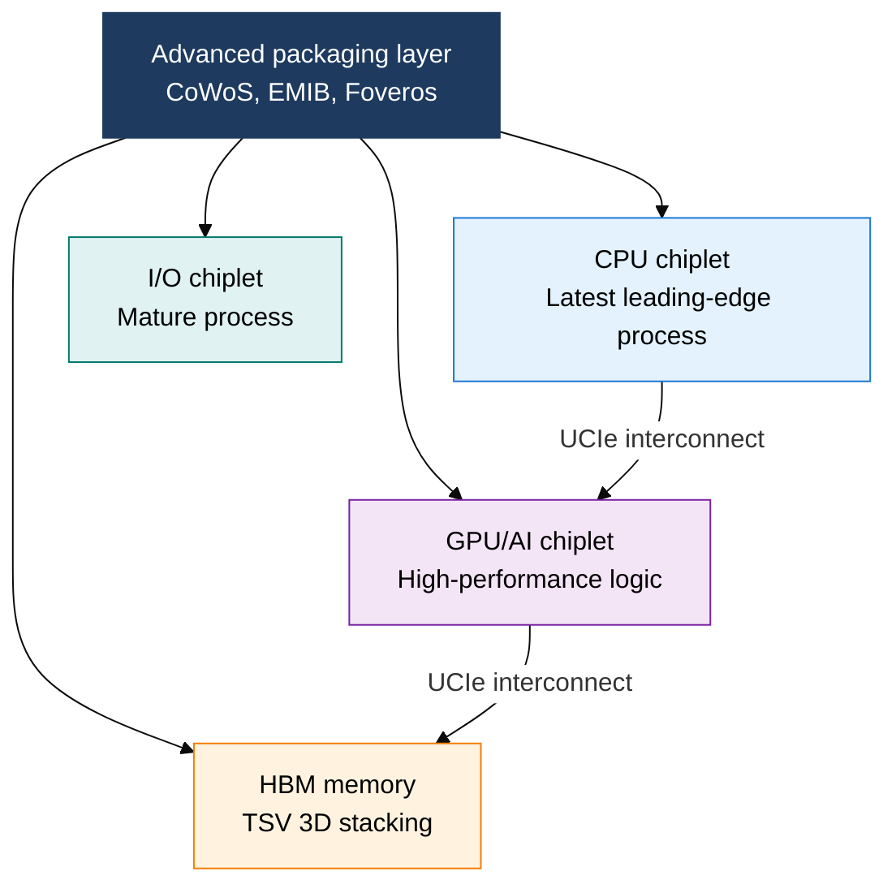
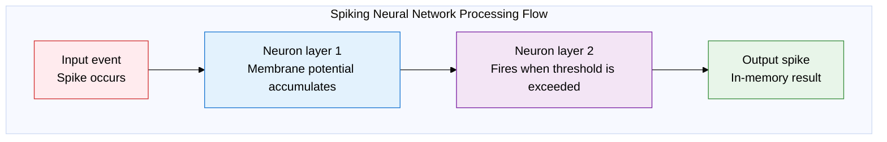

## 1. Overview of Chiplets and Neuromorphic Computing, the Next-Generation Semiconductor Approach that Breaks Through Single-Die Limits via Heterogeneous Integration

**Definition**: A next-generation semiconductor architecture that overcomes the yield and cost limits of a single die by combining functionally separated chiplets through advanced packaging, and that mimics the brain's spiking mechanism to achieve event-driven, ultra-low-power computation.
- Chiplets maximize inter-die bandwidth using the UCIe standard interconnect and TSV/CoWoS 3D packaging
- Neuromorphic designs use SNNs (spiking neural networks) that compute only when an event occurs, saving energy
- Optimized for applications requiring real-time, low-power processing, such as AI inference, edge IoT, and autonomous driving

**Characteristics**:
- **Heterogeneous integration**: Combines dies from different process nodes — logic, memory, analog — into a single package
- **Brain-inspired processing**: Implements a neuron-synapse structure in hardware, consuming power only when a spike occurs
- **Scalability and reuse**: Chiplet-level design, verification, and recombination shorten development time and cut cost

---

## 2. Core Structure of Chiplets and Neuromorphic Computing

### A. Chiplet Technology and 3D Packaging Structure

| Category | Traditional SoC | Chiplet |
|---|---|---|
| **Yield** | Yield falls sharply as die area grows | Splitting into smaller dies greatly improves yield |
| **Cost** | High cost from applying a single leading-edge process throughout | Choosing the optimal process per function cuts cost |
| **Heterogeneous integration** | Only integration within the same process is possible | Mixed integration of CPU, GPU, HBM, and analog |
| **Representative products** | Qualcomm Snapdragon (early monolithic SoC) | AMD Zen 4 (CCD+IOD), Intel Meteor Lake |

---

### B. Neuromorphic Computing Structure and Comparison with Von Neumann Architecture

| Category | Von Neumann Architecture | Neuromorphic Architecture |
|---|---|---|
| **Processing style** | Clock-synchronous sequential computation | Asynchronous event-driven spiking |
| **Memory structure** | CPU and memory separated (Von Neumann bottleneck) | Unified neuron-synapse in-memory computation |
| **Energy efficiency** | Always draws power, inefficient | Draws power only when a spike occurs |
| **Application domains** | General-purpose computing, batch AI training | Edge AI, sensor processing, robot control |
| **Representative chips** | Intel Xeon, NVIDIA A100 | Intel Loihi 2, IBM TrueNorth |

---

## 3. Expected Benefits and Practical Applications of Adopting Chiplets and Neuromorphic Computing

| Category | Key Benefits | Practical Applications |
|---|---|---|
| **Design efficiency** | Choosing the optimal process per function improves yield and cost together | Adopting AMD/Intel-style chiplet-split design, leveraging a multi-vendor chiplet ecosystem based on the UCIe standard |
| **High-bandwidth memory** | HBM plus TSV 3D stacking achieves memory bandwidth in the TB/s range | Applying CoWoS packaging in AI accelerators and HPC systems, placing GPU and HBM close together to minimize latency |
| **Ultra-low-power AI** | SNN event-driven processing saves tens to hundreds of times the energy versus a conventional GPU | Deploying neuromorphic inference engines in IoT sensors, wearables, and autonomous-driving edge devices |
| **Technology convergence** | Mixing neuromorphic tiles within chiplet packaging configures optimal compute per use case | Adding neuromorphic cores to heterogeneous chiplet designs, building next-generation AI SoC and robot-control SoC platforms |
