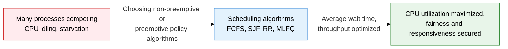
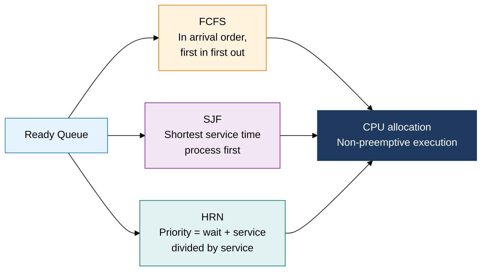
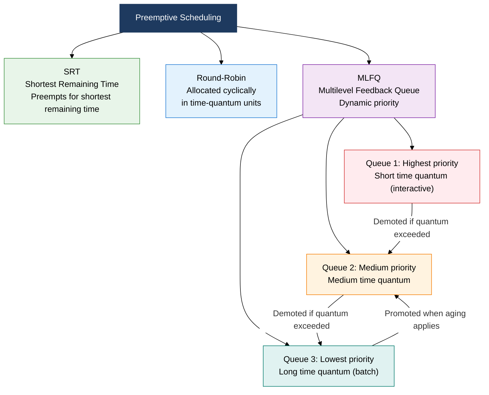

## 1. Overview of CPU Scheduling, a Policy Design that Minimizes Process Wait Time and Maximizes CPU Efficiency

**Definition**: A core operating-system policy that decides the order and manner in which the CPU is assigned to processes in the Ready Queue, split into two families: non-preemptive and preemptive.
- Scheduling metrics: CPU utilization, throughput, turnaround time, waiting time, response time
- Non-preemptive scheduling cannot switch processes until the running process voluntarily releases the CPU
- Preemptive scheduling can forcibly reclaim the CPU from a running process based on priority or time quantum

**Characteristics**:
- **Algorithm diversity**: Choose the optimal algorithm — FCFS, SJF, HRN, SRT, RR, MLFQ — based on environment and goals
- **Starvation management**: Aging gradually raises the priority of long-waiting processes
- **Hierarchical feedback**: MLFQ adapts to process characteristics (CPU-bound vs. I/O-bound) based on past CPU usage history

---

## 2. Core Structure of CPU Scheduling

### A. Non-Preemptive Scheduling: FCFS, SJF, HRN

| Algorithm | Selection Criteria | Starvation | Overhead | Suitable Environment | Notes |
|---|---|---|---|---|---|
| **FCFS** | Arrival time order (first in first out) | None | Very low | Batch processing systems | Convoy effect: a long job makes short jobs wait |
| **SJF** | Prioritizes the process with the shortest service time (CPU burst) | Occurs (long jobs wait indefinitely) | Low | Interactive systems, minimizing average wait | Optimal algorithm, but service time cannot be predicted |
| **HRN** | Priority = (waiting time + service time) / service time | None (aging built in) | Medium | Environments needing to fix SJF's starvation | Priority rises automatically the longer a process waits |

---

### B. Preemptive Scheduling: SRT, Round-Robin, MLFQ, and the Multilevel Feedback Queue

| Algorithm | Selection Criteria | Starvation | Overhead | Time Quantum | Suitable Environment |
|---|---|---|---|---|---|
| **SRT** | Preempts for the process with the shortest remaining service time | Occurs (long jobs wait indefinitely) | Medium (frequent preemption) | None (event-driven) | Minimizing response time, interactive |
| **Round-Robin** | Forces a switch to the next process when the time quantum (q) expires | None | Proportional to quantum size | 10-100 ms recommended | Time-sharing systems, fairness-focused environments |
| **MLFQ** | A process is demoted to a lower queue for using more CPU, and returns to a higher queue when I/O completes | Prevented via aging | High (managing movement between queues) | Varies by queue (shorter at the top) | General-purpose OS (Linux CFS-based), mixed workloads |
| **Time quantum choice** | Too small causes context-switch overhead to spike; too large approaches FCFS | - | Inversely proportional to quantum size | Empirically, about 80% of processes finish within one quantum | Decided after analyzing the process's average CPU burst distribution |

---

## 3. Expected Benefits and Practical Applications of Applying CPU Scheduling

| Category | Key Benefits | Practical Applications |
|---|---|---|
| **Performance** | Choosing the right algorithm shortens average wait and turnaround time and maximizes CPU utilization | Applying SJF/MLFQ after analyzing workload characteristics (CPU-bound vs. I/O-bound), visualizing performance with Gantt charts |
| **Fairness** | Round-Robin and aging guarantee every process a reasonable share of CPU time | Linux's CFS (Completely Fair Scheduler) distributes CPU fairly based on virtual runtime, priority adjusted via the nice value |
| **Responsiveness** | Preemptive MLFQ keeps interactive processes in higher queues, improving perceived response speed | Applying Rate-Monotonic and EDF algorithms in real-time systems (RTOS), guaranteeing deadline-based priority |
| **Scalability** | Combining CPU affinity and load balancing in multicore environments enables linear scaling | Pinning threads to cores with Linux `taskset`/`sched_setaffinity`, minimizing memory latency with NUMA-aware scheduling |
