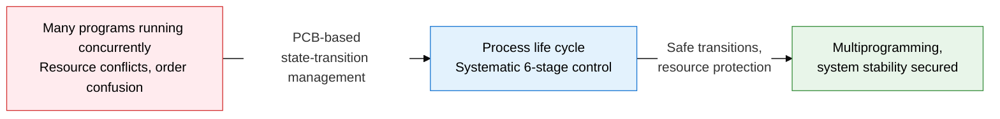
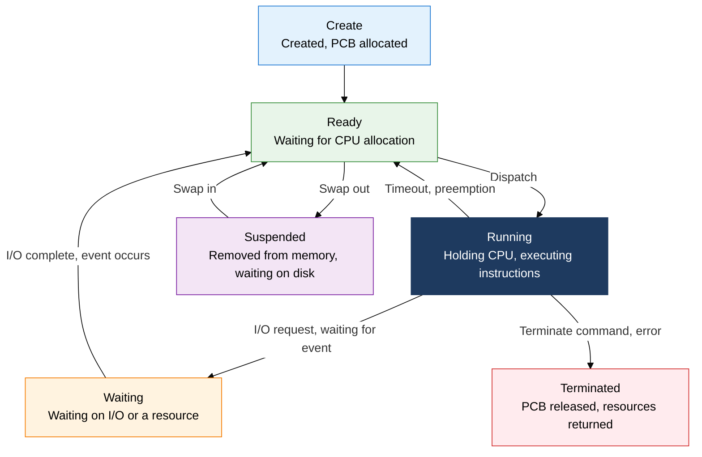

## 1. Overview of Process Management, the Core OS Technique that Tracks the State and Resource Information of an Execution Unit via the PCB

**Definition**: A core management technique in which the operating system tracks each process's state, registers, and resource information via the PCB (Process Control Block) and controls CPU usage according to state-transition rules.
- A process is an instance of an executing program, holding an independent memory space (code, data, stack, heap)
- The PCB includes the process ID, state, PC (Program Counter), register set, memory map, and I/O information
- The operating system time-shares the CPU among multiple processes via context switching

**Characteristics**:
- **State-based control**: Six transitions — Create, Ready, Running, Waiting, Suspended, Terminated — clearly define the process life cycle
- **PCB-centric abstraction**: All process information is consolidated in a single PCB so the OS kernel manages it through a consistent interface
- **Transparent resource protection**: Independent memory spaces and privilege modes (User/Kernel) block interference between processes

---

## 2. Core Structure of Process Management

### A. PCB Structure and the 6 Process State Transitions

| State | Description | Transition Condition | PCB Location |
|---|---|---|---|
| **Create** | Process created, PCB initialized | fork() / exec() call | Creation queue |
| **Ready** | Ready to execute, waiting for CPU allocation | Creation complete, I/O complete, timeout | Ready Queue |
| **Running** | Holding the CPU, executing instructions | Scheduler dispatch | CPU registers |
| **Waiting** | Waiting for I/O to complete or an event to occur | I/O request, waiting on a semaphore | Wait Queue |
| **Suspended** | Swapped out to disk due to insufficient memory | Swap-out (low memory) | Swap space |
| **Terminated** | Execution complete, PCB released and resources returned | Normal exit, forced kill | Zombie state (before the parent reaps it) |

---

### B. Context Switching Mechanism and Ways to Reduce Overhead

```mermaid
%%{init: { 'theme': 'base', 'themeVariables': { 'edgeLabelBackground': '#fff' }}}%%
flowchart LR
    P1["Process A<br/>Running"] --"Interrupt or<br/>timeout occurs"--> KN["Kernel entry<br/>Interrupt handler"]
    KN --"Saves registers<br/>into A's PCB"--> SV["PCB_A saved<br/>PC, SP, registers"]
    SV --"Scheduler picks<br/>next process"--> LD["PCB_B restored<br/>PC, SP, registers"]
    LD --"Returns to<br/>user mode"--> P2["Process B<br/>Running"]
    style P1 fill:#E3F2FD,stroke:#1976D2,color:#000
    style KN fill:#FFEBEE,stroke:#D32F2F,color:#000
    style SV fill:#FFF3E0,stroke:#F57C00,color:#000
    style LD fill:#F3E5F5,stroke:#7B1FA2,color:#000
    style P2 fill:#E8F5E9,stroke:#388E3C,color:#000
```

| Category | Description | Overhead Cause / Reduction Approach |
|---|---|---|
| **Direct cost** | Time to read and write the full register set to memory when saving/restoring the PCB | Minimizing register count, using hardware context-switch support (x86 TSS) |
| **Indirect cost - TLB flush** | Switching processes invalidates the TLB (Translation Lookaside Buffer), spiking cache misses | Selectively preserving the TLB using ASID (Address Space ID) tags |
| **Indirect cost - cache pollution** | Running a new process leaves no valid data in L1/L2 cache, causing cold misses | Using threads (switching within the same process), setting CPU affinity |
| **Reduction strategy** | Applying designs that reduce the frequency of context switches itself | Expanding the time quantum, minimizing blocking with coroutines/async I/O, using thread pools |

---

## 3. Expected Benefits and Practical Applications of Applying Process Management

| Category | Key Benefits | Practical Applications |
|---|---|---|
| **Stability** | PCB-based isolation blocks memory interference between processes, minimizing system crashes | Deploying each microservice as an independent process to contain fault propagation |
| **Performance** | Analyzing context-switch overhead enables optimizing the time quantum and scheduling policy | Monitoring `/proc/[pid]/status`, tuning after measuring context-switch counts with perf/strace |
| **Resource efficiency** | State-transition-based scheduling minimizes CPU idle time and enables multiprogramming | Controlling per-process CPU/memory quotas with cgroups in container environments |
| **Diagnostics and debugging** | Register and stack information in the PCB enables core-dump analysis and deadlock detection | Analyzing GDB core dumps, tracking process state in real time with `ps -elf`/`top` |
