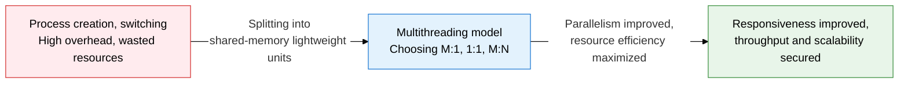
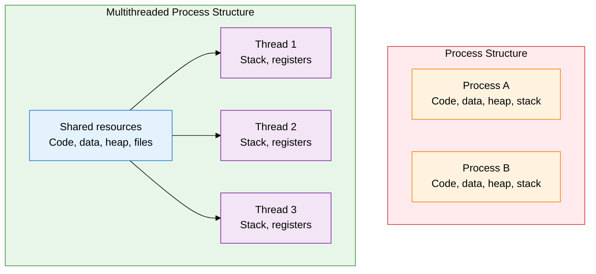
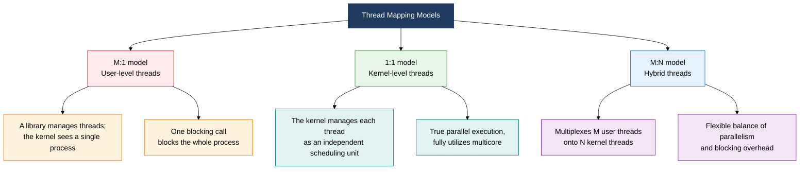

## 1. Overview of Thread Models, a Technique that Raises Parallelism via an Execution Unit Lighter than a Process

**Definition**: A light-weight execution unit (Light-Weight Process) that shares code, data, and heap within a single process while holding only its own stack and registers independently — a technique for implementing concurrency and parallelism efficiently.
- Threads have lower creation and context-switching cost than processes, suiting high-frequency concurrent work
- Shared memory access allows data exchange without IPC, but can raise synchronization issues
- In a multicore environment, the 1:1 thread model provides true parallelism

**Characteristics**:
- **Lightweight**: Only the stack and registers are held independently; creation and teardown cost is tens of times lower than for a process
- **Resource sharing**: Sharing code, data, heap, and file descriptors within the same address space minimizes communication cost
- **Model choice**: User-level (M:1), kernel-level (1:1), and hybrid (M:N) models achieve optimal parallelism per environment

---

## 2. Core Structure of Thread Models and Multithreading

### A. Process vs. Thread Structure Comparison and Multithreading Pros and Cons

| Comparison | Process | Thread |
|---|---|---|
| **Memory space** | Independent (code, data, heap, stack each separate) | Code, data, heap shared; only the stack is independent |
| **Creation cost** | High (fork plus memory copy or COW) | Low (only new stack space allocated) |
| **Context-switch cost** | High (TLB flush, address-space swap) | Low (switch within the same address space, TLB may be preserved) |
| **Communication method** | Requires IPC (pipes, sockets, shared memory) | Direct access to heap/global variables (needs synchronization) |
| **Fault isolation** | An error in one process does not affect other processes | An error in one thread (e.g., segfault) can terminate the whole process |
| **Parallel execution** | Each runs independently on multicore | True parallel execution only under the 1:1 model |
| **Synchronization complexity** | Low (independent memory) | High (watch for race conditions and deadlocks) |

---

### B. Comparing the 3 Thread Models: M:1, 1:1, M:N

| Model | Mapping | Advantages | Disadvantages | Example Uses |
|---|---|---|---|---|
| **M:1 (user level)** | M user threads → 1 kernel thread | Fast switching with no kernel involvement, highly portable | One blocking call blocks the whole process; multicore unused | POSIX Green Threads, early Java threads |
| **1:1 (kernel level)** | 1 user thread → 1 kernel thread | True parallel execution, blocking handled per thread | Kernel resources exhaust as thread count grows; high creation cost | Linux pthreads, Windows Thread, current Java |
| **M:N (hybrid)** | M user threads → N kernel threads (M≥N) | Balances parallelism and flexibility, blocking handled individually | High implementation complexity, needs two scheduler layers | Go goroutine, Erlang processes, Solaris |

---

## 3. Expected Benefits and Practical Applications of Applying Thread Models

| Category | Key Benefits | Practical Applications |
|---|---|---|
| **Performance** | Lower creation and switching cost than processes raises throughput and cuts response latency | Assigning a thread per request in web servers (Apache, Nginx), reducing creation cost with thread pools |
| **Parallelism** | Fully utilizing multicore CPU cores under the 1:1 model accelerates compute-intensive work | Using ForkJoinPool in JVM-based servers, distributing matrix operations and image processing in parallel |
| **Resource efficiency** | Shared memory removes the need for IPC, cutting memory footprint and simplifying data consistency | Handling tens of thousands of concurrent connections with Go goroutines (M:N), safe communication via channels |
| **Maintainability** | A clear thread model makes it easier to establish synchronization policy, structurally blocking race conditions and deadlocks | Protecting critical sections with synchronized, ReentrantLock, and Atomic classes; using thread-analysis tools (jstack) |
