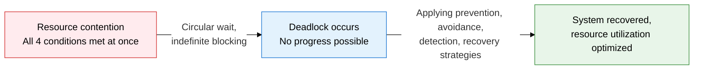
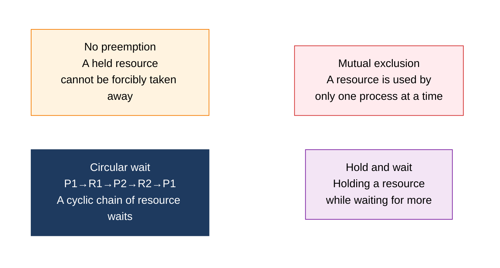
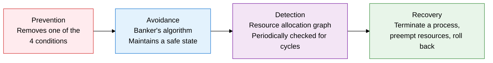

## 1. Overview of Deadlock, where Processes Wait Indefinitely for Each Other's Resources

**Definition**: A state in which two or more processes wait indefinitely for resources held by one another, such that none of them can proceed.
- Occurs when all four necessary conditions — mutual exclusion, hold and wait, no preemption, circular wait — hold simultaneously
- A cycle in the Resource Allocation Graph indicates the possibility of deadlock
- Addressed through four strategies: Prevention, Avoidance, Detection, and Recovery

**Characteristics**:
- **Necessary and sufficient conditions**: Removing even one of the four conditions prevents deadlock at the source
- **Dynamic occurrence**: Arises nondeterministically at runtime, depending on resource request order and allocation timing
- **Trade-offs by strategy**: Prevention lowers resource utilization, avoidance requires advance information, detection and recovery incur overhead

---

## 2. Core Structure of Deadlock

### A. The 4 Necessary Conditions for Deadlock

| Condition | Description | Resource Allocation Graph Representation |
|---|---|---|
| **Mutual exclusion** | A resource cannot be shared; while one process holds it exclusively, others must wait | Shown as a single instance on the resource node |
| **Hold and wait** | A process holds at least one resource while requesting and waiting for additional resources held by others | A process→resource request edge exists alongside an allocation edge |
| **No preemption** | The OS cannot forcibly reclaim a resource until the process voluntarily releases it | The allocation edge persists until the resource is released |
| **Circular wait** | A cyclic wait chain forms among processes and resources — e.g., P1 holds R1 and waits for R2, P2 holds R2 and waits for R1 | A cycle exists in the Resource Allocation Graph |

---

### B. Comparing the 4 Deadlock-Handling Strategies

| Comparison | Prevention | Avoidance | Detection | Recovery |
|---|---|---|---|---|
| **Core principle** | Remove one of the 4 conditions at system design time | Check whether allocation keeps the system in a Safe State before granting it | Allow deadlock to occur and detect it periodically | Resolve by terminating a process or preempting resources after detection |
| **Representative techniques** | Removing circular wait (request resources in numbered order), removing hold and wait (batch requests) | Banker's Algorithm, resource allocation graph algorithm | Resource allocation graph cycle detection, Wait-for Graph | Forced process termination, checkpoint rollback, preempt and reallocate resources |
| **Prior information required** | Not needed | Must declare maximum resource requests (Max) in advance | Not needed | Not needed (acts on detection results) |
| **Resource utilization** | Low (overly restrictive) | Medium (allocation limited to below the safe threshold) | High (allocation allowed without restriction) | High (intervenes only after detection) |
| **Overhead** | Low | Medium (safety check on every allocation) | Medium (periodic detection cost) | High (rollback/restart cost) |
| **Application environment** | Simple embedded, real-time systems | Systems with few resources and processes | General-purpose OS, databases | DB transaction rollback, cluster resource management |

---

## 3. Expected Benefits and Practical Applications of Deadlock Management

| Category | Key Benefits | Practical Applications |
|---|---|---|
| **Stability** | Blocking deadlock at the source or recovering quickly ensures uninterrupted system operation | RDBMS deadlock detection (InnoDB wait-for graph), maintaining data integrity via automatic transaction rollback |
| **Performance** | Avoidance and detection strategies improve resource utilization and throughput versus prevention | Implementing a cloud resource scheduler based on the Banker's algorithm, setting container CPU/memory limits |
| **Reliability** | Checkpoint/rollback recovery mechanisms minimize data loss when failures occur | Automatically resolving deadlock via leader-election timeouts in distributed systems (Kubernetes, Zookeeper) |
| **Design quality** | Adopting resource-ordering rules and lock hierarchies removes circular wait at design time | Integrating lock-acquisition-order static analysis tools (ThreadSanitizer, Helgrind) into code review |
