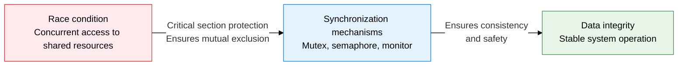
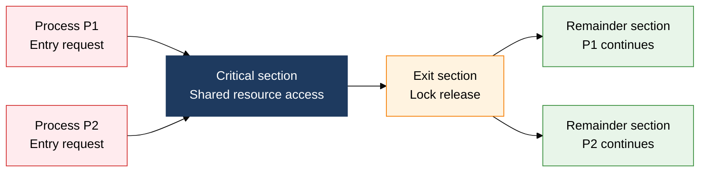
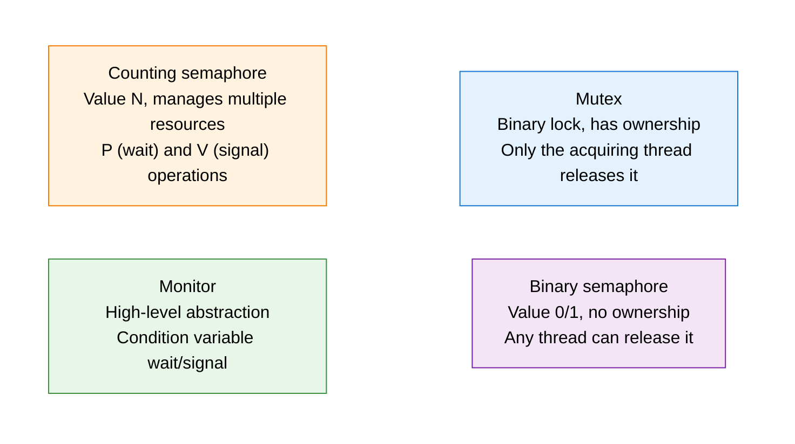

## 1. Overview of Process Synchronization, Resolving Shared Resource Contention with Atomic Mutual Exclusion

**Definition**: An operating system technique that controls the race condition arising when two or more processes or threads access a shared resource concurrently, using a critical section protection mechanism to guarantee data consistency.
- The critical section is the code region that reads or writes a shared resource; only one process may enter it at a time
- Implemented through hardware support (Test-And-Set, Compare-And-Swap) and software constructs (mutex, semaphore, monitor)
- Without synchronization, a race condition, starvation, or deadlock can result

**Characteristics**:
- **Guaranteed atomicity**: Implements critical section entry and exit as atomic hardware instructions, blocking interleaving
- **Layered abstraction**: Abstraction level rises from hardware instruction to spinlock to semaphore to monitor
- **Fairness/performance balance**: Coordinates throughput and responsiveness through the waiting method (busy waiting vs. blocking) and priority policy

---

## 2. Core Structure of Process Synchronization

### A. The Critical Section Problem and Its Resolution Conditions

| Condition/Technique | Description | Problem if violated |
|---|---|---|
| **Mutual exclusion** | While one process is executing in the critical section, no other process may enter | Data inconsistency, race condition |
| **Progress** | When no process is in the critical section, one of the waiting processes must be able to enter within a finite time | Unnecessary blocking, processing delay |
| **Bounded waiting** | There must be an upper bound on how many times other processes can enter after a process requests entry | Starvation, indefinite waiting |
| **Test-And-Set** | Atomic hardware instruction that reads a memory value and sets it to 1, used to implement spinlocks | Can cause busy waiting |
| **Compare-And-Swap** | Atomic instruction that compares an expected value with the current value and swaps only when they match; the basis of lock-free structures | Can cause the ABA problem |

---

### B. Comparing Mutex, Semaphore, and Monitor

| Comparison item | Mutex | Semaphore | Monitor |
|---|---|---|---|
| **Ownership** | Only the acquiring thread can release it | No ownership; any thread can perform V | Managed automatically inside the monitor |
| **Resource count** | Single resource (binary state) | Single (binary) or multiple (counting) | Single critical section (multiple condition variables possible) |
| **Scope of use** | Mutual exclusion between threads | Synchronization/resource counting between processes | Class level within the same language/runtime |
| **Language support** | POSIX pthread_mutex | POSIX sem_t, System V | Java synchronized, C# lock |
| **Implementation complexity** | Low | Medium (P/V ordering matters) | Low (compiler automates lock insertion) |
| **Misuse risk** | Deadlock (nested acquisition) | Semaphore inversion (P/V ordering error) | Condition variable lost-wakeup |

---

## 3. Expected Benefits and Practical Applications of Process Synchronization

| Category | Key Benefits | Practical Applications |
|---|---|---|
| **Safety** | Eliminates race conditions to guarantee shared data consistency, prevents abnormal system termination | Ties into DB transaction isolation levels; applies mutexes to shared queue/cache access in multithreaded servers |
| **Performance** | Limits concurrent access counts with semaphore/counting techniques, prevents resource saturation | Uses counting semaphores to cap connection pool/thread pool size, tunes an appropriate concurrency level |
| **Productivity** | Automates lock acquisition/release with monitor/language-level synchronization, minimizes development errors | Manages shared state safely with Java synchronized/ReentrantLock, Python threading.Lock |
| **Scalability** | Achieves high-performance parallel processing with lock-free, CAS-based non-blocking data structures | Uses java.util.concurrent, C++ std::atomic to eliminate lock contention on hot paths |
