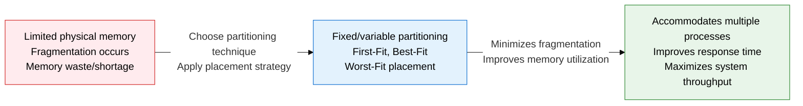
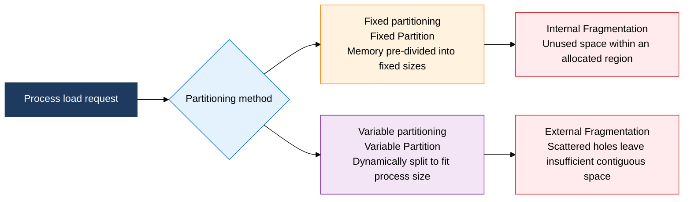
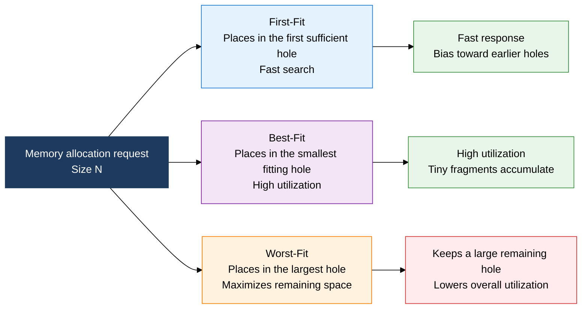

## 1. Contiguous Allocation and Placement Strategies That Minimize Fragmentation, Overview of Physical Memory Management

**Definition**: An operating system memory management technique that divides physical memory into fixed- or variable-size partitions and applies a placement strategy to minimize fragmentation, making concurrent loading of multiple processes efficient.
- Fixed partitioning causes internal fragmentation and variable partitioning causes external fragmentation, so a trade-off analysis is needed
- The First-Fit, Best-Fit, and Worst-Fit placement strategies trade off execution time against memory utilization
- When external fragmentation worsens, compaction can reclaim contiguous free space, but at the cost of overhead

**Characteristics**:
- **Dual fragmentation structure**: Internal fragmentation from fixed partitioning and external fragmentation from variable partitioning stem from different causes of waste, and this is the basis for choosing a technique
- **Variety of placement strategies**: Choose First-Fit (speed priority), Best-Fit (utilization priority), or Worst-Fit (maximizes remaining space) according to system goals
- **Recovery through compaction**: When external fragmentation accumulates under variable partitioning, compaction merges holes to reclaim contiguous space

---

## 2. Core Structure of Physical Memory Management

### A. Contiguous Allocation Techniques: Fixed Partitioning vs. Variable Partitioning

| Category | Fixed Partition | Variable Partition |
|---|---|---|
| **Partitioning method** | Memory pre-divided into fixed-size partitions at boot | Dynamically split on request to match process size |
| **Fragmentation type** | Internal fragmentation — wasted remaining space when partition size > process size | External fragmentation — small holes scattered, leaving insufficient contiguous space |
| **Management complexity** | Low — simple management via a partition table | High — requires maintaining a free hole list |
| **Memory utilization** | Low — waste worsens when partition size and process size mismatch | High — allocation matches process size, minimizing waste |
| **Multiprogramming** | Limited by the number of partitions | Flexibly accommodated within the total memory pool |
| **Typical environment** | Early IBM OS/360, embedded RTOS | Modern general-purpose OS (Unix, Linux) |

---

### B. Comparing the Three Memory Placement Strategies and Compaction

| Strategy | Search Method | Execution Time | Memory Utilization | Degree of Fragmentation | Characteristics and Usage Criteria |
|---|---|---|---|---|---|
| **First-Fit** | Selects the first sufficient hole from the front of the hole list | O(n) — fast on average | Medium | Medium — bias toward front holes | Simple to implement, suited to general-purpose environments |
| **Best-Fit** | Selects the hole with the smallest size difference | O(n) — full search | High | High — tiny remaining holes accumulate | Chosen when saving memory matters, increases compaction frequency |
| **Worst-Fit** | Places in the largest hole | O(n) — full search | Low | Low — keeps large remaining holes | Aims to reserve space for large processes |
| **Compaction** | Merges scattered holes by relocating memory to one side | O(n) — large process-move overhead | Improved | Eliminated | Resolves external fragmentation, requires moving running processes |

---

## 3. Expected Benefits and Practical Applications of Physical Memory Management Techniques

| Category | Key Benefits | Practical Applications |
|---|---|---|
| **Memory utilization** | Applying variable partitioning + Best-Fit minimizes fragmentation and reduces memory waste | Choose a placement strategy after analyzing process size distribution, schedule periodic compaction |
| **System responsiveness** | First-Fit's fast search minimizes memory allocation delay | Adopt First-Fit in real-time systems, optimize O(1) search based on a sorted hole list |
| **Multiprogramming** | Variable partitioning accommodates processes of varying sizes concurrently, improving CPU utilization | Classify processes by memory size, establish a wait-queue management policy for allocation failures |
| **Operational stability** | Fragmentation monitoring and automated compaction prevent memory exhaustion during long-term operation | Trigger automatic compaction based on a free-memory threshold, operate a memory-usage trend dashboard |
