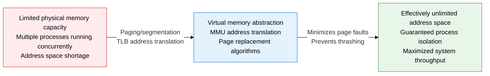
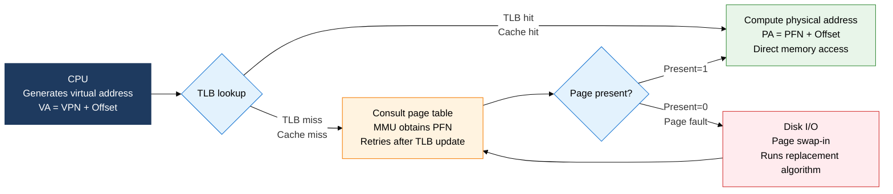
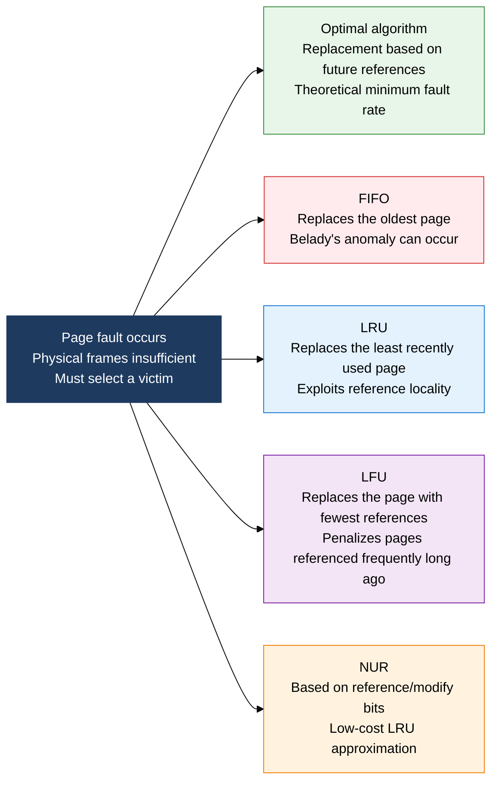

## 1. Address Abstraction That Runs Processes Beyond the Limits of Physical Memory, Overview of Virtual Memory

**Definition**: An operating system memory abstraction technique that gives a process a logical address space larger than physical memory, and uses the MMU and a page replacement algorithm to support actual execution transparently.
- Paging manages the address space in fixed-size pages, while segmentation divides it into variable-size logical units
- A TLB (Translation Lookaside Buffer) speeds up page table lookups, minimizing address translation overhead
- The quality of the page replacement policy directly determines the page fault rate and whether thrashing occurs

**Characteristics**:
- **Transparent address abstraction**: A process uses a contiguous virtual address space without knowing the physical memory layout, maximizing development convenience
- **Demand paging**: Only pages that are actually accessed are loaded into physical memory, minimizing initial load time and memory footprint
- **Variety of replacement algorithms**: FIFO, LRU, LFU, NUR, and the optimal algorithm manage the trade-off between page fault rate and implementation complexity

---

## 2. Core Structure of Virtual Memory

### A. Paging Technique and TLB Address Translation

| Category | Paging | Segmentation |
|---|---|---|
| **Division unit** | Fixed-size pages (typically 4KB) | Variable-size logical units (code, stack, heap, etc.) |
| **Fragmentation** | Internal fragmentation — wasted space remaining in the last page | External fragmentation — holes appear between segments |
| **Address translation** | VPN (Virtual Page Number) → PFN (Physical Frame Number) | Segment number + offset → Base + Limit check |
| **Protection/sharing** | Easy to set per-page access permissions (R/W/X) | Semantic access control via per-logical-unit protection |
| **TLB effect** | Shortens page table lookups via cache; translation within 1 cycle on a hit | Improves translation speed via segment descriptor caching |
| **Adoption in modern OS** | Default on most modern architectures like x86-64, ARM | x86 segment registers (partially retained for security/protection) |

---

### B. Page Replacement Algorithms and Thrashing Prevention

| Algorithm | Replacement Criterion | Page Fault Rate | Implementation Complexity | Limitations and Notes |
|---|---|---|---|---|
| **Optimal** | The page referenced furthest in the future | Lowest — theoretical lower bound | Not implementable (requires future knowledge) | Used as a benchmark for comparing other algorithms |
| **FIFO** | The page that has been in memory longest | High | Low — simple queue implementation | Belady's anomaly — fault rate can increase as frames increase |
| **LRU** | The page unused for the longest time | Low | Medium — needs timestamps/stack | Exploits reference locality well, needs hardware support |
| **LFU** | The page with the fewest references | Medium | Medium — needs counter maintenance | Unfair advantage for pages referenced heavily early on |
| **NUR** | Minimum combination of reference bit (R) and modify bit (M) | LRU approximation | Low — implemented with 2 bits | A practical approximation of LRU, implemented as the Clock algorithm in modern OSes |

**Causes of Thrashing and Prevention Measures**

| Category | Content |
|---|---|
| **Thrashing definition** | A state where excessive page faults consume the CPU entirely with page replacement, halting actual work |
| **Cause** | Excessive degree of multiprogramming — occurs when the frames allocated to a process are fewer than its working set |
| **Working Set** | The set of pages a process references within a time window (Window Δ) — guaranteeing frames equal to the working set prevents thrashing |
| **PFF (Page Fault Frequency)** | Measures the page fault rate and dynamically adjusts frames — adds frames above the upper bound, reclaims frames below the lower bound |

---

## 3. Expected Benefits and Practical Applications of Virtual Memory and Page Replacement

| Category | Key Benefits | Practical Applications |
|---|---|---|
| **Address space expansion** | Enables running large processes that exceed physical memory capacity | Optimize swap area size, improve I/O efficiency with mmap-based file memory mapping |
| **Performance optimization** | Improved TLB hit rate minimizes address translation overhead and improves response speed | Tune page size (apply HugePages), expand TLB coverage to keep hit rate above 99% |
| **Reliability assurance** | LRU/NUR replacement algorithms minimize page fault rate and prevent thrashing | Dynamically allocate frames based on working-set monitoring, apply automatic PFF threshold adjustment policy |
| **Process isolation** | Separated virtual address spaces block memory intrusion between processes at the source | Set page table protection bits, strengthen security with ASLR (address space layout randomization) |
