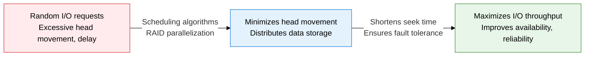
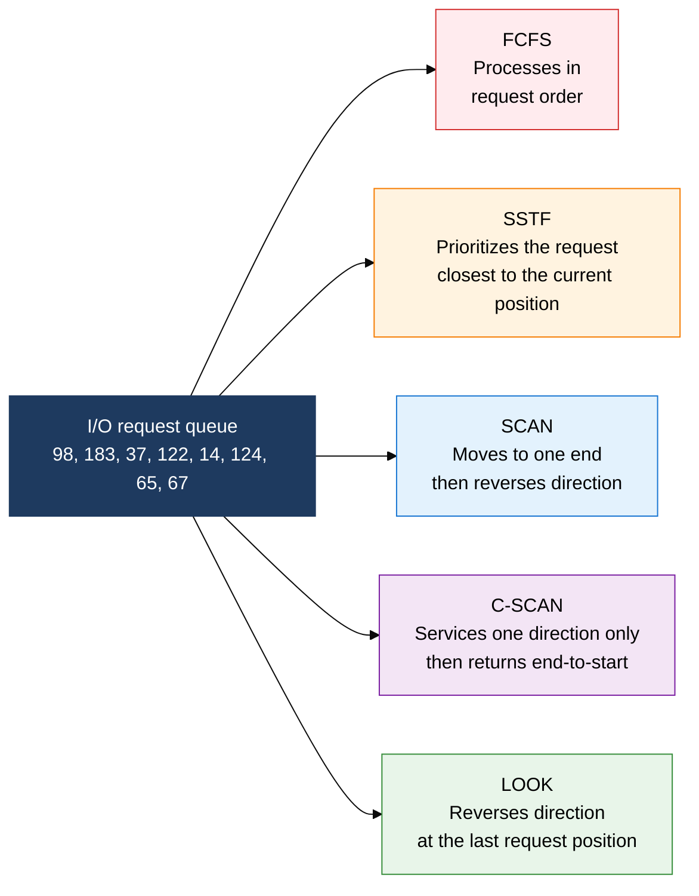
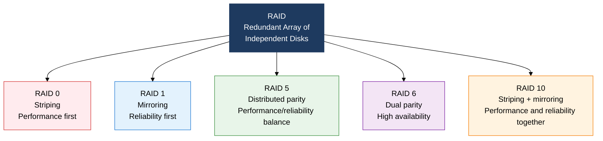

## 1. Maximizing I/O Performance by Minimizing Head Movement, Overview of Disk Scheduling and RAID

**Definition**: A storage management technique that improves both I/O performance and reliability using scheduling algorithms that optimize disk head movement order and RAID technology that logically combines multiple disks.
- Disk scheduling determines the order in which pending I/O requests are processed, minimizing average seek time
- RAID reflects the performance, capacity, and reliability trade-off in its design through combinations of striping, mirroring, and parity
- When designing server and storage systems, the level must be chosen based on workload characteristics (read-heavy, write-heavy, or mixed)

**Characteristics**:
- **Seek-time-centered optimization**: Algorithms shorten seek time, which accounts for the largest share of rotational latency and transfer time
- **RAID parallelism**: Distributing data across multiple disks improves throughput by a level-dependent multiple compared to a single disk
- **Fault tolerance**: Parity and mirroring guarantee lossless data recovery even when one or two disks fail

---

## 2. Core Structure of Disk Scheduling and RAID

### A. Comparing Five Disk Scheduling Algorithms

| Algorithm | Processing Method | Average Seek Time | Fairness | Starvation | Characteristics |
|---|---|---|---|---|---|
| **FCFS** | Processes requests in arrival order | Largest | High | None | Simple to implement, worst performance |
| **SSTF** | Prioritizes the request closest to the current head position | Small | Low | Can occur | High throughput, but risk of starving outer-cylinder requests |
| **SCAN** | Moves to one end, then repeats in reverse | Medium | Medium | None | Elevator algorithm, wait-time difference exists between the two ends |
| **C-SCAN** | Services one direction, then returns to the start | Medium | High | None | Evens out wait times vs. SCAN, but return-move overhead |
| **LOOK** | Reverses direction at the last request position | Small | Medium | None | An improved SCAN, eliminates unnecessary end-of-track movement |

---

### B. RAID Level Structures and Characteristics

| RAID Level | Minimum Disks | Usable Capacity | Reliability | Read Performance | Write Performance | Primary Use |
|---|---|---|---|---|---|---|
| **RAID 0** | 2 | All N disks | None (single failure loses everything) | Very high | Very high | Video editing, temporary data |
| **RAID 1** | 2 | N/2 | Tolerates 1 disk failure | High | Medium | OS disk, boot volume |
| **RAID 5** | 3 | N-1 disks | Tolerates 1 disk failure | High | Medium | File server, NAS |
| **RAID 6** | 4 | N-2 disks | Tolerates 2 simultaneous disk failures | High | Low | Large-scale archive, backup |
| **RAID 10** | 4 | N/2 | Tolerates 1 failure per mirror pair | Very high | High | DB server, high-performance transactions |

---

## 3. Expected Benefits and Practical Applications of Disk Scheduling and RAID

| Category | Key Benefits | Practical Applications |
|---|---|---|
| **Performance** | LOOK/SSTF cut average seek time by 30-50%, RAID 0/10 improve I/O throughput | RAID 10 for DB servers, RAID 5 combined with a SCAN algorithm for log servers with heavy sequential access |
| **Reliability** | RAID 5/6 parity recovers data losslessly on disk failure; RAID 6 tolerates 2 simultaneous failures | Apply RAID 6 in mission-critical systems, keep hot-spare disks on standby for automatic rebuild |
| **Availability** | Hot-swap/hot-spare support enables disk replacement with no downtime, ensuring service continuity | Duplicate RAID controllers in SAN/NAS storage, use battery-backed cache to offset write performance |
| **Cost optimization** | Choosing a RAID level suited to workload characteristics cuts unnecessary disk costs | RAID 0 (low-cost, high-performance) for dev/test environments, tiered storage design with RAID 5/10 for production |
