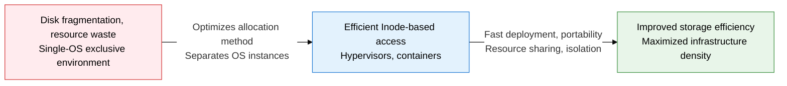
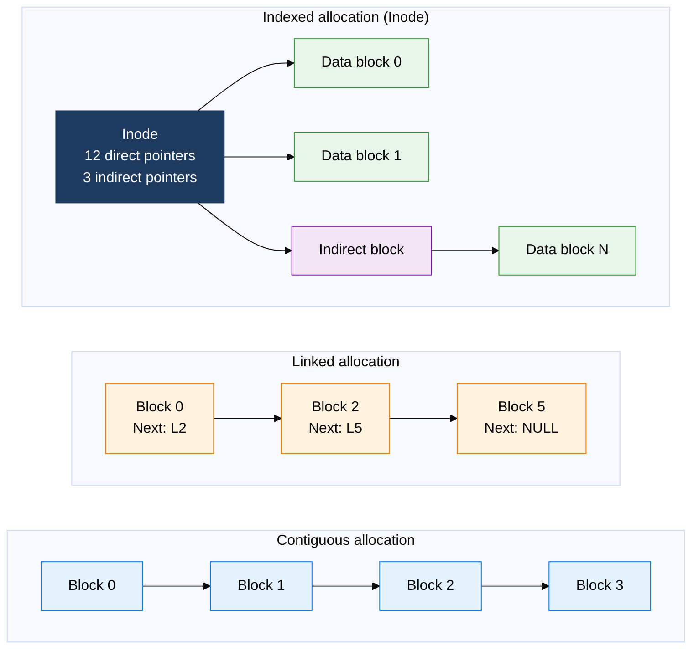
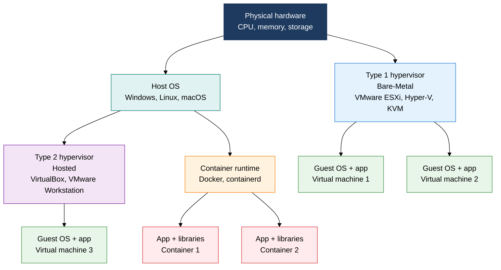

## 1. Maximizing Resource Efficiency with File Allocation and Hypervisors/Containers, Overview of File Systems and Virtualization

**Definition**: A system software technique that raises storage utilization and infrastructure efficiency through file allocation methods that efficiently distribute disk space among files, and virtualization technology that provides multiple independent execution environments on a single physical server.
- File allocation methods fall into three types — contiguous, linked, and indexed — chosen based on access pattern and fragmentation tolerance
- A hypervisor operates by providing hardware resources to virtual machines either directly or through a host OS
- Containers share the OS kernel while isolating with namespaces and cgroups, minimizing overhead compared to a hypervisor

**Characteristics**:
- **Allocation flexibility**: Choose contiguous allocation for fast access, linked allocation to avoid fragmentation, or Inode-based indexed allocation for efficient random access, depending on purpose
- **Balance of isolation and sharing**: A hypervisor achieves strong hardware-level isolation, while a container achieves lightweight process-level isolation
- **Portability**: Container images package environment dependencies, guaranteeing a consistent execution environment across dev, test, and production

---

## 2. Core Structure of File Systems and Virtualization

### A. Comparing Three File Allocation Methods

| Allocation Method | Principle | Sequential Access | Random Access | External Fragmentation | Internal Fragmentation | Typical Use |
|---|---|---|---|---|---|---|
| **Contiguous allocation** | Stores a file in contiguous blocks, location expressed as start block + length | Very fast | Fast | Occurs | None | CD-ROM, early file systems |
| **Linked allocation** | Each block holds a pointer to the next block; evolved into FAT | Fast | Slow | None | Wastes space on pointers | FAT16, FAT32 |
| **Indexed allocation** | Pointers centralized in an Inode, with direct, single, double, and triple indirect pointers | Fast | Fast | None | Small amount of waste | ext2/ext4, NTFS, HFS+ |

---

### B. Comparing Virtualization Types: Hypervisor vs. Container

| Category | Type 1 Hypervisor | Type 2 Hypervisor | Container (Docker) |
|---|---|---|---|
| **Operating method** | Controls hardware directly, runs without an OS | Runs on top of the host OS | Shares the host OS kernel, isolated via namespaces/cgroups |
| **Isolation level** | Strong hardware-level isolation | OS-level isolation | Lightweight process-level isolation |
| **Overhead** | Low (under 5%) | High (10-20%) | Very low (1-2%) |
| **Boot time** | Tens of seconds | Several minutes | A few seconds |
| **Portability** | VM image unit (several GB) | VM image unit (several GB) | Container image (tens to hundreds of MB) |
| **Representative products** | VMware ESXi, KVM, Hyper-V | VirtualBox, VMware Workstation | Docker, Podman, containerd |
| **Primary use** | Data center server virtualization | Dev/test environments | Microservices, CI/CD pipelines |

---

## 3. Expected Benefits and Practical Applications of File Systems and Virtualization

| Category | Key Benefits | Practical Applications |
|---|---|---|
| **Storage efficiency** | Inode-based indexed allocation minimizes fragmentation, improves random-access speed for large files | Adopt the ext4/XFS file system, enable journaling to guarantee data consistency after an abnormal shutdown |
| **Infrastructure density** | Type 1 hypervisor runs dozens of VMs on a single physical server, achieving over 70% server utilization | Build a private cloud on VMware vSphere/KVM, use vMotion/Live Migration for zero-downtime VM relocation |
| **Deployment agility** | Reusing container images shortens deployment time and eliminates environment mismatch problems | Set up a CI/CD pipeline on Docker + Kubernetes, standardize application deployment with Helm Charts |
| **Security/isolation** | VMs strengthen multi-tenant security with strong isolation, containers prevent conflicts between services via namespaces | Isolate sensitive workloads in Type 1 hypervisor VMs, deploy general microservices lightweight via containers |
