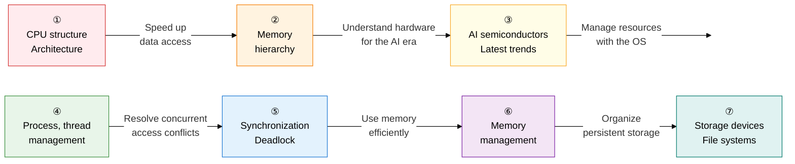

Computer architecture and OS form the foundational technology area that connects **"the physical control of hardware to the software mechanisms of the kernel"** into one coherent whole.
From CPU, memory, and I/O architecture to scheduling, virtual memory, and synchronization, this section systematically covers the core principles underlying AI semiconductors and cloud virtualization.

## Learning Roadmap — 7-Stage Flow

---

## ① Computer System Architecture and CPU Structure

> Covers **"the arithmetic and control units at the core of computer hardware, and the mechanisms that improve performance."**
> Von Neumann vs. Harvard architecture, the 4 stages of the instruction cycle, and pipelining hazards are frequently tested essay topics.

| Order | Topic | Key Keywords | Importance |
|:---:|---|---|:---:|
| 1 | [Basic Computer System Structure](01-cpu-architecture/computer-system-architecture) | Von Neumann vs. Harvard, data/address/control bus, bus arbitration | ★★☆ |
| 2 | [CPU Structure and Operating Principles](01-cpu-architecture/cpu-structure) | ALU, CU, registers (PC, IR, MAR, MBR), Fetch-Decode-Execute-Interrupt, CISC vs. RISC | ★★★ |
| 3 | [Parallel Processing and Processor Performance Improvement](01-cpu-architecture/parallel-processing) | Pipelining, data/structural/control hazards, superscalar/VLIW, Flynn's taxonomy (SIMD, MIMD) | ★★★ |

**→ Key study points**: Connect the 4 stages of the instruction cycle (Fetch→Decode→Execute→Interrupt) to the register flow (PC→IR→MAR→MBR), and memorize the 3 types of pipelining hazards paired with their solutions (forwarding, branch prediction, bubbles).

---

## ② Memory Hierarchy and Optimization

> Covers **"the memory system that resolves the trade-off between speed and capacity."**
> The 3 cache mapping types, the 4 MESI protocol states, and Write-Through vs. Write-Back are highly frequent essay topics.

| Order | Topic | Key Keywords | Importance |
|:---:|---|---|:---:|
| 4 | [Cache Memory Structure and Optimization](02-memory/cache-memory) | Direct, associative, and set-associative mapping, LRU/LFU/FIFO replacement, MESI coherence, Write-Through vs. Write-Back | ★★★ |
| 5 | [Main Memory and Next-Generation Memory](02-memory/main-memory) | SRAM vs. DRAM, DDR5/HBM high performance, NAND vs. NOR flash | ★★☆ |

**→ Key study points**: Understand the **causes of conflict misses** across the 3 cache mapping types with a diagram, and explain the MESI protocol state transitions (Modified→Exclusive→Shared→Invalid) alongside a multiprocessor scenario.

---

## ③ High-Performance Computing and Latest Semiconductor Trends

> These are **"the hardware innovation technologies of the AI/big-data era."**
> GPU/GPGPU vs. NPU differences, chiplet yield advantages, and PIM solving memory bandwidth limits are the latest frequent topics.

| Order | Topic | Key Keywords | Importance |
|:---:|---|---|:---:|
| 6 | [AI Semiconductors and Accelerators](03-advanced-hardware/ai-semiconductor) | GPU/GPGPU, NPU/TPU matrix operation optimization, PIM/PNM near-memory computing | ★★★ |
| 7 | [Chiplets and Neuromorphic Computing](03-advanced-hardware/chiplet-neuromorphic) | UCIe, 3D packaging/TSV, SNN spiking neural networks, event-driven processing | ★★☆ |

**→ Key study points**: Compare the **compute unit and memory structure differences** among GPU (parallel matrix operations), NPU (deep-learning-dedicated MAC units), and TPU (Google's tensor optimization) in a table, and explain the principle by which chiplets improve yield.

---

## ④ Process and Thread Management

> This is **"the core mechanism by which the OS kernel achieves multitasking with limited resources."**
> The 6 process state transitions, CPU scheduling algorithms (including the HRN formula), and MLFQ operating principles are frequently tested essay topics.

| Order | Topic | Key Keywords | Importance |
|:---:|---|---|:---:|
| 8 | [Process Management](04-process-thread/process) | PCB structure, state transitions (Create, Ready, Running, Waiting, Terminated, Suspended), context switching | ★★★ |
| 9 | [Thread Models and Multithreading](04-process-thread/thread) | User-level and kernel-level threads, multithreading models (M:1, 1:1, M:N) | ★★★ |
| 10 | [CPU Scheduling Algorithms](04-process-thread/cpu-scheduling) | FCFS, SJF, HRN (non-preemptive), SRT, RR, MLFQ (preemptive), starvation, aging | ★★★ |

**→ Key study points**: Calculate the HRN priority formula `(waiting time + service time) / service time` with a numeric example, and explain step by step the principle behind **moving to a lower queue when the time quantum is exhausted** in MLFQ.

---

## ⑤ Concurrency Control and Deadlock

> Covers **"resolving data races and resource-monopolization problems in a multithreaded environment."**
> Comparing mutex, semaphore, and monitor, the 4 deadlock conditions, and the banker's algorithm's Safe State must be memorized.

| Order | Topic | Key Keywords | Importance |
|:---:|---|---|:---:|
| 11 | [Process Synchronization Mechanisms](05-concurrency-deadlock/synchronization) | Critical section (mutual exclusion, progress, bounded waiting), mutex vs. semaphore (P/V operations) vs. monitor, race condition | ★★★ |
| 12 | [Deadlock](05-concurrency-deadlock/deadlock) | 4 conditions for occurrence (mutual exclusion, hold-and-wait, no preemption, circular wait), prevention/avoidance (banker's algorithm), detection, recovery | ★★★ |

**→ Key study points**: Organize the difference between mutex (has ownership, 1 resource) and semaphore (counting, N resources) using the **restaurant key vs. parking-lot ticket** analogy, and directly calculate the banker's algorithm's Safe State determination with a numeric example.

---

## ⑥ Memory Management

> This is **"the technology that efficiently distributes limited physical memory and virtually extends it."**
> The page address translation flow through the TLB, the LRU replacement algorithm, and thrashing and the working set are core exam topics.

| Order | Topic | Key Keywords | Importance |
|:---:|---|---|:---:|
| 13 | [Physical Memory Management Techniques](06-memory-management/physical-memory) | Fixed/variable partitioning, internal/external fragmentation, First-Fit, Best-Fit, Worst-Fit | ★★☆ |
| 14 | [Virtual Memory and Page Replacement](06-memory-management/virtual-memory) | Paging, TLB, segmentation, page fault handling, FIFO/LRU/NUR/optimal replacement, thrashing, working set | ★★★ |

**→ Key study points**: Diagram the virtual address (page number + offset) → TLB hit/miss → page table → physical address translation process **field by field**, and explain with a graph the cause of thrashing (increasing the degree of multiprogramming paradoxically decreases CPU utilization).

---

## ⑦ Storage Devices and File Systems

> Covers **"the management of physical non-volatile storage media and virtualization technology."**
> RAID level capacity/reliability calculations, Unix Inode's 3-level indirect pointers, and comparing hypervisors vs. containers are frequent essay topics.

| Order | Topic | Key Keywords | Importance |
|:---:|---|---|:---:|
| 15 | [Disk Scheduling and RAID](07-storage-filesystem/disk-scheduling-raid) | FCFS, SSTF, SCAN, C-SCAN, LOOK, RAID 0/1/5/6/10 (striping, mirroring, parity) | ★★★ |
| 16 | [File Systems and Virtualization](07-storage-filesystem/filesystem-virtualization) | Contiguous/linked/indexed allocation (Unix Inode), Type 1/2 hypervisors, container (Docker) isolation | ★★★ |

**→ Key study points**: Calculate RAID 5's **usable capacity = (N-1)/N × total** formula for various disk counts, and compare the **isolation level, boot speed, and security** differences between a container (shared OS kernel) and a VM (guest OS on a hypervisor).

---

## Exam Strategy

| Question Pattern | Key Response Strategy |
|---|---|
| **Operating process** | Describe the instruction cycle, page fault, and context switch as a step-by-step register flow |
| **Comparison questions** | Memorize the comparison tables for CISC vs. RISC, mutex vs. semaphore, Type 1 vs. Type 2 vs. container, and RAID levels |
| **Formulas and figures** | HRN formula, RAID capacity calculation, virtual-to-physical address translation field calculation |
| **Latest trends** | NPU/PIM solving memory bottlenecks, chiplet yield advantages, neuromorphic SNN event-driven processing |
| **Cause-and-solution pairs** | Pipelining hazard → solution, thrashing → working set, deadlock → banker's algorithm |
