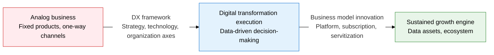
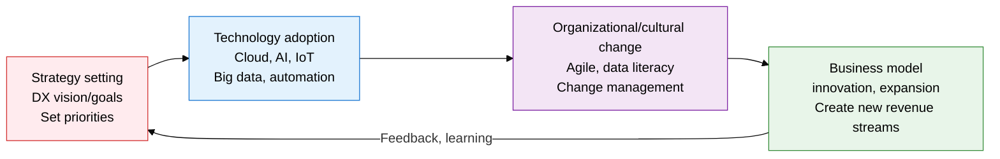
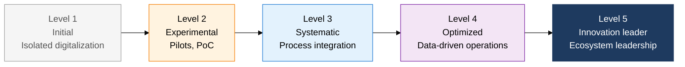

## 1. Reinventing the Business Model, Not Just Adopting Technology, Overview of Digital Transformation

**Definition**: A strategic transformation activity that secures sustainable competitive advantage by fundamentally reinventing the business model, processes, and customer experience using digital technology.
- Includes a total change in organizational culture, operating methods, and revenue structure — not just the adoption of an IT system
- Materializes as 4 business model innovation types: Servitization, subscription economy, platforms, and data monetization
- Diagnoses the current position using the 5 levels of the Digital Maturity Model (DMM) and establishes a phased capability development roadmap

**Characteristics**:
- **Integration across strategy, technology, and organization**: Technology adoption without strategic direction, and digitalization without change management, are both causes of failure
- **Redefining the business model**: Converts existing product-sales approaches into service, subscription, or platform models to generate recurring revenue
- **Data as the core asset**: The ultimate goal of digital transformation is participation in the data economy through collecting, analyzing, and monetizing data

---

## 2. Core Structure of Digital Transformation

### A. DX Execution Framework and Business Model Innovation Types

| Innovation Type | Definition | Core Mechanism | Representative Examples |
|---|---|---|---|
| **Servitization** | Shifts from selling products to providing outcome/performance-based services | Monitors product condition via sensors/IoT, then contracts guarantee outcomes | GE Aviation's per-hour engine billing, Rolls-Royce's Power-by-the-Hour |
| **Subscription economy** | Secures recurring revenue via monthly/annual subscriptions instead of one-time purchases | Advances customer lock-in, data accumulation, and personalized services | Adobe Creative Cloud, Microsoft 365, Netflix |
| **Platform business** | Operates a digital ecosystem connecting suppliers and demanders | Value grows exponentially with participants due to network effects | Amazon Marketplace, Kakao Taxi, Airbnb |
| **Data monetization** | Monetizes collected data through analysis, sales, advertising, and personalized recommendations | Builds a data pipeline and applies AI models | Google advertising, financial companies' MyData services |

---

### B. The 5 Levels of the Digital Maturity Model and Evaluation Criteria

| Evaluation Area | Level 1 Initial | Level 2 Experimental | Level 3 Systematic | Level 4 Optimized | Level 5 Innovation Leader |
|---|---|---|---|---|---|
| **Strategy/leadership** | IT seen as a cost | Pursuing DX pilot projects | Formal DX strategy established | DX KPIs tied to management goals | DX drives industry paradigm |
| **Technology/infrastructure** | Centered on legacy systems | Partial cloud adoption | Cloud/API integration | AI/automation embedded in operations | Platform ecosystem open externally |
| **Data/analytics** | Data silos, manual work | Data collection begins | Integrated data platform | Real-time analytics, predictive models | Data productization, revenue generation |
| **Organization/culture** | Resistance to change, isolated IT department | Some agile teams experimenting | Agile spreads company-wide | Data literacy across all employees | Innovation culture, external collaboration ecosystem |

---

## 3. Expected Benefits and Practical Applications of Digital Transformation

| Category | Key Benefits | Practical Applications |
|---|---|---|
| **Strategic** | Creating new revenue models breaks dependence on the existing business and secures new growth drivers | Assess current level via a DMM diagnosis, then establish a 3-year DX roadmap |
| **Operational** | Process automation and AI adoption cut operating costs and improve quality consistency | Determine RPA/cloud adoption priorities through value-chain analysis, measure ROI |
| **Customer experience** | Integrating digital channels and personalized services raises customer satisfaction and repurchase rate | Manage churn rate and LTV as core KPIs when converting to a subscription model |
| **Organization/culture** | Establishing a data-driven decision-making culture reduces errors from intuitive judgment | Run a data-literacy training program for all employees, adopt agile OKRs |
