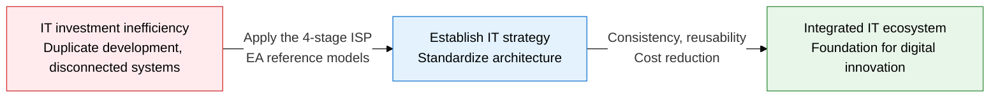
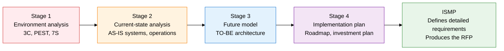
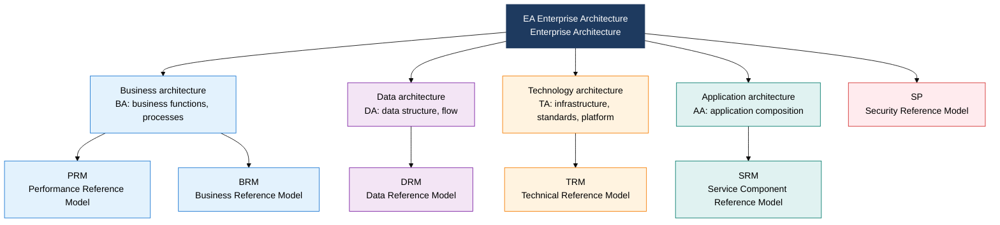

## 1. The Mid- to Long-Term Blueprint That Systematically Designs IT Investment Direction, Overview of ISP and EA

**Definition**: An IT strategic planning methodology that combines ISP, which establishes an organization's mid- to long-term IT direction through a 4-stage process, with EA, which systematizes business, data, technology, and application architecture into 6 reference models.
- ISP (Information Strategy Planning) is a strategic planning activity that establishes a 3-5 year mid- to long-term IT master plan
- ISMP (Information System Master Plan) is the follow-up stage after ISP that defines the detailed requirements for building individual systems
- EA (Enterprise Architecture) is a governance framework that manages an organization's entire IT assets in an integrated way across 4 architecture views

**Characteristics**:
- **Phased layered structure**: Spreads decision-making risk across 3 layers — ISP (strategy) → ISMP (requirements) → system build (execution)
- **Reference model standardization**: EA's 6 reference models prevent duplicate development and ensure interoperability between systems
- **Mandatory for the public sector and large enterprises**: Statutes require EA-based ISP/ISMP execution before government agencies launch an informatization project

---

## 2. Core Structure of ISP, ISMP, and EA

### A. The 4 Stages of the ISP Process and How ISMP Differs

| Comparison Item | ISP (Information Strategy Planning) | ISMP (Information System Master Plan) |
|---|---|---|
| **Purpose** | Establish mid- to long-term IT investment direction and priorities | Define detailed requirements for building individual systems |
| **Timeframe** | 3-5 year mid- to long-term strategic view | 1-2 year execution view per individual project |
| **Key deliverables** | IT master plan, architecture blueprint, roadmap | Functional requirements document, RFP, project proposal request |
| **Analysis techniques** | 3C, PEST, 7S, SWOT, AS-IS/TO-BE | Business function decomposition (BFD), data flow diagram (DFD) |
| **Performed by** | Management, IT strategy team, external consulting | IT planning team, procurement staff, systems analysts |
| **Legal basis** | Article 71 of the Enforcement Decree of the Electronic Government Act | Information System Audit Standards (Ministry of the Interior and Safety) |

---

### B. EA's 4 Architectures and 6 Reference Models

| Reference Model | Full Name | Related Architecture | Key Content and Role |
|---|---|---|---|
| **PRM** | Performance Reference Model | BA | Performance goal/measurement-indicator system, links to IT investment outcomes |
| **BRM** | Business Reference Model | BA | Classification system for an agency's business functions, basis for eliminating duplicate work |
| **SRM** | Service Component Reference Model | AA | Classifies common service components, identifies reusable services |
| **DRM** | Data Reference Model | DA | Common data standards, metadata, basis for data sharing |
| **TRM** | Technical Reference Model | TA | Technology standards, infrastructure specifications, defines interoperability criteria |
| **SP** | Security Profile | All areas | Applies security requirements and control criteria across every architecture layer |

---

## 3. Expected Benefits and Practical Applications of Adopting ISP, ISMP, and EA

| Category | Key Benefits | Practical Applications |
|---|---|---|
| **Strategic** | Clarifying IT investment priorities prevents duplicate investment and unnecessary system builds | Use the ISP roadmap as the basis for project feasibility review when composing the annual informatization budget |
| **Architecture** | EA reference-model-based standardization improves interoperability and reusability between systems | Mandate TRM/SRM fitness review before adopting new systems, consolidate duplicate systems |
| **Governance** | ISMP's detailed requirement definitions minimize requirement mismatches and disputes between client and vendor | Mandate attaching ISMP deliverables when drafting an RFP, link to the audit checklist |
| **Security/quality** | Applying the SP reference model across every layer embeds security from the architecture design stage | Integrate EA security reference model checkpoints into the DevSecOps pipeline |
